# RV1126B Dual Camera SDK

CLI-программы для стереокамеры на базе Rockchip RV1126B: захват мега-кадра через AVS, нарезка на cam0/cam1 через RGA (hardware 2D engine), поворот, сохранение в NV12.

**Репозиторий содержит только наши программы** (`app/`) + документацию (`README.md`, `docs/`). Заголовки и библиотеки SDK **не включены** — предполагается, что у пользователя есть тот же SDK рядом (см. [Сборка](#сборка)).

## Источник

- **Origin SDK:** `rv1126b-linux6.1` (Rockchip RV1126B, ядро Linux 6.1)
- **Базовый коммит:** `7285d5c2f` ("Fix(4g): EC20 LTE automatic connection at startup")
- **Содержимое репо:** `app/` (наши CLI), `docs/` (картинки), `README.md`, `build.sh`, `CMakeLists.txt`
- **Содержимое SDK (не в репо):** `external/rockit/` (MPI), `external/linux-rga/` (RGA), `external/camera_engine_rkaiq/` (rkaiq)

## Поддерживаемые платформы

| Чип | Архитектура | Конфиги rkipc |
|-----|-------------|---------------|
| **RV1126B** | arm64 | `rv1126b_ipc`, `rv1126b_dv`, `rv1126b_dual_ipc` |
| RV1126 | arm32 | `rv1126_ipc_rockit`, `rv1126_aiisp_ipc`, `rv1126_battery_ipc`, и др. |
| RV1106 / RV1103B | arm32 | `rv1106_ipc`, `rv1106_dual_ipc`, и др. |
| RK3588 / RK3576 | arm64 | `rk3588_ipc`, `rk3576_ipc` |

---

## DSI дисплей RV1126B: характеристики и методология выяснения

### Физические характеристики (доказательства из device-tree + DRM)

| Параметр | Значение | Источник |
|----------|----------|----------|
| **Разрешение** | 720×1280 (portrait) | `/sys/class/drm/card0-DSI-1/modes` → `720x1280` |
| **Ориентация** | портрет (720 ширина, 1280 высота) | `hactive=720`, `vactive=1280` (timing0) |
| **Интерфейс** | MIPI DSI, 4 lanes | `dsi,lanes=4` (panel@0) |
| **Pixel clock** | 60 МГц | `clock-frequency=60000000` (timing0) |
| **Частота кадров** | ~56.45 Гц | `modetest -M rockchip -p` → `720x1280 56.45` |
| **Физический размер** | 68×121 мм | `width-mm=68`, `height-mm=121` (panel@0) |
| **Соотношение сторон** | 9:16 (portrait) | 720:1280 = 0.5625 |
| **Connector** | DSI-1 (card0) | `/sys/class/drm/card0-DSI-1/status=connected` |
| **CRTC** | crtc-0 (VOP0) | `cat /sys/kernel/debug/dri/0/state` → `crtc[72]: crtc-0` |
| **Planes** | VOP0-win0-0 (overlay), VOP0-win2-0 (primary) | DRM state: 2 plane nodes |
| **Backlight** | 200/255 (78%) | `/sys/class/backlight/backlight/brightness` |
| **DPMS** | On | `/sys/class/drm/card0-DSI-1/dpms` |

### Тайминги (timing0 из device-tree)

| Параметр | Значение | Описание |
|----------|----------|----------|
| `hactive` | 720 | активные пиксели по горизонтали |
| `hfront-porch` | 34 | передний порог H-sync |
| `hback-porch` | 34 | задний порог H-sync |
| `hsync-len` | 24 | длина H-sync |
| **H total** | 812 | 720+34+34+24 |
| `vactive` | 1280 | активные строки по вертикали |
| `vfront-porch` | 20 | передний порог V-sync |
| `vback-porch` | 6 | задний порог V-sync |
| `vsync-len` | 3 | длина V-sync |
| **V total** | 1309 | 1280+20+6+3 |
| **Pixel clock** | 60 МГц | 812×1309×56.45 ≈ 60 МГц ✓ |

### Методология выяснения

**1. Device-tree (источник истины для hardware config):**
```bash
# DSI контроллер: /proc/device-tree/dsi@22120000/
# Панель: /proc/device-tree/dsi@22120000/panel@0/
# Тайминги: /proc/device-tree/dsi@22120000/panel@0/display-timings/timing0/

# Чтение 32-bit big-endian свойств (device-tree формат):
hex=$(od -An -tx1 /proc/device-tree/.../timing0/hactive | tr -d ' \n')
printf "%d\n" 0x$hex   # → 720
```

**2. DRM sysfs (runtime state):**
```bash
cat /sys/class/drm/card0-DSI-1/status    # connected
cat /sys/class/drm/card0-DSI-1/modes    # 720x1280
cat /sys/class/drm/card0-DSI-1/dpms     # On
cat /sys/class/backlight/backlight/brightness  # 200
```

**3. modetest (DRM modes из userspace):**
```bash
modetest -M rockchip -p
# CRTCs: id=72, size=720x1280
# Mode #0: 720x1280 56.45 ... 60000 (pixel clock 60MHz)
```

**4. DRM debugfs (plane/crtc state):**
```bash
cat /sys/kernel/debug/dri/0/state
# plane[58]: VOP0-win2-0 (primary, zpos=0)
# plane[73]: VOP0-win0-0 (overlay, zpos=0)
# crtc[72]: crtc-0, enable=1, active=1
```

**5. Проверка расчётов:**
- Частота кадров = pixel_clock / (H_total × V_total) = 60МГц / (812 × 1309) = 56.45 Гц ✓
- Соотношение = 720/1280 = 0.5625 = 9:16 (portrait) ✓
- Физический DPI = 720 / (68мм / 25.4) = 720 / 2.677 = 269 DPI (высокая плотность)

### Команды верификации (скопировать на плату)

Все характеристики можно проверить одной командой:
```bash
# 1. DRM connector + modes + DPMS
cat /sys/class/drm/card0-DSI-1/status      # connected
cat /sys/class/drm/card0-DSI-1/modes      # 720x1280
cat /sys/class/drm/card0-DSI-1/dpms       # On

# 2. Backlight
cat /sys/class/backlight/backlight/brightness        # 200
cat /sys/class/backlight/backlight/max_brightness    # 255

# 3. DRM mode line (частота, тайминги, pixel clock)
modetest -M rockchip -p | grep -A1 '720x1280'
# → 720x1280 56.45 720 754 778 812 1280 1300 1303 1309 60000

# 4. Plane/crtc state (кто занимает plane)
cat /sys/kernel/debug/dri/0/state | grep -E 'plane|crtc|fb=|zpos'

# 5. Device-tree timing0 (источник истины для таймингов)
T=/proc/device-tree/dsi@22120000/panel@0/display-timings/timing0
for f in clock-frequency hactive hfront-porch hsync-len hback-porch \
         vactive vfront-porch vsync-len vback-porch; do
    hex=$(od -An -tx1 $T/$f | tr -d ' \n')
    printf "%-16s = %d\n" "$f" 0x$hex
done
# → clock-frequency = 60000000
# → hactive = 720, hfront-porch = 34, hsync-len = 24, hback-porch = 34
# → vactive = 1280, vfront-porch = 20, vsync-len = 3, vback-porch = 6

# 6. Panel physical size + DSI lanes
P=/proc/device-tree/dsi@22120000/panel@0
for f in dsi,lanes width-mm height-mm; do
    hex=$(od -An -tx1 $P/$f | tr -d ' \n')
    printf "%-12s = %d\n" "$f" 0x$hex
done
# → dsi,lanes = 4, width-mm = 68, height-mm = 121

# 7. Проверка частоты кадров (расчёт)
python3 -c "print(60000000 / (812 * 1309))"  # → 56.4486... ≈ 56.45
```

### Почему вертикальная склейка (NOBLEND_VER)

Дисплей **портретный** (720×1280, 9:16). Две камеры GC2093 дают 1920×1080 каждая (landscape, 16:9).

| Склейка | Мега-кадр | После rot=90 | Вписывается в 720×1280? |
|---------|-----------|--------------|--------------------------|
| **HOR** (3840×1080) | 3840×1080 | 1080×3840 | ❌ слишком высокий |
| **VER** (1920×2160) | 1920×2160 | 2160×1920 | ✅ pan-and-scan по 2160×1920 |

При вертикальной склейке мега-кадр 1920×2160 → RGA crop 1280×720 → rotate 90 → 720×1280 → идеально вписывается в портретный дисплей. Pan-and-scan окно 1280×720 гуляет по 1920×2160 по синусоиде.

### Видимые и невидимые пиксели (porches + sync)

Строка режима из `modetest`:
```
720x1280 56.45  720 754 778 812  1280 1300 1303 1309  60000
         │      │              │                │       │
         │      │              │                │       └─ pixel clock (60 МГц)
         │      │              │                └─ V: active end start total
         │      │              └─ H: active end start total
         │      └─ частота (Гц)
         └─ разрешение
```

**Видимые пиксели (active)** — то, что видно на экране. Для нашего дисплея:
- H active = 720 (720 пикселей в каждой строке светятся)
- V active = 1280 (1280 строк)
- Итого 720 × 1280 = 921 600 видимых пикселей.

**Невидимые пиксели (porches + sync)** — служебные области за пределами матрицы. На матрице их нет, но контроллеру они нужны для синхронизации.

#### Зачем нужны

**H-sync (горизонтальная синхронизация):**
Контроллер построчно выталкивает пиксели в матрицу. Дойдя до конца строки (720), он должен:
1. **Front porch (34)** — подождать, пока последний пиксель "дотечёт" до края матрицы
2. **H-sync (24)** — послать импульс "строка закончена, готовлю следующую"
3. **Back porch (34)** — подождать, пока электроника матрицы переключится на новую строку

Аналогия — печатная машинка: напечатали строку → каретка возвращается (front porch) → звонок (sync) → каретка на месте (back porch) → новая строка.

**V-sync (вертикальная синхронизация):**
Аналогично для кадров целиком:
1. **Front porch (20 строк)** — последний ряд матрицы "дотекает"
2. **V-sync (3 строки)** — импульс "кадр закончен"
3. **Back porch (6 строк)** — матрица готовится к новому кадру

#### Полный кадр (timing0)

```
┌─────────────────────────── 812 пикселей ───────────────────────────┐
│                                                                    │
│  ┌──── 720 видимых ────┐─34─┬─24─┬─34─┐                            │
│  │                     │ FP │Sync│ BP │                            │
│  │   ВИДИМАЯ ОБЛАСТЬ   │    │    │    │                            │
│  │      720×1280       │    │    │    │                            │
│  │                     │    │    │    │                            │
│  │                     │    │    │    │                            │
│  └─────────────────────┘    │    │    │                            │
│                             │    │    │                            │
│  ──── 1280 видимых строк ───┘    │    │                            │
│  ──── 20 front porch ────────►  │    │                            │
│  ──── 3 V-sync ─────────────►  │    │                            │
│  ──── 6 back porch ──────────►  │    │                            │
│                                                                    │
└────────────────────────────────────────────────────────────────────┘
                                    │
                                    V total = 1309 строк
```

#### Числа для нашего дисплея

| Область | H (пиксели) | V (строки) | Что это |
|---------|-------------|------------|---------|
| Active | 720 | 1280 | **видимая картинка** |
| Front porch | 34 | 20 | буфер "дотекания" |
| Sync | 24 | 3 | импульс синхронизации |
| Back porch | 34 | 6 | буфер подготовки |
| **Total** | **812** | **1309** | полный кадр |

#### Почему это физика, а не выдумка

- **Pixel clock 60 МГц** — физический тактовый сигнал на DSI lane. Каждый такт = один пиксель данных.
- За время одного кадра контроллер отдаёт 812 × 1309 = 1 062 908 тактов.
- 60 000 000 / 1 062 908 = 56.45 кадров в секунду.
- Это **реальная частота обновления матрицы** — она физически перерисовывается 56 раз в секунду.

Porches нельзя убрать — матрице нужно время на переключение строк/кадров. Если уменьшить — изображение поедет, появятся артефакты. Эти тайминги либо зашиты в прошивку панели, либо задаются в device-tree (как у нас).

---

## Пайплайн RV1126B: от камеры до оконечников (справочник)

Чтобы не было путаницы между AVS, VPSS, RGA, VO, VOP и DRM — вот полный обзор аппаратных блоков и их связей на RV1126B. Все имена структур/enum соответствуют заголовкам в `external/rockit/mpi/sdk/include/`.

### Аппаратные блоки (путь кадра)

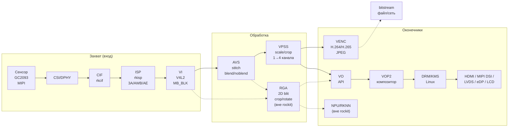

**Сплошные линии** — rockit bind (zero-copy внутри rockit). **Пунктир** — ручная передача через dmabuf fd (RGA/NPU вне rockit).

### Что делает каждый блок

| Блок | Расшифровка | Что делает | Аппаратный? |
|------|-------------|------------|-------------|
| **CSI/DPHY** | MIPI CSI-2 + D-PHY | Приём MIPI-потока с сенсора (тактирование, десериализация) | Да (DPHY0, DPHY3) |
| **CIF** | Camera Interface Framework | Маршрутизация raw данных от CSI к ISP (`rkcif-mipi-lvds`, `/dev/media0`) | Да |
| **ISP** | Image Signal Processor | Дебайеризация, AWB, AE, AF, HDR, LSC, денойз — всё что в IQ-файле (`/etc/iqfiles/gc2093_*.json`) | Да (`rkisp-vir0`, `rkisp-vir1`) |
| **VI** | Video Input | V4L2-обёртка над ISP, отдаёт кадры в rockit через `RK_MPI_VI_GetChnFrame`. Каналы: MAINPATH (0), SELFPATH (1), FBC (2), NPU (4) | API над V4L2 |
| **AVS** | Auto Video Stitching | Аппаратное сшивание N камер в один мега-кадр. Режимы: `NOBLEND_HOR/VER/QR/OVL`, `BLEND`, `BLEND_DYN`. Проекции: equirectangular, rectilinear, cylindrical, cube_map | Да (аппаратный блок) |
| **VPSS** | Video Process Sub-System | Масштабирование, кроп, поворот, конверсия формата. Может работать на GPU, RGA, ISP или своём硬件 | Да/софт (через `enVProcDev`) |
| **RGA** | Raster Graphic Acceleration | 2D blit: crop, rotate, scale, format convert, color fill. Работает с dmabuf через IOMMU (zero-copy). Не часть rockit — отдельная библиотека `librga.so` | Да (RGA2/RGA3) |
| **VENC** | Video Encode | H.264/H.265/JPEG/MJPEG/ProRes кодирование. Rate control: CBR, VBR, AVBR, FIXQP. GOP: NORMALP, TSVC2-4, SMARTP | Да (аппаратный кодек) |
| **VO** | Video Output | API над VOP2 — композиция слоёв и отправка на физический интерфейс (HDMI, MIPI, LVDS, ...) | API над VOP2 |
| **VOP2** | Video Output Processor v2 | Аппаратный композитор: берёт слои (Cluster/Smart/Esmart), смешивает, выводит на дисплей | Да (аппаратный блок) |
| **DRM/KMS** | Direct Rendering Manager | Linux-подсистема отображения. На RV1126B **VOP2 экспортируется через DRM** — rockit VO использует DRM под капотом | Linux subsystem |

### Связи: bind-механизм rockit

Компоненты соединяются через `RK_MPI_SYS_Bind(src, dst)` — это **zero-copy**: данные передаются как `MB_BLK` (дескриптор буфера), без копирования.

```c
MPP_CHN_S src = { .enModId = RK_ID_VI,   .s32DevId = 0, .s32ChnId = 0 };
MPP_CHN_S dst = { .enModId = RK_ID_AVS,  .s32DevId = 0, .s32ChnId = 0 };
RK_MPI_SYS_Bind(&src, &dst);  // VI[0,0] → AVS[0,0]
```

**Иерархия VO** (от кадра до пикселей на экране):

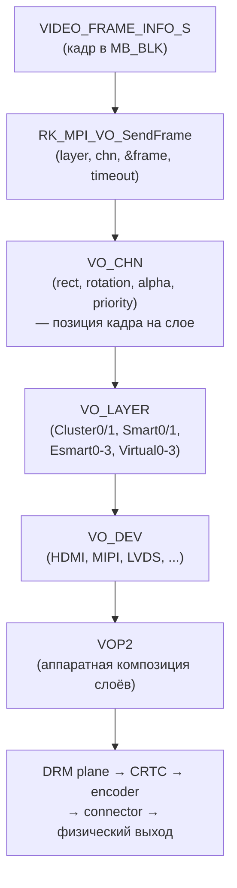

**Типы слоёв VO** (`VO_LAYER_MODE_E`):
- `VO_LAYER_MODE_VIDEO` — видео-слой (аппаратное масштабирование, YUV)
- `VO_LAYER_MODE_GRAPHIC` — графический слой (UI/OSD, RGB)
- `VO_LAYER_MODE_CURSOR` — курсор
- `VO_LAYER_MODE_VIRTUAL` — виртуальный (для WBC — write-back capture)

**Режимы композиции** (`VO_SPLICE_MODE_E`):
- `VO_SPLICE_MODE_GPU` — композиция через GPU
- `VO_SPLICE_MODE_RGA` — композиция через RGA (используется в rkipc для multi-camera)

### Буферы: MB (Memory Buffer) и zero-copy

Все кадры в rockit — это `MB_BLK` (дескриптор буфера в общем пуле). Типы источников буферов (`MB_SOURCE_E`):

| `MB_SOURCE_*` | Что значит | Когда использовать |
|---------------|-----------|-------------------|
| `COMMON` | Общий пул (разделяемый между модулями) | По умолчанию |
| `MODULE` | Пул модуля (VENC/VO/... свой) | Изоляция |
| `PRIVATE` | Приватный пул канала (`u32FrameBufCnt`) | Когда нужен свой размер/количество |
| `USER` | Пользовательский буфер | Внешний dmabuf |

**Внешний dmabuf (zero-copy с RGA/NPU)** — через `MB_EXT_CONFIG_S`:

```c
MB_EXT_CONFIG_S ext = {
    .s32Fd      = dmabuf_fd,   // fd из /dev/dma_heap/
    .pu8VirAddr = va,           // mmap'd адрес
    .u64PhyAddr = 0,            // rockit получит из dmabuf
    .u64Size    = size,
    .pFreeCB    = NULL,         // не освобождает rockit — мы управляем
};
MB_BLK mb;
RK_MPI_SYS_CreateMB(&mb, &ext);  // обернуть внешний dmabuf в MB_BLK
// ... передать в VO/VPSS/VENC ...
RK_MPI_SYS_Free(mb);             // освободить обёртку (не сам dmabuf!)
```

Это позволяет передавать кадр из RGA в VO **без CPU-копии** — rockit берёт dmabuf fd и отдаёт его VOP2 напрямую через IOMMU.

### AVS vs VPSS vs RGA — в чём разница?

Это частая путаница. Все три могут "склеивать" кадры, но **по-разному**:

| | **AVS** | **VPSS** | **RGA** |
|---|---|---|---|
| **Что делает** | Сшивает N камер в панораму (geometric warp + blend) | Масштабирование/кроп/поворот одного кадра, **fan-out** на N каналов | 2D blit: crop, rotate, scale, format convert |
| **Аппаратный блок** | AVS (отдельный) | VPSS/GPU/RGA (настраивается через `enVProcDev`) | RGA2/RGA3 (отдельный) |
| **Вход** | N pipe (по одному на камеру) | 1 кадр → **до 4 каналов** (VPSS_CHN0-3) | 1-2 кадра (src + pat) |
| **Выход** | 1 мега-кадр (панорама) | **N кадров** (разные разрешения/форматы из одного источника!) | 1 кадр (преобразованный) |
| **Синхронизация** | `bSyncPipe=1` — аппаратная синхронизация N камер | Нет | Нет |
| **Blend** | Да (LUT-based, с калибровкой) | Нет | Нет (только alpha blend pat) |
| **Warp/проекция** | Да (equirectangular, cylindrical, cube_map) | Нет | Нет |
| **API** | `RK_MPI_AVS_*` (rockit) | `RK_MPI_VPSS_*` (rockit) | `improcess()` (librga, НЕ rockit) |
| **Zero-copy** | Да (внутри rockit) | Да (внутри rockit) | Да (dmabuf fd через IOMMU) |
| **Когда использовать** | Сшивание стерео/панорамы | Подготовка кадра для VENC/VO/NPU **внутри rockit-пайплайна** | Кастомная обработка **вне** rockit-пайплайна |

### VPSS vs RGA — детальный разбор

VPSS и RGA **пересекаются по функциональности** (оба делают scale/crop/rotate), но это **разные инструменты для разных задач**.

#### Что умеет VPSS (и RGA не умеет)

| Возможность VPSS | RGA | Комментарий |
|------------------|-----|-------------|
| **Fan-out: 1 вход → 4 выхода** одновременно | ❌ | VPSS group имеет до 4 каналов (`VPSS_CHN0-3`), каждый со своим разрешением/форматом. RGA делает 1 blit за вызов. |
| **Интеграция в rockit bind-пайплайн** | ❌ | VPSS — полноценный узел `RK_MPI_SYS_Bind(VI→VPSS, VPSS→VENC, VPSS→VO)`. RGA — вне rockit, вызывается вручную. |
| **`VIDEO_PROC_DEV_VPSS`** — аппаратный VPSS-блок | ❌ | На RV1126B **есть** аппаратный VPSS (TRM: `0x21D20000`, 64KB) и VPSS_LITE (`0x21D30000`). По умолчанию в rkipc `vpss_proc_dev = vpss`. RGA такого не умеет. |
| **`VIDEO_PROC_DEV_GPU`** — обработка через GPU | ❌ | VPSS может делегировать на GPU (медленнее RGA, но гибче). |
| **`VIDEO_PROC_DEV_ISP`** — обработка через ISP | ❌ | VPSS может использовать ISP для scaling (только на некоторых чипах). |
| **`COMPRESS_RFBC_64x4`** — аппаратное сжатие | ❌ | VPSS умеет AFBC/RFBC compression для экономии памяти. RGA — нет. |
| **`ASPECT_RATIO_AUTO/MANUAL`** — aspect ratio с letterbox | ❌ | VPSS сам считает прямоугольник с сохранением пропорций. RGA — нет, нужно считать вручную. |
| **`EnableBackupFrame`** — буфер последнего кадра | ❌ | VPSS хранит последний кадр, можно получить даже если источник остановился. |
| **`GetRegionLuma`** — измерение яркости региона | ❌ | VPSS может отдавать статистику яркости без полного чтения кадра. |
| **`SetGrpDelay`** — задержка пайплайна | ❌ | VPSS может буферизовать кадры для выравнивания таймингов. |
| **`AttachMbPool`** — свой пул буферов на канал | частично | VPSS может использовать общий пул для нескольких потребителей. |
| **`AIISP_ATTR_S`** — AI-ISP обработка | ❌ | VPSS может применять AI-модель для улучшения изображения. |

#### Что умеет RGA (и VPSS не умеет)

| Возможность RGA | VPSS | Комментарий |
|-----------------|------|-------------|
| **`improcess()` — синхронный 2D blit** | нет | RGA вызывается напрямую: `improcess(src, dst, ...)` — один вызов, один кадр. VPSS — асинхронный пайплайн. |
| **`wrapbuffer_fd_t()` — любой dmabuf fd** | нет | RGA принимает **любой** dmabuf (из `/dev/dma_heap/`, от NPU, от GPU, от rockit). VPSS — только rockit MB_BLK. |
| **Alpha blend (src over pat)** | нет | RGA может накладывать pat-буфер с alpha-смешиванием. VPSS — нет. |
| **Color fill / color key** | нет | RGA может заливать регион цветом, делать key-color transparency. |
| **Произвольный crop rect** | да | RGA: `srect` — любой прямоугольник. VPSS: `SetChnCrop` — тоже crop, но в рамках канала. |
| **Поворот 90/180/270** | да | Оба умеют. RGA: `IM_HAL_TRANSFORM_ROT_90`. VPSS: `SetChnRotation(ROTATION_90)`. |
| **Зеркальное отражение** | да | RGA: `IM_HAL_TRANSFORM_FLIP_H/V`. VPSS: `bMirror`, `bFlip`. |
| **Работа вне rockit** | нет | RGA можно использовать без `RK_MPI_SYS_Init()`. VPSS — только внутри rockit. |
| **`IM_SYNC` / `IM_ASYNC`** — режим вызова | нет | RGA может работать синхронно (ждать завершения) или асинхронно (callback). VPSS — всегда асинхронный пайплайн. |

#### Когда выбирать VPSS

**VPSS — это "разветвитель" пайплайна.** Главная фишка: **1 вход → 4 выхода** с разными разрешениями.

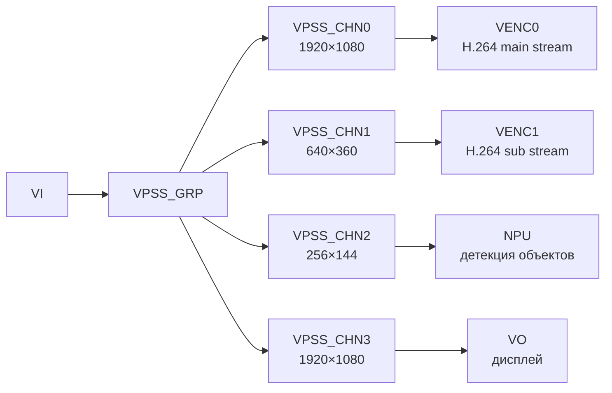

**Пример из rkipc** (`rv1126b_ipc/video.c`):
```c
// Один VPSS group, 4 канала — каждый со своим разрешением
stVpssGrpAttr.u32MaxW = 4096;
stVpssGrpAttr.u32MaxH = 4096;
stVpssGrpAttr.enPixelFormat = RK_FMT_YUV420SP;
stVpssGrpAttr.enVProcDev = VIDEO_PROC_DEV_VPSS;  // или GPU, или RGA

// CHN0 → VENC0 (main stream, 1080p)
stVpssChnAttr[0].u32Width = 1920;
stVpssChnAttr[0].u32Height = 1080;

// CHN1 → VENC1 (sub stream, 360p)
stVpssChnAttr[1].u32Width = 640;
stVpssChnAttr[1].u32Height = 360;

// CHN2 → NPU (детекция, 144p)
stVpssChnAttr[2].u32Width = 256;
stVpssChnAttr[2].u32Height = 144;

// CHN3 → VO (дисплей, 1080p)
stVpssChnAttr[3].u32Width = 1920;
stVpssChnAttr[3].u32Height = 1080;
```

**Выбирайте VPSS когда:**
1. **Нужно несколько разрешений одновременно** — main stream 1080p + sub stream 360p + NPU 144p. VPSS делает это за один проход, RGA потребует 3 вызова.
2. **Нужна интеграция в rockit bind-пайплайн** — `RK_MPI_SYS_Bind(VI→VPSS, VPSS→VENC)`. RGA нельзя забиндить.
3. **Нужно AFBC/RFBC сжатие** — экономия полосы памяти на 4K.
4. **Нужен aspect ratio с letterbox** — VPSS сам считает, RGA — нет.
5. **Нужна статистика яркости** (`GetRegionLuma`) — для автоэкспозиции.
6. **Нужен AI-ISP** — AI-улучшение изображения.

#### Когда выбирать RGA

**RGA — это "ручной 2D-процессор".** Главная фишка: **работает с любым dmabuf, вне rockit**.

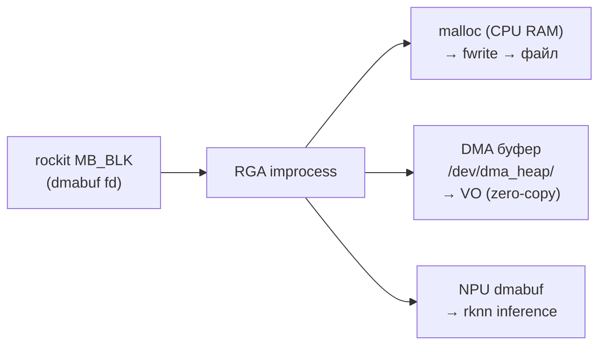

**Пример из `vi_grab_avs_dma.c`:**
```c
// src — dmabuf fd от rockit (AVS мега-кадр)
int src_fd = RK_MPI_MB_Handle2Fd(mb);
rga_buffer_t src = wrapbuffer_fd_t(src_fd, mega_w, mega_h, ...);

// dst — DMA буфер из /dev/dma_heap/ (НЕ rockit!)
dma_buf_alloc("/dev/dma_heap/system-uncached", size, &dst_fd, &dst_va);
rga_buffer_t dst = wrapbuffer_fd_t(dst_fd, out_w, out_h, ...);

// Один вызов — crop + rotate
im_rect srect = { .x = cam_w, .y = 0, .width = cam_w, .height = cam_h };
im_rect drect = { .width = out_w, .height = out_h };
improcess(src, dst, pat, srect, drect, prect, IM_HAL_TRANSFORM_ROT_90 | IM_SYNC);

// dst_fd теперь можно отправить в VO (MB_EXT) или NPU (rknn_set_io_mem)
```

**Выбирайте RGA когда:**
1. **Нужна обработка вне rockit-пайплайна** — наш `vi_grab_avs` берёт кадр из AVS, режет на 2 половинки, сохраняет в файл. VPSS так не умеет.
2. **Нужно передать кадр в NPU** — RGA режет/масштабирует в dmabuf, NPU читает через `rknn_set_io_mem`. VPSS отдаёт только rockit MB_BLK.
3. **Нужны alpha-blend / color key / color fill** — наложение OSD, логотипа, прозрачности.
4. **Нужна синхронная обработка** — `improcess(..., IM_SYNC)` ждёт завершения. VPSS — асинхронный.
5. **Нужен произвольный dmabuf** — из `/dev/dma_heap/`, от GPU, от другого процесса. VPSS — только rockit.
6. **Простая операция над одним кадром** — crop + rotate. Создавать VPSS group ради одного кадра — оверкилл.

#### VPSS на RV1126B — аппаратный блок есть

> **Исправление**: ранее здесь было неверное утверждение, что на RV1126B нет аппаратного VPSS. Это **ошибка**.

Согласно **RV1126B TRM V1.1 Part1** (rockchip.fr), в memory map:
- **VPSS** — `0x21D20000`, 64KB register space — аппаратный блок
- **VPSS_LITE** — `0x21D30000`, 64KB register space — лёгкая версия

И в rkipc ini-файлах для RV1126B (`rkipc-3840x2160.ini`, `rkipc-3200x1800.ini`, `rkipc-2688x1520.ini`):
```ini
[video.source]
vpss_proc_dev = vpss    ; ← VIDEO_PROC_DEV_VPSS (аппаратный), НЕ rga
```

То есть на RV1126B **по умолчанию используется аппаратный VPSS**, а не RGA-под-капотом.

`enVProcDev` может быть:
- `VIDEO_PROC_DEV_VPSS` — **аппаратный VPSS-блок** (по умолчанию в rkipc для RV1126B)
- `VIDEO_PROC_DEV_RGA` — fallback на RGA (если VPSS занят или не нужен)
- `VIDEO_PROC_DEV_GPU` — fallback на GPU

**Производительность**: аппаратный VPSS быстрее RGA для scale/crop (специализированный конвейер). Прямой вызов RGA (`improcess`) удобнее для одиночных операций вне rockit-пайплайна.

#### Архитектура VPSS: Group и Channel

> **Источник:** Rockchip Developer Guide MPI EN (`Rockchip_Developer_Guide_MPI_EN.docx.md`), раздел "VPSS Basic Concepts". Цитаты и номера строк приведены по markdown-экспорту.

**Group (группа) = входной поток** в VPSS. К группе привязывается **один** источник (VI/VDEC/AVS или ручная подача через `SendFrame`).

> *"Each group time-shares hardware devices; the hardware processes the tasks submitted by each group in turn."* (стр. 10176-10178)

> *"Each Group can only be bound to one input source."* (стр. 10467-10468)

**Channel (канал) = выход** из группы. Все каналы одной группы получают **один и тот же вход**, но каждый выдаёт свой размер/формат/rotate/crop.

> *"VPSS group's channel. Provides multiple channels, each with scaling, cropping and other functions. Scales the image to the target resolution set by the user."* (стр. 10180-10184)

**Лимиты на RV1126B** (`external/rockit/lib/arm64/rv1126b/rk_defines.h`):
```c
#define VPSS_MAX_GRP_NUM   256   // до 256 групп (входов)
#define VPSS_MAX_CHN_NUM     6   // до 6 каналов на группу (выходов)
```

**Схема:**

```
Сенсор 0 (VI) ──┐                          ┌─ CHN0 ──→ 1920×1080 NV12 ──→ VENC (запись)
                ├─→ GROUP 2 ──┬─ CHN0 ──→ │
                │             ├─ CHN1 ──→ │  (до 6 каналов, каждый со своим
                │             ├─ CHN2 ──→ │   scale/crop/rotate/format)
                │             ├─ CHN3 ──→ │
                │             ├─ CHN4 ──→ │
                │             └─ CHN5 ──→ │
                │                         │
Сенсор 1 (VI) ──┘                         │
                │                         │
                └─→ GROUP 3 ──┬─ CHN0 ──→ ┘  (то же для 2-й камеры)
                             ├─ CHN1 ──→
                             └─ ...    ──→
```

**Типичный пример — один сенсор, три потребителя:**
```
VI (1920×1080) → GROUP 0
                   ├─ CHN0: 1920×1080 NV12  → VENC (запись H264)
                   ├─ CHN1: 1280×720  NV12  → VO   (превью на дисплей)
                   └─ CHN2: 224×224   RGB   → NPU  (нейросеть)
```
Один вход — три разных выхода (запись, превью, AI). Без VPSS пришлось бы делать 3 захвата с сенсора.

**Что настраивается на каком уровне:**

| Уровень | Что | Пример API |
|---------|-----|-----------|
| **Group** | размер входа, формат, frame rate, **mirror, crop, rotation** | `SetGrpAttr`, `SetGrpCrop`, `SetGrpRotation`, `SetGrpMirror` |
| **Channel** | размер выхода, формат, scale, crop, **rotation, mirror, flip** | `SetChnAttr`, `SetChnCrop`, `SetChnRotation`, `SetChnMirror` |

**И группа, и канал имеют rotation.** Разница:
- `SetGrpRotation` — применяется к входу **до** каналов (один rotate → все каналы получают повёрнутый кадр)
- `SetChnRotation` — применяется к выходу **конкретного канала** (можно разные углы для разных каналов)

**Hardware device (на RV1126 — RGA по умолчанию, можно переключить на ISP):**

| Чип | Доступные device | По умолчанию |
|-----|------------------|--------------|
| RV1109/RV1126 | RGA, ISP | RGA |
| RV1103/RV1106 | RGA | RGA |
| RK356X | GPU, RGA | GPU |
| RK3588 | GPU, RGA | GPU |

> *"RV1109/RV1126 — RGA (Default Device), ISP"* (стр. 10302)

Переключение: `RK_MPI_VPSS_SetVProcDev(grp, VIDEO_PROC_DEV_ISP)`.

**Ограничения device на RV1126** (по китайскому оригиналу `Rockchip_Developer_Guide_MPI_CN.pdf` V2.13.3):

> **ВНИМАНИЕ:** английская версия документации (`Rockchip_Developer_Guide_MPI_EN.docx.md`) содержит **неверный перевод** строки про ISP device. Английская версия: *"Supports Scale Only Mirror/Flip Rotation Crop Cover/Mosaic Neither supported"* — двусмысленно, можно понять как "поддерживает Scale, Mirror/Flip, Rotation, Crop". Но китайский оригинал (стр. 5302): *"只支持Scale，Mirror/Flip、Rotation、Crop、Cover/Mosaic均不支持"* = **"Только поддерживает Scale. Mirror/Flip, Rotation, Crop, Cover/Mosaic — все не поддерживаются"**.

| Device | Scale | Mirror/Flip | Rotation | Crop | Mosaic | Overlay alpha | Доступен на RV1126 |
|--------|-------|-------------|----------|------|--------|---------------|---------------------|
| **RGA** (по умолч.) | да | да | (не документировано в VPSS) | да | нет | нет (YUV+alpha) | **да** |
| **ISP** | **да** | **НЕТ** | **НЕТ** | **НЕТ** | **НЕТ** | только OVERLAY_EX_RGN | **да** |
| **VPSS** | да | да | **только tile input** | да | нет | только OVERLAY_EX_RGN | **НЕТ** |

> Китайский оригинал, стр. 6621 (онлайн-конверсия) / стр. 5302 (pdfplumber): *"只支持Scale，Mirror/Flip、Rotation、Crop、Cover/Mosaic均不支持"* (ISP device: только Scale, остальное НЕ поддерживается)

> Китайский оригинал, стр. 6679 (онлайн) / стр. 5337 (pdfplumber): *"只有Tile模式的输入图像支持旋转，其他图像格式不支持"* (VPSS device: только Tile input поддерживает rotation)

**VGS** поддерживает rotation (стр. 20211: *"VGS⽀持对⼀幅图像进⾏0、90、180、270⻆度的旋转"*), и в отличие от VPSS-rotate — **VGS можно использовать напрямую** через `RK_MPI_VGS_*` API (не только в PAST mode).

**VGS rotation API** (доступен в нашем SDK, `external/rockit/mpi/sdk/include/rk_mpi_vgs.h`):

```c
VGS_HANDLE hHandle;
VGS_TASK_ATTR_S stTask = {0};
// stTask.stImgIn.stVFrame  = входной кадр (VIDEO_FRAME_S с MB_BLK)
// stTask.stImgOut.stVFrame = выходной кадр (для 90/270 — width/height меняются местами)

RK_MPI_VGS_BeginJob(&hHandle);
RK_MPI_VGS_AddRotationTask(hHandle, &stTask, ROTATION_90);
RK_MPI_VGS_EndJob(hHandle);
// → кадр повёрнут аппаратно VGS, результат в stTask.stImgOut
```

Пример в SDK: `external/rockit/mpi/example/mod/test_mpi_vgs.cpp` (стр. 177-237, функция `unit_test_vgs_generate_rotation_task`).

**Сравнение способов rotate на RV1126:**

| Способ | Доступен? | Где работает | API |
|--------|-----------|--------------|-----|
| **RGA напрямую** (`improcess`) | **да** ✓ | вне rockit | `improcess()` (librga) |
| **VGS напрямую** (`RK_MPI_VGS_*`) | **да** (в SDK) | внутри rockit | `RK_MPI_VGS_AddRotationTask` |
| VPSS `SetChnRotation` + RGA device | нет | — | (не документировано) |
| VPSS `SetChnRotation` + ISP device | нет | — | (ISP: только Scale) |
| VPSS `SetChnRotation` + VPSS device | нет | — | (VPSS device недоступен, tile-only) |
| VPSS `SetGrpRotation` | нет | — | (те же ограничения device) |

**Вывод для rotate на RV1126:** VPSS rotate **не работает** ни на одном доступном device:
- ISP device — только Scale, rotation **НЕ поддерживается** (китайский оригинал стр. 6621)
- RGA device — rotate в VPSS context не документирован
- VPSS device — недоступен на RV1126 (tile-only rotate, стр. 6679)
- VGS через VPSS — только PAST mode (стр. 7769)

**Доступные альтернативы для rotate:**
1. **RGA напрямую** (`improcess`) — доказанно работает, используется в наших программах
2. **VGS напрямую** (`RK_MPI_VGS_AddRotationTask`) — есть в SDK, не тестировали

> **Документация не покрывает RV1126B:** список поддерживаемых чипов в V2.13.3 (2024.10): RK3506, RK3308, RV1106/RV1103, RV1106B/RV1103B. **RV1126/RV1126B отсутствует** в списке, хотя упоминается в тексте. Возможно документация устаревшая или неполная для RV1126B.

#### Восстановленная картина VPSS на RV1126B (из SDK-первоисточников)

Поскольку документация скомпрометирована (неверный английский перевод + RV1126B отсутствует в списке), картина восстановлена из **первоисточников SDK**:

**1. `rk_defines.h` — автоматически сгенерированный конфиг** (`external/rockit/lib/arm64/rv1126b/rk_defines.h`):

```c
/* Automatic generated [rv1126b] config */
#define VPSS_MAX_GRP_NUM               256
#define VPSS_MAX_CHN_NUM               6
#define VPSS_VIDEO_PROC_DEVICE_TYPE    3   /* ← VIDEO_PROC_DEV_VPSS */
```

Сравнение по чипам (`VPSS_VIDEO_PROC_DEVICE_TYPE`):

| Чип | Значение | Device по умолчанию |
|-----|----------|---------------------|
| RK3308 | 1 | RGA |
| RK3506 | 1 | RGA |
| RV1106 | 1 | RGA |
| **RV1126B (arm32)** | **3** | **VPSS** |
| **RV1126B (arm64)** | **3** | **VPSS** |
| RK3588 | 0 | GPU |

**RV1126B — единственный чип с `VIDEO_PROC_DEV_VPSS` (3) по умолчанию.** Аппаратный VPSS блок на RV1126B **есть** и используется по умолчанию.

**2. `librockit.so` — строки ошибок** (извлечены `strings` из `external/rockit/lib/arm64/rv1126b/linux/librockit.so`):

Ключевые находки:
- **`online not support rotate.`** — online mode не поддерживает rotate
- **`online not support mirror.`** — online mode не поддерживает mirror
- **`rkvpss-offline`** — есть offline устройство VPSS
- **`findVpssOfflineDev`** — функция поиска offline устройства
- **`/dev/mpi/gdc`** + **`create gdc failed for chn(%d)`** — **GDC используется для rotate**
- **`set grp[%d] rotation[%d] failed`** / **`VPSS[%d] set rotation[%d] failed`** — rotate API есть
- **`Handle:%d enVProcDev:%d is not support`** — проверка device с fallback
- **`/sys/module/video_rkisp/parameters/m_online`** — параметр ядра online/offline

**3. `rkadk_media_comm.c` — комментарий Rockchip** (`external/rockit/mpi/sdk/include/...`, строка 879):

```c
stModParam.stExtChnParam.mirrorCmsc = 0; // 1 is for vpss offline, 0 is for vpss online(vi ext)
```

**Подтверждение:** на RV1126B есть **два режима VPSS**:
- **online** (`mirrorCmsc=0`, по умолчанию) — VPSS работает через VI ext channels
- **offline** (`mirrorCmsc=1`) — VPSS работает через отдельное offline устройство `rkvpss-offline`

**4. `rk_mpi_vpss.h` — API rotate** (`external/rockit/mpi/sdk/include/rk_mpi_vpss.h`):

```c
RK_S32 RK_MPI_VPSS_SetGrpRotation(VPSS_GRP VpssGrp, ROTATION_E enRotation);        // 0/90/180/270
RK_S32 RK_MPI_VPSS_SetChnRotation(VPSS_GRP VpssGrp, VPSS_CHN VpssChn, ROTATION_E enRotation);
RK_S32 RK_MPI_VPSS_SetChnRotationEx(VPSS_GRP VpssGrp, VPSS_CHN VpssChn,
            const VPSS_ROTATION_EX_ATTR_S* pstRotationExAttr);  // произвольный угол 0-360
```

**`SetChnRotationEx`** — rotate на **произвольный угол** (0-360) через GDC, с distortion center и dest size (`ROTATION_EX_S` в `rk_comm_video.h:623-640`).

**5. rkadk ini — реальные имена устройств** (`external/rockit/mpi/sdk/include/...`, `app/rkadk/inicfg/rv1126b/rkadk_setting_sensor_0.ini`):

```ini
[vi.0] device_name = rkvpss_scale0   # VI канал 0 — выход аппаратного VPSS
[vi.1] device_name = rkvpss_scale1   # VI канал 1
[vi.2] device_name = rkvpss_scale2   # VI канал 2
[vi.3] device_name = rkvpss_scale3   # VI канал 3
```

`rkvpss_scale0/1/2/3` — выходы **аппаратного VPSS блока**, встроенного в ISP pipeline.

#### Восстановленная картина: как работает VPSS на RV1126B

**Два разных "VPSS":**

| Что | Где | Управление | Rotate? |
|-----|-----|-----------|---------|
| **Аппаратный VPSS блок** (`rkvpss_scale0-3`) | Встроен в ISP pipeline, между ISP и VI | Через device-tree/media-ctl | **нет** (это VI каналы) |
| **Программный VPSS модуль rockit** (`RK_MPI_VPSS_*`) | Менеджер в `librockit.so` | Через MPI API | **зависит от mode** |

**Режимы программного VPSS модуля:**

| Режим | Как включается | Rotate | Mirror | Что использует |
|-------|---------------|--------|--------|----------------|
| **online** (по умолчанию) | `mirrorCmsc=0` | **НЕТ** | **НЕТ** | VI ext channels (аппаратный VPSS блок) |
| **offline** | `mirrorCmsc=1` | **ДА** (через GDC) | **ДА** | `rkvpss-offline` устройство + GDC |

**Почему наш тест `--vpss-rotate` не сработал:**

Наш код (`vi_grab_dual.c:521`) использует `VIDEO_PROC_DEV_VPSS` в **online mode** (по умолчанию). В online mode:
- `SetChnRotation(90)` → rockit логирует `online not support rotate.` → rotate игнорируется
- Кадр проходит через VI ext channels (аппаратный VPSS блок) без rotate
- RGA потом делает scale на неправильный размер → искажение

**Чтобы VPSS rotate заработал, нужно:**
1. Переключить VPSS в **offline mode** (`mirrorCmsc=1` через `RK_MPI_VI_SetModParam`)
2. Использовать `rkvpss-offline` устройство
3. Тогда `SetChnRotation(90)` будет использовать GDC для rotate

**Но это сложнее** чем RGA напрямую — нужно менять режим VI, что может повлиять на другие каналы.

#### VPSS offline через SendFrame — альтернативный путь

**Гипотеза:** Если кормить VPSS кадр вручную через `RK_MPI_VPSS_SendFrame` (без bind с VI), это **автоматически включает offline mode** — rotate должен заработать через GDC.

**Доказательство из SDK** (`external/rockit/mpi/example/common/test_mod_vpss.cpp`):

Пример `TEST_VPSS_ModInit` показывает полный цикл **без bind с VI**:
```c
// 1. Создать группу (без RK_MPI_SYS_Bind с VI!)
TEST_VPSS_Start(grp, chnNum, &grpAttr, chnAttr);

// 2. Установить device
RK_MPI_VPSS_SetVProcDev(grp, VIDEO_PROC_DEV_VPSS);

// 3. Установить rotate
RK_MPI_VPSS_SetGrpRotation(grp, ROTATION_90);        // group rotate
TEST_VPSS_SetChnRotation(grp, chn, ROTATION_90);     // channel rotate
TEST_VPSS_SetChnRotationEx(grp, chn, rotationEx);    // произвольный угол

// 4. Подать кадр вручную (вместо bind с VI)
RK_MPI_VPSS_SendFrame(grp, 0, &videoFrame, -1);

// 5. Получить обработанный кадр
RK_MPI_VPSS_GetChnFrame(grp, chn, &frameOut, -1);
// → кадр повёрнут аппаратно через GDC
```

**Ключевое:** в примере `TEST_VPSS_Start` (`test_comm_vpss.cpp:51-91`) **нет `RK_MPI_SYS_Bind`** — группа создаётся без привязки к VI. Кадры подаются через `SendFrame`. Это и есть **offline mode**.

**Доказательство из `librockit.so`:**
- `vpss_send_frame` — функция подачи кадра
- `findVpssOfflineDev` — поиск offline устройства
- `rkvpss-offline` — offline устройство
- `gdc_send_frame` — GDC принимает кадр для rotate
- `create gdc success for chn(%d)` — GDC создаётся для канала
- `prep:rotation` — подготовка rotation

**Логика:** когда VPSS группа не привязана к VI (нет bind), rockit использует `rkvpss-offline` устройство вместо online VI ext channels. В offline mode rotate работает через GDC.

**Сравнение online vs offline (через SendFrame):**

| Параметр | online (bind с VI) | offline (SendFrame) |
|----------|---------------------|---------------------|
| Подача кадра | `RK_MPI_SYS_Bind(VI→VPSS)` | `RK_MPI_VPSS_SendFrame(grp, ...)` |
| Устройство | VI ext channels (`rkvpss_scale0-3`) | `rkvpss-offline` |
| Rotate | **НЕТ** (`online not support rotate`) | **ДА** (через GDC) |
| Mirror | **НЕТ** | **ДА** |
| Scale | да | да |
| Crop | да | да |
| Копирование пикселей | **нет** (zero-copy) | **нет** (zero-copy — передаётся MB_BLK) |
| Управление буфером | rockit сам | вручную (держать до GetChnFrame) |
| Сложность | низкая | средняя |

**Важно: копирования пикселей НЕТ в обоих режимах.** Кадр живёт в железе (MMZ/dmabuf). Передаётся **дескриптор** `MB_BLK`, не сами пиксели:

```c
// VI отдаёт дескриптор буфера (не пиксели)
RK_MPI_VI_GetChnFrame(viDev, viChn, &viFrame, -1);
// viFrame.stVFrame.pMbBlk — дескриптор (указатель на буфер в MMZ)

// Отдаём тот же дескриптор в VPSS (zero-copy!)
RK_MPI_VPSS_SendFrame(vpssGrp, 0, &viFrame, -1);

// VPSS/GDC работают с тем же буфером через IOMMU (аппаратный доступ к памяти)
```

Это **тот же принцип** что мы используем сейчас для RGA:
```c
// Наш текущий код (vi_grab_dual.c:380)
int src_fd = RK_MPI_MB_Handle2Fd(src_mb);   // dmabuf fd из MB_BLK
wrapbuffer_fd_t(src_fd, ...);                // RGA работает с тем же буфером
```

**Разница online vs offline — не в копировании, а в управлении буфером:**
- **online (bind):** rockit сам управляет — VI отдаёт кадр VPSS, VPSS отдаёт дальше, буфер возвращается в пул VI автоматически
- **offline (SendFrame):** приложение управляет — нужно держать `viFrame` (не вызывать `ReleaseChnFrame`) пока VPSS не закончит обработку (после `GetChnFrame` из VPSS)

**Минус offline через SendFrame:** нужно вручную управлять временем жизни буфера — не освобождать VI кадр пока VPSS не отдаст результат. В online mode rockit делает это сам.

**Как это применимо к нам:**

Наш пайплайн сейчас: `VI → VPSS (online, scale) → RGA (rotate) → VO`

Альтернатива через offline: `VI → app → VPSS (offline, scale+rotate via GDC) → VO`

```c
// Получаем кадр из VI
RK_MPI_VI_GetChnFrame(viDev, viChn, &viFrame, -1);

// Подаём в VPSS (offline mode, без bind)
RK_MPI_VPSS_SendFrame(vpssGrp, 0, &viFrame, -1);

// Получаем повёрнутый+отмасштабированный кадр
RK_MPI_VPSS_GetChnFrame(vpssGrp, vpssChn, &outFrame, -1);
// → outFrame уже повёрнут на 90° и отмасштабирован до 720×1280

// Отдаём в VO
RK_MPI_VO_SendFrame(voLayer, voChn, &outFrame, -1);
```

**Преимущества над RGA:**
- Rotate + scale **за один проход** аппаратно (GDC + VPSS)
- Не занимает RGA (RGA свободен для других задач — OSD, bounding boxes)
- Fan-out: один VPSS group → несколько каналов (VO + RKNN с разными размерами)
- **Zero-copy** — кадр передаётся как MB_BLK (дескриптор), не копируется

**Недостатки:**
- Нужно вручную управлять временем жизни буфера (держать VI кадр пока VPSS не отдаст результат)
- Нужно тестировать (не доказано что работает на RV1126B)
- Сложнее код

**Статус:** гипотеза, основанная на SDK примере и строках из `librockit.so`. **Требует тестирования на плате.**

#### Проверка на плате (реальные данные)

Плата ожила — проверили напрямую через SSH (`ssh rock`):

**1. Аппаратный VPSS блок есть и включён** (`/proc/device-tree/vpss@21d20000/`):
```
compatible = "rockchip,rv1126b-rkvpss"
status = "okay"
```
Адрес `0x21d20000` совпадает с TRM. Прерывания работают:
```
128: ... GICv2 194 Level  rkvpss_hw
129: ... GICv2 193 Level  rkvpss_hw
```

**2. Два виртуальных VPSS устройства** (по одному на сенсор):
```
/dev/mpi/rkvpss-vir0   # сенсор 0
/dev/mpi/rkvpss-vir1   # сенсор 1
```

**3. Media topology** (`media-ctl -d /dev/media4 -p`):
```
driver: rkvpss-vir0
model:  rkvpss0
rkvpss-subdev (2 pads, 7 links)
  ├─ rkvpss_scale0 [ENABLED]   # /dev/video39
  ├─ rkvpss_scale1 [ENABLED]   # /dev/video40
  ├─ rkvpss_scale2 [ENABLED]   # /dev/video41
  ├─ rkvpss_scale3 [ENABLED]   # /dev/video42
  ├─ rkvpss_scale4 [ENABLED]   # /dev/video43
  └─ rkvpss_scale5 [ENABLED]   # /dev/video44
```
**6 каналов** на каждый сенсор — совпадает с `VPSS_MAX_CHN_NUM = 6` из `rk_defines.h`.

**4. `rkvpss-offline` устройства НЕТ на плате:**
```
/dev/mpi/ — только rkvpss-vir0, rkvpss-vir1 (нет rkvpss-offline)
/proc/device-tree/ — только vpss@21d20000, rkvpss-vir0, rkvpss-vir1
```
Но в `librockit.so` есть строки `rkvpss-offline` и `findVpssOfflineDev` — это **логическое имя** внутри rockit, не device-tree устройство. Rockit ищет offline устройство через `/sys/class/video4linux/` по имени.

**5. Online/offline параметр ядра:**
```
/sys/module/video_rkisp/parameters/m_online = N,N,N,N,N,N,N,N
```
Все 8 параметров = `N` (offline). Но это параметр ISP, не VPSS.

**6. GDC устройство есть:**
```
/dev/mpi/gdc
```
GDC доступен — может делать rotate.

**7. Все MPI устройства:**
```
/dev/mpi/: aiisp avs gdc ivs rkcif-mipi-lvds rkcif-mipi-lvds2
           rkisp-vir0 rkisp-vir1 rkvpss-vir0 rkvpss-vir1
           valloc venc vlog vpss vrga vrgn vsys vvi
```

#### Уточнённая картина: online vs offline на RV1126B

**`rkvpss-vir0/1` — это и есть "online" VPSS** (встроен в ISP pipeline):
- VI каналы `rkvpss_scale0-5` — выходы аппаратного VPSS блока
- Кадр идёт: `Сенсор → CSI → ISP → VPSS (rkvpss-vir) → VI → приложение`
- Rotate **НЕ работает** (`online not support rotate`)

**`rkvpss-offline` — логическое устройство для offline mode** (не в device-tree):
- Rockit ищет его через `findVpssOfflineDev` по `/sys/class/video4linux/`
- В offline mode кадр подаётся через `RK_MPI_VPSS_SendFrame`
- Rotate **работает** через GDC

**Гипотеза:** `rkvpss-offline` — это **тот же `rkvpss-vir0/1`**, но используемый в другом режиме (через `RK_MPI_VPSS_SendFrame` вместо bind с VI). Rockit переключает VPSS блок в offline режим через `RKVPSS_CMD_MODULE_SEL` ioctl (строка `set vpss module sel failed` в librockit.so).

**Параметр `mirrorCmsc`** (из `rkadk_media_comm.c:879`):
```c
stModParam.stExtChnParam.mirrorCmsc = 0; // 1 is for vpss offline, 0 is for vpss online(vi ext)
```
- `mirrorCmsc=0` (online) — VI ext channels используют `rkvpss_scale0-5` напрямую
- `mirrorCmsc=1` (offline) — VPSS переключается в offline режим, rotate через GDC

**Восстановленная схема VPSS на RV1126B:**

```
                    ┌─────────────────────────────────────┐
                    │  Аппаратный VPSS блок (0x21d20000)  │
                    │  rkvpss_hw (2 IRQ)                  │
                    └────────┬────────────────────────────┘
                             │
                    ┌────────┴────────┐
                    │  rkvpss-vir0/1  │  (виртуальные устройства)
                    │  /dev/media4/5  │
                    └────────┬────────┘
                             │
              ┌──────────────┴──────────────┐
              │                              │
        online mode                    offline mode
        (bind с VI)                    (SendFrame)
        mirrorCmsc=0                   mirrorCmsc=1
              │                              │
              ▼                              ▼
    rkvpss_scale0-5                 rkvpss-offline
    (VI ext channels)               (логическое устройство)
              │                              │
              ▼                              ▼
    VI → приложение                 GDC (rotate) → приложение
    Rotate: НЕТ                     Rotate: ДА
```

#### Сводная таблица: rotate на RV1126B (восстановленная)

| Способ | Режим | Работает? | Через что | Сложность |
|--------|-------|-----------|-----------|-----------|
| **RGA напрямую** (`improcess`) | любой | **да** ✓ | RGA hardware | низкая |
| **VGS напрямую** (`RK_MPI_VGS_*`) | любой | да (в SDK) | VGS hardware | средняя |
| **VPSS `SetChnRotation`** | online | **НЕТ** | — | — |
| **VPSS `SetChnRotation`** | offline | **да** (теоретически) | GDC hardware | высокая |
| **VPSS `SetChnRotationEx`** | offline | да (произвольный угол) | GDC hardware | высокая |
| **VPSS `SetGrpRotation`** | offline | да (теоретически) | GDC hardware | высокая |

**Текущий выбор:** RGA напрямую — доказанно работает, просто, не требует смены режима VI.
**Альтернатива для будущего:** VPSS offline + GDC rotate — аппаратно, без RGA, но требует переключения режима.

#### Сводная таблица: VPSS vs RGA

| Критерий | **VPSS** | **RGA** |
|----------|----------|---------|
| **Где живёт** | Внутри rockit (`librockit.so`) | Отдельная библиотека (`librga.so`) |
| **API** | `RK_MPI_VPSS_*` (rockit MPI) | `improcess()`, `wrapbuffer_fd_t()` (im2d) |
| **Вход** | `RK_MPI_VPSS_SendFrame` (rockit MB_BLK) | `wrapbuffer_fd_t(dmabuf_fd, ...)` (любой dmabuf) |
| **Выход** | `RK_MPI_VPSS_GetChnFrame` (rockit MB_BLK) | `rga_buffer_t dst` (любой dmabuf) |
| **Fan-out** | **1 → 4 канала** (разные разрешения) | 1 → 1 (один blit за вызов) |
| **Bind** | `RK_MPI_SYS_Bind(VI→VPSS, VPSS→VENC)` | нет (вне rockit) |
| **Аппаратный блок** | На RV1126B — **аппаратный VPSS** (`0x21D20000`) + VPSS_LITE (`0x21D30000`), по умолчанию `VIDEO_PROC_DEV_VPSS` | RGA2/RGA3 напрямую |
| **Compression** | AFBC_16x16, RFBC_64x4 | нет |
| **Aspect ratio** | `ASPECT_RATIO_AUTO/MANUAL` (auto letterbox) | вручную |
| **Alpha blend** | нет | да (src over pat) |
| **Color fill / key** | нет | да |
| **Синхронность** | Асинхронный пайплайн | `IM_SYNC` (синхро) или `IM_ASYNC` (callback) |
| **NPU integration** | Только через rockit MB_BLK | **Напрямую** (`rknn_set_io_mem.fd = dmabuf_fd`) |
| **Вне rockit** | ❌ (нужен `RK_MPI_SYS_Init`) | ✅ (можно без rockit) |
| **Оверхед** | Больше (слои rockit) | Меньше (прямой вызов) |
| **Когда использовать** | Multi-resolution fan-out в rockit-пайплайне | Кастомная обработка, NPU, вне rockit |

**На этой плате** (RV1126B + 2× GC2093):
- **AVS** — сшивание двух камер в мега-кадр 3840×1080 (`vi_grab_avs`, `vi_grab_avs_dma`)
- **RGA** — нарезка мега-кадра на половинки + поворот (`vi_grab_avs --split`, `vi_grab_avs_dma`)
- **VPSS** — **не используется** в наших программах. Был бы нужен если бы мы делали IPC-пайплайн (main+sub stream + NPU + display из одного кадра). rkipc использует VPSS именно так.

### RGA: рисование поверх кадра (OSD, bounding boxes, прямоугольники)

**ДА, RGA умеет рисовать прямоугольники** поверх растра — аппаратно, без CPU. Это нужно для выделения объектов после NPU-детекции (bounding boxes), OSD (on-screen display), масок приватности.

#### API рисования (`im2d_single.h`)

| Функция | Что делает | Аппаратно? |
|---------|------------|------------|
| `imfill(dst, rect, color)` | Залить прямоугольник цветом | Да (`IM_COLOR_FILL`) |
| `imfillArray(dst, rects[], n, color)` | Залить N прямоугольников одним цветом | Да (цикл `imfill`) |
| **`imrectangle(dst, rect, color, thickness)`** | **Нарисовать контур прямоугольника** (толщина линий) | Да (4× `imfill`) |
| **`imrectangleArray(dst, rects[], n, color, thickness)`** | **N прямоугольников-контуров** | Да (цикл `imrectangle`) |
| `immosaic(image, rect, mode)` | Замозаичить регион (`IM_MOSAIC_8/16/32/64/128`) | Да (только RGA2 Pro) |
| `immosaicArray(image, rects[], n, mode)` | N мозаичных регионов | Да |
| `imblend(fg, bg, mode)` | Alpha-blend поверх фона (`IM_ALPHA_BLEND_SRC_OVER`) | Да |
| `imcomposite(srcA, srcB, dst, mode)` | 3-channel blend (srcA + srcB → dst) | Да |
| `imcolorkey(src, dst, range, mode)` | Color-key transparency (зелёный экран) | Да |
| `imrop(src, dst, code)` | Raster OPeration (AND/OR/XOR) | Да |
| `imquantize(src, dst, nn_info)` | NPU-квантизация (для RKNN препроцессинга) | Да |
| `imgaussianBlur(src, dst, w, h, σ)` | Гауссово размытие | Да |
| `impalette(src, dst, lut)` | LUT-palette (палитра) | Да |
| `immakeBorder(src, dst, ...)` | Добавить рамку (как `cv::copyMakeBorder`) | Да |

#### Пример: bounding boxes после NPU-детекции

```c
/* Допустим, NPU вернул координаты объектов:
 *   {x=100, y=50, w=200, h=150}  — человек
 *   {x=400, y=80, w=120, h=90}   — машина
 * Рисуем красные контуры поверх кадра (NV12, 1920×1080) */

rga_buffer_t frame = wrapbuffer_fd_t(dmabuf_fd, 1920, 1080,
                                     1920, 1080, RK_FORMAT_YCbCr_420_SP);

im_rect boxes[2] = {
    { .x = 100, .y = 50,  .width = 200, .height = 150 },  /* person */
    { .x = 400, .y = 80,  .width = 120, .height = 90  },  /* car   */
};

/* Цвет в формате dst (NV12 = YUV). Красный в YUV: Y=76, U=84, V=255.
 * imfill/imrectangle принимают color как uint32 — для NV12 это
 * (V << 16) | (U << 8) | Y, но проще использовать RGBA-буфер для OSD. */
uint32_t red_yuv = (255 << 16) | (84 << 8) | 76;

IM_STATUS st = imrectangleArray(frame, boxes, 2, red_yuv, /*thickness=*/3, IM_SYNC);
if (st != IM_STATUS_SUCCESS)
    fprintf(stderr, "imrectangleArray failed: %d\n", (int)st);
```

#### Как `imrectangle` работает внутри

`imrectangle` — это **4 вызова `imfill`** (верх, низ, лево, право):

```c
IM_STATUS imrectangle(rga_buffer_t dst, im_rect rect,
                      uint32_t color, int thickness, int sync) {
    if (thickness < 0)
        return imfill(dst, rect, color, sync);  /* filled */

    int h_length = rect.width;
    int v_length = rect.height - 2 * thickness;
    im_rect fill_rect[4] = {
        {rect.x,                          rect.y,                          h_length, thickness},  /* top    */
        {rect.x,                          rect.y + rect.height - thickness, h_length, thickness},  /* bottom */
        {rect.x,                          rect.y + thickness,              thickness, v_length},   /* left   */
        {rect.x + rect.width - thickness, rect.y + thickness,              thickness, v_length},   /* right  */
    };
    return imfillArray(dst, fill_rect, 4, color, sync);
}
```

То есть контур толщиной 3px = 4 аппаратных `IM_COLOR_FILL` операции. Каждый `imfill` — это один вызов RGA через `/dev/rga` ioctl.

#### Поддержка на RV1126B

Все версии RGA (RGA_1, RGA_1_PLUS, RGA_2, RGA_2_LITE0/1/2, RGA_2_ENHANCE, RGA_2_PRO) поддерживают `IM_RGA_SUPPORT_FEATURE_COLOR_FILL`. RV1126B имеет RGA (точная версия определяется в runtime через `imqueryRGAMap()`), так что **`imfill`/`imrectangle` работают**.

Дополнительные фичи (зависят от версии RGA):
- `IM_RGA_SUPPORT_FEATURE_COLOR_PALETTE` — все версии (LUT-палитра)
- `IM_RGA_SUPPORT_FEATURE_ROP` — RGA_1, RGA_2, RGA_2_LITE0, RGA_2_ENHANCE, RGA_2_PRO
- `IM_RGA_SUPPORT_FEATURE_MOSAIC` — **только RGA_2_PRO** (мозаика для масок приватности)
- `IM_RGA_SUPPORT_FEATURE_OSD` — только RGA_2_PRO
- `IM_RGA_SUPPORT_FEATURE_ALPHA_BIT_MAP` — только RGA_2_PRO

#### Цвет в NV12 (YUV) vs RGBA

RGA `imfill` принимает `uint32_t color`. Формат цвета зависит от pixel format буфера:

| Формат буфера | Цвет | Пример (красный) |
|---------------|------|-------------------|
| `RK_FORMAT_RGBA_8888` | `0xRRGGBBAA` | `0xFF0000FF` (R=255, G=0, B=0, A=255) |
| `RK_FORMAT_BGRA_8888` | `0xBBGGRRAA` | `0x0000FFFF` |
| `RK_FORMAT_YCbCr_420_SP` (NV12) | `0x00VUY` или `0xVUY` | Y=76, U=84, V=255 → `0xFF544C` |

Для OSD удобнее использовать **RGBA-буфер** и alpha-blend его поверх YUV-кадра через `imblend` — так можно рисовать полупрозрачные прямоугольники.

#### Полный пайплайн: NPU-детекция → RGA-разметка → VO-дисплей

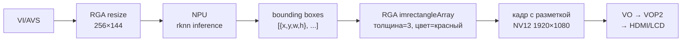

**Zero-copy**: кадр остаётся в DMA буфере на всём пути — RGA пишет прямо в dmabuf, VO читает из того же dmabuf.

#### Альтернативы для OSD

| Способ | Где | Плюсы | Минусы |
|--------|-----|-------|--------|
| **RGA `imrectangle`** | librga | Аппаратно, zero-copy, просто | Только прямоугольники |
| **RGN (Region)** | rockit MPI (`RK_MPI_RGN_*`) | Интеграция в bind-пайплайн, overlay на VO layer | Сложнее, только для VO |
| **CPU + RGBA overlay** | приложение | Любые фигуры, текст (FreeType) | Медленно, CPU copy |
| **GPU (OpenGL ES)** | приложение | Любые фигуры, шейдеры | Сложнее, нужен EGL context |

Для простых bounding boxes после NPU — **RGA `imrectangleArray`** оптимально: один вызов, аппаратно, zero-copy.

### Зона действия VPSS: что может, что не может

VPSS — это **внутренний узел rockit-пайплайна**. Его "зона действия" жёстко ограничена границами rockit.

#### Что VPSS МОЖЕТ

| Возможность | Куда | Источник в SDK |
|-------------|------|----------------|
| **Принимать кадр от AVS** (через bind) | VPSS_GRP (вход) | `RK_MPI_SYS_Bind(AVS→VPSS)` — работает в rkadk (`rkadk_record.c:1168`) |
| **Принимать кадр от VI** (через bind) | VPSS_GRP (вход) | `RK_MPI_SYS_Bind(VI→VPSS)` — стандартный путь |
| **Принимать кадр от VDEC** (через bind) | VPSS_GRP (вход) | для декодированного потока |
| **Принимать кадр вручную** (SendFrame) | VPSS_GRP (вход) | `RK_MPI_VPSS_SendFrame(grp, pipe, &frame, timeout)` — любой rockit MB_BLK |
| **Fan-out 1→4 канала** | VPSS_CHN0-3 (выходы) | `u32UseChnCnt`, `u32ChnMap[]` в `VPSS_GRP_ATTR_S` |
| **Scale на каждый канал** | VPSS_CHN0-3 | `stVpssChnAttr[i].u32Width/Height` |
| **Crop на каждый канал** | VPSS_CHN0-3 | `RK_MPI_VPSS_SetChnCrop(grp, chn, &crop)` |
| **Поворот 90/180/270 на канал** | VPSS_CHN0-3 | `RK_MPI_VPSS_SetChnRotation(grp, chn, ROTATION_90)` |
| **Mirror + Flip** | VPSS_CHN0-3 | `bMirror`, `bFlip` в `VPSS_CHN_ATTR_S` |
| **AFBC/RFBC compression** | VPSS_GRP | `enCompressMode = COMPRESS_RFBC_64x4` |
| **Aspect ratio с letterbox** | VPSS_CHN | `stAspectRatio` в `VPSS_CHN_ATTR_S` |
| **Передать на VO** (через bind) | VO | `RK_MPI_SYS_Bind(VPSS→VO)` — работает в rkadk (`rkadk_disp.c:328`) |
| **Передать на VENC** (через bind) | VENC | `RK_MPI_SYS_Bind(VPSS→VENC)` — стандарт |
| **Передать на NPU?** | ❌ НЕТ напрямую | NPU не rockit-модуль (`RK_ID_NPU` нет в `MOD_ID_E`) |
| **Получить кадр вручную** | приложение | `RK_MPI_VPSS_GetChnFrame(grp, chn, &frame, timeout)` → MB_BLK |
| **Выбор железа** | RV1126B | `enVProcDev = VIDEO_PROC_DEV_VPSS` (по умолчанию, аппаратный) / `RGA` / `GPU` |

#### Что VPSS НЕ МОЖЕТ

| Ограничение | Почему | Альтернатива |
|-------------|--------|--------------|
| **Принимать кадр от RGA** (через bind) | RGA — не rockit-модуль для bind (`RK_ID_RGA` есть в enum, но bind RGA→VPSS не реализован) | RGA → `RK_MPI_VPSS_SendFrame()` вручную (нужно обернуть dmabuf в MB_BLK через `MB_EXT`) |
| **Принимать произвольный dmabuf** | VPSS работает только с rockit MB_BLK | Использовать `RK_MPI_SYS_MbAlloc` + `MB_EXT` для обёртки внешнего dmabuf |
| **Отправить в DRM напрямую** | DRM — kernel subsystem, не rockit-модуль | Только через VO: `VPSS→VO→VOP2→DRM` |
| **Отправить в NPU напрямую** | NPU — отдельный SDK (RKNN), не rockit-модуль | `RK_MPI_VPSS_GetChnFrame` → `RK_MPI_MB_Handle2Fd` → `rknn_set_io_mem.fd` |
| **Работать вне rockit** | Нужен `RK_MPI_SYS_Init()` | Для вне-rockit обработки — RGA |
| **Больше 4 каналов** | `VPSS_MAX_CHN_NUM = 4` (CHN0-3) | Создать второй VPSS_GRP и забиндить тот же источник |

#### Может ли AVS-кадр пойти на VPSS для fan-out? — ДА

Это **стандартный путь** в rkadk для PiP (picture-in-picture):

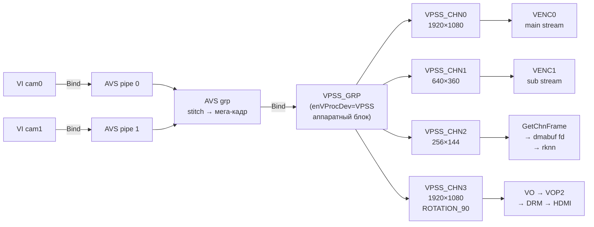

Код из rkadk (`rkadk_record.c:1166-1200`):
```c
// AVS → VPSS (мега-кадр идёт на VPSS для fan-out)
ret = RK_MPI_SYS_Bind(&stAvsChn, &stDstVpssChn);   // AVS chn → VPSS grp

// VPSS → VENC (один из каналов VPSS → энкодер)
ret = RK_MPI_MPI_SYS_Bind(&stSrcVpssChn, &stDestChn); // VPSS chn → VENC

// VI → AVS (две камеры на вход AVS)
ret = RK_MPI_SYS_Bind(&stSrcChn, &stAvspipe0Chn);     // VI cam0 → AVS pipe 0
ret = RK_MPI_SYS_Bind(&stAvsSubViChn, &stAvspipe1Chn); // VI cam1 → AVS pipe 1
```

#### Может ли кадр пойти на VPSS через RGA? — только вручную

**RGA не может быть источником bind** для VPSS (нет bind RGA→VPSS в rockit). Но можно вручную:

```c
// 1. RGA обрабатывает кадр в DMA буфер
improcess(src, dst, ...);  // dst — dmabuf_fd

// 2. Обернуть dmabuf в rockit MB_BLK (MB_EXT)
MB_BLK mb = RK_MPI_SYS_MbAlloc(...);  // или MB_EXT с внешним fd
// заполнить VIDEO_FRAME_INFO_S из dst

// 3. Отправить в VPSS вручную
RK_MPI_VPSS_SendFrame(vpssGrp, pipe, &frame, timeout);

// 4. VPSS делает fan-out на свои каналы
```

Это **не zero-copy в чистом виде** — нужен MB_EXT (внешний буфер в rockit). Но копирования данных нет, только обёртка.

**Проще**: если нужен fan-out после RGA, сделать **два вызова RGA** (crop+rotate для каждого потребителя). RGA быстрее для простых операций, чем VPSS+RGA-под-капотом.

#### Может ли VPSS отправить на дисплей минуя VO? — НЕТ

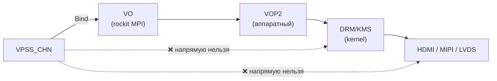

**VPSS не может биндиться на DRM** — DRM не rockit-модуль (`RK_ID_DRM` нет в `MOD_ID_E`). Единственный путь к физическому дисплею через rockit — **VO**:

```c
// VPSS → VO (стандартный путь к дисплею)
MPP_CHN_S src = { .enModId = RK_ID_VPSS, .s32DevId = vpssGrp, .s32ChnId = vpssChn };
MPP_CHN_S dst = { .enModId = RK_ID_VO,   .s32DevId = voLayer, .s32ChnId = voChn   };
RK_MPI_SYS_Bind(&src, &dst);
```

VO под капотом делает `ioctl()` в DRM-драйвер VOP2. То есть **VPSS→VO→VOP2→DRM** — это не "через VO", а "VO и есть интерфейс к DRM в rockit".

#### Если нужен прямой DRM (минуя VO)

Если вы хотите управлять DRM-плоскостями напрямую (например, для композиции с другими приложениями через DRM master), то **VPSS тут не поможет**. Нужно:

```c
// 1. Получить кадр из VPSS (или AVS, или VI)
RK_MPI_VPSS_GetChnFrame(grp, chn, &frame, timeout);  // → MB_BLK
int dmabuf_fd = RK_MPI_MB_Handle2Fd(frame.stVFrame.u64MbBlk);

// 2. Открыть DRM напрямую (минуя VO)
int drm_fd = open("/dev/dri/card0", O_RDWR);
// drmModeAddFB2(drm_fd, dmabuf_fd, ...) → DRM framebuffer
// drmModeSetPlane(...) → показать на экране
```

Но это **дублирует логику VO** — VO уже делает то же самое через VOP2. Проще использовать VO.

#### Сводка: зона действия VPSS

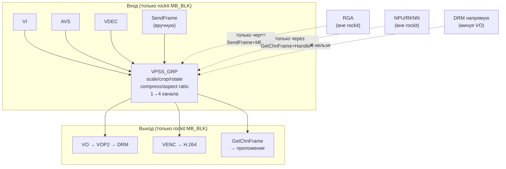

**VPSS — это "остров" в rockit**: входит через rockit-bind (или SendFrame), выходит через rockit-bind (или GetChnFrame). Всё, что вне rockit (RGA, NPU, DRM), требует ручной перекладки через dmabuf fd.

### VO vs VOP2 vs DRM — в чём разница?

| | **VO** | **VOP2** | **DRM/KMS** |
|---|---|---|---|
| **Уровень** | API (rockit MPI) | Аппаратный блок | Linux kernel subsystem |
| **Что делает** | `RK_MPI_VO_SendFrame`, `RK_MPI_VO_BindLayer`, ... | Композиция слоёв → вывод на дисплей | Управление плоскостями/CRTC/encoder/connector |
| **Зависимость** | Использует VOP2 под капотом | Экспортируется через DRM в Linux | Драйвер VOP2 регистрируется как DRM-драйвер |
| **Слои** | `VO_LAYER_CLUSTER0-3`, `VO_LAYER_ESMART0-3`, `VO_LAYER_VIRTUAL0-3` | Cluster, Smart, Esmart (аппаратные) | DRM planes (primary, overlay, cursor) |
| **Интерфейсы** | `VO_INTF_HDMI`, `VO_INTF_MIPI`, `VO_INTF_LVDS`, ... | Те же (аппаратно) | DRM connectors (HDMI, MIPI DSI, LVDS, ...) |

**Иерархия на RV1126B:**
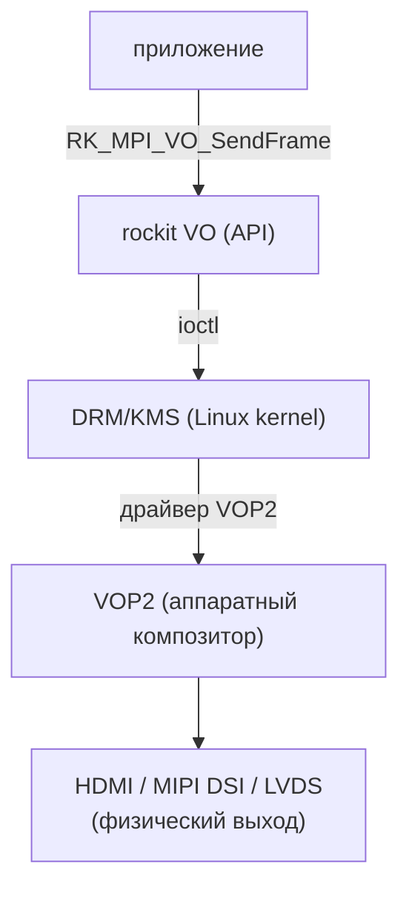

**На RV1126B** (из rkipc `rv1126b_dual_ipc`):
- `g_vo_dev_id = 3` — устройство VO (HDMI на этой плате)
- `g_vo_layer_id = 0` — слой (Cluster0)
- `VO_INTF_MIPI` — интерфейс (MIPI DSI для LCD-панели)
- `VO_OUTPUT_DEFAULT` — тайминг определяется из DTS/device
- `VO_LAYER_MODE_GRAPHIC` — графический слой (RGB888)
- `VO_SPLICE_MODE_RGA` — композиция нескольких каналов через RGA
- `ROTATION_90` — поворот для портретной LCD-панели

### NPU (RKNN) — отдельный мир

NPU **не часть rockit MPI** — нет заголовков `rk_mpi_npu.h` или `rk_comm_npu.h`. NPU доступен через отдельный **RKNN SDK** (`external/rknpu2/`).

**Интеграция с rockit-пайплайном — через dmabuf (zero-copy):**

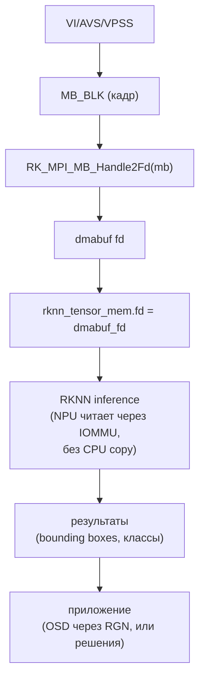

`librga.so` (arm64) берётся из `external/rknpu2/examples/3rdparty/rga/libs/Linux/gcc-aarch64/` — RGA используется и в rockit-пайплайне, и в RKNN-примерах для препроцессинга (resize кадра под вход NPU).

### Полный пайплайн на этой плате (RV1126B + 2× GC2093)

> **Важно:** Cam0 (0x37) — **IR матрица** (монохромная, module-name="IR"), Cam1 (0x7e) — **цветная** (module-name="default"). Оба чипа GC2093, но cam0 физически без Bayer CFA → отдаёт grayscale даже в формате NV12. Подробнее: [Cam0 = IR (grayscale)](#cam0--ir-grayscale-аппаратное-ограничение).

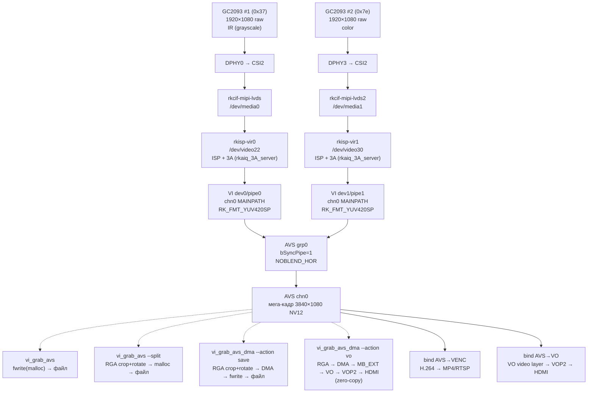

**Пунктир** — наши CLI-программы (ручной захват + RGA). **Сплошная** — rockit bind (автоматический пайплайн).

### Где что реализовано в SDK

| Компонент | SDK путь | API |
|-----------|----------|-----|
| VI | `external/rockit/mpi/sdk/include/rk_mpi_vi.h` | `RK_MPI_VI_*` |
| AVS | `external/rockit/mpi/sdk/include/rk_mpi_avs.h` | `RK_MPI_AVS_*` |
| VPSS | `external/rockit/mpi/sdk/include/rk_mpi_vpss.h` | `RK_MPI_VPSS_*` |
| VENC | `external/rockit/mpi/sdk/include/rk_mpi_venc.h` | `RK_MPI_VENC_*` |
| VO | `external/rockit/mpi/sdk/include/rk_mpi_vo.h` | `RK_MPI_VO_*` |
| SYS (bind, MB) | `external/rockit/mpi/sdk/include/rk_mpi_sys.h` | `RK_MPI_SYS_Bind`, `RK_MPI_SYS_CreateMB` |
| RGA | `external/linux-rga/im2d_api/im2d.h` | `improcess()`, `wrapbuffer_fd_t()` (НЕ rockit) |
| RKNN (NPU) | `external/rknpu2/include/` | `rknn_*` (НЕ rockit) |
| ISP/3A | `external/camera_engine_rkaiq/` | `rk_aiq_*` (демон `rkaiq_3A_server`) |
| DRM | Linux kernel (`/dev/dri/card0`) | `drmMode*` (libdrm, не используется напрямую) |

### Ключевые структуры (шпаргалка)

```c
// Кадр в rockit
VIDEO_FRAME_INFO_S {
    VIDEO_FRAME_S stVFrame {
        MB_BLK pMbBlk;              // дескриптор буфера (dmabuf внутри)
        RK_U32  u32Width, u32Height;
        RK_U32  u32VirWidth;        // stride (выравнивание)
        PIXEL_FORMAT_E enPixelFormat; // RK_FMT_YUV420SP, RK_FMT_RGB888, ...
        COMPRESS_MODE_E enCompressMode; // NONE, AFBC_16x16, RFBC_64x4
        DYNAMIC_RANGE_E enDynamicRange; // SDR8, SDR10, HDR10, HLG
        RK_U64  u64PTS;             // presentation timestamp (мкс)
    };
};

// Канал для bind
MPP_CHN_S {
    MOD_ID_E enModId;   // RK_ID_VI, RK_ID_AVS, RK_ID_VPSS, RK_ID_VENC, RK_ID_VO
    RK_S32   s32DevId;  // device/group id
    RK_S32   s32ChnId;  // channel id
};

// Внешний dmabuf (zero-copy с RGA/NPU)
MB_EXT_CONFIG_S {
    RK_U8   *pu8VirAddr;  // mmap'd адрес
    RK_U64   u64PhyAddr;  // 0 — rockit получит из dmabuf
    RK_S32   s32Fd;       // dmabuf fd из /dev/dma_heap/
    RK_U64   u64Size;
    RK_MPI_MB_FREE_CB pFreeCB;  // NULL — rockit не освобождает
};

// Атрибуты VO layer
VO_VIDEO_LAYER_ATTR_S {
    RECT_S          stDispRect;    // позиция на экране
    SIZE_S          stImageSize;   // размер canvas
    RK_U32          u32DispFrmRt;  // fps
    PIXEL_FORMAT_E  enPixFormat;   // RK_FMT_RGB888 / RK_FMT_YUV420SP
    COMPRESS_MODE_E enCompressMode;
    DYNAMIC_RANGE_E enDstDynamicRange;
};
```

---

## Сборка

Репозиторий **не включает SDK** — заголовки и `librockit.so` берутся из RV1126B SDK (см. [Источник](#источник)). Структура каталогов:

```
parent/
├── sdk/                          # RV1126B SDK (external/rockit, external/linux-rga, ...)
│   └── external/
│       ├── rockit/               # MPI: mpi/sdk/include/, lib/arm64/rv1126b/linux/librockit.so
│       └── linux-rga/            # RGA: im2d_api/, include/
└── rv1126b_temp/                 # этот репо
    ├── app/vi_grab_frame/        # исходники (4 программы + dma_alloc)
    ├── build.sh                  # сборка через zig cc
    ├── CMakeLists.txt            # сборка через cmake
    └── lib/                      # librga.so (с платы — в SDK её нет)
```

### Способ 1: build.sh (zig cc, рекомендуется)

```bash
# Установите zig (https://ziglang.org) — он умеет кросс-компиляцию aarch64-linux-gnu
# SDK_PATH по умолчанию = ../sdk (соседний каталог)

SDK_PATH=/path/to/sdk ./build.sh                  # собрать все 4 программы
SDK_PATH=/path/to/sdk ./build.sh vi_grab_avs      # только одну

# Результат: build/vi_grab_frame, build/vi_grab_avs, build/vi_grab_avs_dma, build/vi_grab_dual
```

**librga.so** — нашёлся в SDK в неочевидном месте: `external/rknpu2/examples/3rdparty/rga/libs/Linux/gcc-aarch64/librga.so` (arm64, 196KB). `build.sh` и `CMakeLists.txt` автоматически находят его. Также есть статическая `librga.a`. Альтернатива — с платы:

```bash
scp root@<board-ip>:/usr/lib/librga.so lib/
```

### Способ 2: CMake (для совместимости с SDK)

```bash
mkdir build && cd build
cmake -DSDK_PATH=/path/to/sdk ..
make

# Кросс-компиляция (aarch64):
cmake -DSDK_PATH=/path/to/sdk -DCMAKE_TOOLCHAIN_FILE=../aarch64-toolchain.cmake ..
make
```

`aarch64-toolchain.cmake` автоматически находит `zig` или `aarch64-linux-gnu-gcc`.

### Что нужно от SDK

| Путь в SDK | Что | Используется |
|------------|-----|--------------|
| `external/rockit/mpi/sdk/include/` | `rk_mpi_*.h`, `rk_comm_*.h` | все программы |
| `external/rockit/lib/arm64/rv1126b/` | `rk_defines.h` | все программы |
| `external/rockit/lib/arm64/rv1126b/linux/` | `librockit.so` | линковка |
| `external/linux-rga/im2d_api/` | `im2d_*.h` (RGA C API) | vi_grab_avs (--split) |
| `external/linux-rga/include/` | `rga.h`, `drmrga.h` | vi_grab_avs (--split) |
| `external/rknpu2/examples/3rdparty/rga/libs/Linux/gcc-aarch64/` | **`librga.so`**, `librga.a` (arm64) | линковка RGA |
| `external/camera_engine_rkaiq/` | `Findlibrga.cmake` (3 копии) | для cmake |

### librga.so — отдельная история

`librga.so` (arm64) нашёлся в SDK в **неочевидном месте** — внутри `rknpu2` (не в `linux-rga` и не в `rkisp_demo`):

```
external/rknpu2/examples/3rdparty/rga/libs/Linux/gcc-aarch64/
├── librga.so   (196 KB, AARCH64) ← то что нужно
└── librga.a    (349 KB, статическая)
```

В `external/camera_engine_rkaiq/rkisp_demo/demo/libs/` есть только **arm32** версия — не подходит для RV1126B.

`build.sh` и `CMakeLists.txt` ищут `librga.so` по порядку:
1. `lib/` (рядом со скриптом — можно положить свою версию)
2. `external/rknpu2/examples/3rdparty/rga/libs/Linux/gcc-aarch64/` ← **нашлось в SDK!**
3. `external/linux-rga/build/` (если собрали из исходников через `BUILD_RGA_FROM_SOURCE=1`)

Альтернативы:
- **С платы** (может быть новее): `scp root@<board>:/usr/lib/librga.so lib/`
- **Собрать из исходников**: `BUILD_RGA_FROM_SOURCE=1 SDK_PATH=/path/to/sdk ./build.sh`

### Загрузка на плату

```bash
scp build/vi_grab_avs root@10.0.55.160:/tmp/
ssh root@10.0.55.160 "/etc/init.d/S40rkaiq_3A start; /tmp/vi_grab_avs -w 1920 -h 1080 --split --rotate-cam 90"
```

---

## Dual Camera Display

Главная доработка — **одновременный вывод двух камер** на один VO-слой через RGA-композитор. Каждая камера получает свой `vo_chn` и прямоугольник на дисплее.

### Архитектура пайплайна

```
Cam 0 (цветная) ─→ VI ─→ VPSS ─→ VO (layer 0, chn 0) ─→ окно (x₀, y₀, W, H)
Cam 1 (серая)   ─→ VI ─→ VPSS ─→ VO (layer 0, chn 1) ─→ окно (x₁, y₁, W, H)
```

Обе камеры идут через один `vo_layer=0`, но разные `vo_chn` (0 и 1). `splice_mode=RGA` включает аппаратный композитор Rockchip RGA, который смешивает каналы в один кадр.

### Раскладки экрана

#### RV1106 / RV1103B (дисплей 320×480, ландшафт)

```
┌──────────┬──────────┐
│          │          │
│  Cam 0   │  Cam 1   │
│ 256×N    │ 256×N    │
│ x=0      │ x=264    │
│ vo_chn=0 │ vo_chn=1 │
│          │          │
└──────────┴──────────┘
  0        256  264   480
```

- Sensor 0: `x=0`, `vo_chn=0`, `width=320` (полная ширина, RGA обрезает)
- Sensor 1: `x=320`, `vo_chn=1`, `width=320`

#### RV1126B (дисплей 1080×1920, портрет)

```
┌──────────┬──────────┐
│          │          │
│          │          │
│  Cam 0   │  Cam 1   │
│ 540×1920 │ 540×1920 │
│ x=0      │ x=540    │
│ vo_chn=0 │ vo_chn=1 │
│          │          │
│          │          │
└──────────┴──────────┘
  0       540       1080
```

- Sensor 0: `x=0`, `width=540`, `vo_chn=0`
- Sensor 1: `x=540`, `width=540`, `vo_chn=1`

---

## Изменённые файлы

### C-код (общий для всех платформ)

| Файл | Изменение |
|------|-----------|
| `app/rkadk/src/display/rkadk_disp.c` | `stDispHandle` → массив `stDispHandle[RKADK_MAX_SENSOR_CNT]` с индексацией по `u32CamId`. Каждая камера получает независимый handle (bInit, tid, bSendBuffer, u32CamId). |
| `app/rkadk/examples/CMakeLists.txt` | Добавлена цель сборки `rkadk_dual_disp_test` |
| `app/rkadk/examples/rkadk_dual_disp_test.c` | **Новый файл** — test app для запуска двух камер |

### INI-конфиги RV1106

| Файл | Изменение |
|------|-----------|
| `app/rkadk/inicfg/rv1106_1103/rkadk_setting_sensor_1.ini` | `x: 0→320`, `vo_chn: 0→1` |
| `app/rkadk/inicfg/rv1106_1103/rkadk_defsetting_sensor_1.ini` | `x: 0→320`, `vo_chn: 0→1` |

### INI-конфиги RV1126B

| Файл | Изменение |
|------|-----------|
| `app/rkadk/inicfg/rv1126b/rkadk_setting_sensor_0.ini` | `width: 1080→540` |
| `app/rkadk/inicfg/rv1126b/rkadk_defsetting_sensor_0.ini` | `width: 1080→540` |
| `app/rkadk/inicfg/rv1126b/rkadk_setting_sensor_1.ini` | `x: 0→540`, `width: 1080→540`, `vo_chn: 0→1` |
| `app/rkadk/inicfg/rv1126b/rkadk_defsetting_sensor_1.ini` | `x: 0→540`, `width: 1080→540`, `vo_chn: 0→1` |

### Патч-файлы (в корне репо)

| Файл | Описание |
|------|----------|
| `dual_camera_patch.diff` | Патч для RV1106 (C-код + ini + CMakeLists) |
| `dual_camera_patch_rv1126b.diff` | Патч ini-конфигов для RV1126B |
| `dual_camera_patch_README.md` | Оригинальное описание патча RV1106 |
| `apply_patch.sh` | Скрипт применения патча |

---

## Ключевое изменение: массив хэндлов по CamId

**До** — один глобальный handle на все камеры:

```c
static RKADK_DISP_HANDLE_S stDispHandle = {
    .bInit = false, .u32CamId = 0, .bSendBuffer = false, .tid = 0};
```

**После** — массив по количеству сенсоров, каждая камера независима:

```c
static RKADK_DISP_HANDLE_S stDispHandle[RKADK_MAX_SENSOR_CNT] = {
    [0 ... RKADK_MAX_SENSOR_CNT - 1] = {
        .bInit = false, .u32CamId = 0, .bSendBuffer = false, .tid = 0}};
```

Все обращения `stDispHandle.bInit` → `stDispHandle[u32CamId].bInit` в `RKADK_DISP_Init()` и `RKADK_DISP_DeInit()`. Это позволяет вызывать `RKADK_DISP_Init(0)` и `RKADK_DISP_Init(1)` независимо — каждая камера создаёт свой VPSS, VO-канал и поток.

### Особенность для RV1126B

Код в `#if defined(RV1106_1103) || defined(RV1103B)` (поток `RKADK_DISP_GetVpssMb`) **не компилируется** для RV1126B. RV1126B использует путь `RKADK_MPI_SYS_Bind` (VPSS→VO через системный bind), а не ручную пересылку кадров в потоке. Патч корректно обходит это — изменения `tid`/`bSendBuffer` применяются только к RV1106, а массив хэндлов и проверки `bInit` — общие.

---

## Почему `[display]` находится в файле сенсора?

Файл `rkadk_setting_sensor_0.ini` — это **не "файл сенсора"**, а **файл всего медиа-пайплайна для камеры 0** (CamId=0). Один ini = одна камера = один полный пайплайн от матрицы до всех выходов.

### Структура файла

```ini
[sensor]      # матрица (2688×1520, ISP, flip/mirror)
[vi.0]        # VI канал 0 → RECORD_MAIN (2688×1520)
[vi.1]        # VI канал 1 → RECORD_SUB/PREVIEW/LIVE (1280×720)
[vi.2]        # VI канал 2 → DISP (1920×1080)         ← для дисплея
[vi.3]        # VI канал 3 → THUMB (256×176)
[record.0]    # запись основной поток (H.264, 2688×1520)
[record.1]    # запись субпоток (H.264, 1280×720)
[photo]       # фото (JPEG, 2688×1520)
[preview]     # превью-стрим (H.264, 1280×720)
[live]        # лайв-стрим (H.264, 1280×720)
[display]     # вывод на экран (VO)                   ← вот он
[thumb]       # миниатюры (JPEG, 256×176)
```

### Логика

Камера — это не только сенсор. Это **полный пайплайн**:

```
Сенсор → VI (4 канала) → VPSS → {запись, фото, превью, дисплей, миниатюры}
```

`[display]` — это один из выходов пайплайна камеры, наряду с `[record]`, `[photo]`, `[preview]`, `[thumb]`. Каждый выход забирает кадр из VPSS и направляет его в свой модуль (VENC для записи, VO для дисплея, и т.д.).

Связь между секциями:

```ini
[vi.2]
module = DISP                          # VI канал 2 → для дисплея

[display]
vpss_grp = 1                           # VPSS группа 1
vpss_chn = 1                           # VPSS канал 1 → забирает кадр для VO
vo_chn   = 0                           # VO канал 0 → прямоугольник на экране
```

`[display]` описывает **как именно кадр этой конкретной камеры попадает на экран**: через какой VPSS, в какой VO-канал, в какой прямоугольник.

### Для двух камер — два файла

```
rkadk_setting_sensor_0.ini   → CamId=0 → vo_chn=0, x=0,     width=540
rkadk_setting_sensor_1.ini   → CamId=1 → vo_chn=1, x=540,   width=540
```

Каждая камера имеет свой собственный display-конфиг, потому что каждая выводится в свой прямоугольник на экране через свой VO-канал. Именно поэтому для dual camera пришлось править display-секцию в **обоих** файлах — у каждой камеры свой прямоугольник.

### Почему не разделили на отдельные файлы?

Можно было бы разделить: `sensor.ini` (матрица) + `display.ini` (экран) + `record.ini` (запись). Но Rockchip выбрала модель **"один ini на CamId"** — всё про одну камеру в одном файле. Это удобно: добавил новую камеру → создал один файл, скопировал, поменял `dev_id`, `vo_chn`, `vpss_grp`. Не нужно править 5 разных файлов.

Так что `[display]` в файле сенсора — это не баг, а архитектура: **файл описывает всю камеру целиком**, от матрицы до экрана.

---

## Архитектура: где живёт конфигурационное программирование?

Система конфигурационного программирования пайплайна — **полностью в открытом коде rkadk**. Закрытая библиотека `librockit.so` ничего не знает про ini-файлы.

### Три слоя

```
┌─────────────────────────────────────────────────────┐
│  INI-файлы (rkadk_setting_sensor_0.ini)             │  ← конфигурация
│  [sensor] [vi.0] [display] [record] ...              │
├─────────────────────────────────────────────────────┤
│  rkadk (открытый C-код, ~4638 строк)                 │  ← парсинг + оркестрация
│                                                      │
│  rkadk_param.c          → RKADK_Ini2Struct()         │  читает ini → C-структуры
│  rkadk_struct2ini.c     → iniparser_load()           │  generic ini↔struct mapper
│  rkadk_param_map.h      → g_stDispCfgMapTable[]      │  "display:width" → offset в struct
│  rkadk_disp.c           → RKADK_DISP_Init()          │  берёт struct → вызывает MPI
│  rkadk_media_comm.c     → RKADK_MPI_VO_Init()        │  обёртка над MPI
├─────────────────────────────────────────────────────┤
│  librockit.so / librockit.a (ЗАКРЫТАЯ, ~1.4 МБ)      │  ← реализация MPI
│                                                      │
│  RK_MPI_VO_SetChnAttr()   → драйвер VO               │
│  RK_MPI_VPSS_Init()       → драйвер VPSS             │
│  RK_MPI_SYS_Bind()        → системный bind            │
│  RK_MPI_VI_Init()         → драйвер VI                │
└─────────────────────────────────────────────────────┘
```

### Как это работает по шагам

**1. ini → C-структуры** (открытый код, `rkadk_param.c:1791`)

```c
ret = RKADK_Ini2Struct(sensorPath[i], &pstCfg->stMediaCfg[i].stDispCfg,
                       pstMapTableCfg->pstMapTable,
                       pstMapTableCfg->u32TableLen);
```

`RKADK_Ini2Struct` (`rkadk_struct2ini.c:54`) — generic парсер. Берёт map-таблицу:

```c
// rkadk_param_map.h:344
static RKADK_SI_CONFIG_MAP_S g_stDispCfgMapTable[] = {
    DEFINE_MAP(display, tagRKADK_PARAM_DISP_CFG_S, int_e, x),
    DEFINE_MAP(display, tagRKADK_PARAM_DISP_CFG_S, int_e, y),
    DEFINE_MAP(display, tagRKADK_PARAM_DISP_CFG_S, int_e, width),
    DEFINE_MAP(display, tagRKADK_PARAM_DISP_CFG_S, int_e, height),
    ...
    DEFINE_MAP(display, tagRKADK_PARAM_DISP_CFG_S, int_e, vo_chn),
};
```

`DEFINE_MAP` генерирует запись: секция `"display"`, поле `"width"`, тип `int`, смещение `offsetof(tagRKADK_PARAM_DISP_CFG_S, width)`. Парсер читает `display:width = 540` из ini и пишет `540` по этому смещению в структуру. Чистый reflection через offset — никаких хардкод-парсеров на каждое поле.

**2. C-структуры → MPI вызовы** (открытый код, `rkadk_disp.c:65-68`)

```c
stChnAttr.stRect.s32X = pstDispCfg->x;           // из ini
stChnAttr.stRect.s32Y = pstDispCfg->y;
stChnAttr.stRect.u32Width = pstDispCfg->width;    // 540
stChnAttr.stRect.u32Height = pstDispCfg->height;  // 1920
```

Потом:

```c
// rkadk_media_comm.c:1406 — обёртка rkadk
ret = RK_MPI_VO_SetChnAttr(s32VoLay, s32VoChn, pstChnAttr);
ret = RK_MPI_VO_EnableChn(s32VoLay, s32VoChn);
```

**3. MPI → железо** (закрытая `librockit.so`)

`RK_MPI_VO_SetChnAttr` — это **только декларация** в `rk_mpi_vo.h`. Реализация — внутри `librockit.so`. Библиотека общается с kernel-драйверами VO/VPSS/VI через ioctl. Она не знает про ini — она получает готовые C-структуры (`VO_CHN_ATTR_S`).

### Что где находится

| Компонент | Где | Что делает |
|-----------|-----|------------|
| **ini-файлы** | открыто | Описание пайплайна |
| **iniparser** | открыто (`src/third-party/iniparser/`) | Generic ini-парсер (сторонняя библиотека) |
| **RKADK_Ini2Struct** | открыто (`rkadk_struct2ini.c`) | Reflection: ini → C-struct через map-таблицы |
| **Map-таблицы** | открыто (`rkadk_param_map.h`) | `"display:width"` → `offsetof(struct, width)` |
| **rkadk_param.c** | открыто (4638 строк) | Загрузка/сохранение/проверка всех конфигов |
| **rkadk_disp.c** | открыто | Оркестрация: берёт struct → вызывает MPI |
| **rkadk_media_comm.c** | открыто | Обёртки `RKADK_MPI_*` над `RK_MPI_*` |
| **RK_MPI_VO_\*** | **закрыто** (`librockit.so`) | Реализация: ioctl к kernel-драйверам |
| **RK_MPI_VPSS_\*** | **закрыто** | То же |
| **RK_MPI_SYS_Bind** | **закрыто** | То же |

### Аналогия

- **librockit.so** — это как **GStreamer daemon**: управляет hardware-блоками (VI, VPSS, VO, VENC), но через C API (MPI), не через pipeline-описание.
- **rkadk** — это как **GStreamer pipeline builder**: читает ini-описание пайплайна и вызывает MPI-функции чтобы его построить.
- **ini-файлы** — это как **GStreamer launch string**: декларативное описание графа.

Можно сказать, что rkadk — это **тонкий оркестратор над MPI**. Вся "магия" конфигурационного программирования (ini→struct→MPI) — в открытом коде. Закрытая библиотека — это просто hardware abstraction layer, она не знает ничего про конфигурацию.

---

## Что позволяет система? NPU, RGA и кастомная обработка

Через rkadk ini-конфигурацию **нельзя** взять кадр и отправить в NPU. Но в SDK есть **два разных способа** работы с медиа-пайплайном, и один из них это умеет.

### Подход 1: rkadk + MPI (то, что мы патчили) — "низкоуровневый"

MPI предоставляет **только hardware-блоки Rockchip**:

| Модуль | Что делает |
|--------|-----------|
| VI | Захват с сенсора |
| VPSS | Масштабирование (через RGA/ISP) |
| VO | Вывод на дисплей |
| VENC | Кодирование H.264/H.265/JPEG |
| VDEC | Декодирование |
| AI/AO | Аудио вход/выход |
| AENC/ADEC | Аудио кодирование |
| RGN | Регионы (OSD-оверлеи) |
| GDC | Геометрическая коррекция (fisheye) |
| VGS | Video Graphics Subsystem |
| TDE | 2D graphics engine |
| AVS | Auto Video Stitching |
| DIS | Digital Image Stabilization |
| PVS | Picture Video Sync |

**NPU здесь нет.** MPI работает с hardware-блоками SoC, а NPU — это отдельный процессор со своим API (`librknn.so`, не входит в rockit).

#### Но! Можно вытащить кадр вручную (zero-copy)

MPI позволяет получить кадр из пайплайна как `MB_BLK` (memory block):

```c
VIDEO_FRAME_INFO_S stFrame;
// Получить кадр из VPSS
RK_MPI_VPSS_GetChnFrame(grp, chn, &stFrame, timeout);

// Получить виртуальный адрес данных
void *data = RK_MPI_MB_Handle2VirAddr(stFrame.stVFrame.pMbBlk);
// или физический адрес (для DMA в NPU)
RK_U64 phys = RK_MPI_MB_Handle2PhysAddr(stFrame.stVFrame.pMbBlk);
// или fd (для DMA-BUF import в NPU)
RK_S32 fd = RK_MPI_MB_Handle2Fd(stFrame.stVFrame.pMbBlk);

// ... здесь передаёшь data/fd в rknn_api ...

// Вернуть кадр
RK_MPI_VPSS_ReleaseChnFrame(grp, chn, &stFrame);
```

Это **не через ini** — это в C-коде. Вы прерываете пайплайн, забираете кадр, обрабатываете, возвращаете. Но это **zero-copy**: кадр лежит в DMA-памяти, NPU может работать с физическим адресом или dmabuf fd напрямую.

#### Реальный пример из rkipc (RV1126B)

В `app/rkipc/src/rv1126b_ipc/` этот паттерн уже работает — rkipc получает кадры из VI и отправляет их в NPU через RockIva. Это рабочий код, который можно взять за основу.

**1. Инициализация VI канала для NPU** (`video.c:783-807`):

```c
#define VIDEO_PIPE_0 0   // основной поток (VENC)
#define VIDEO_PIPE_1 1   // второй поток (VENC)
#define VIDEO_PIPE_2 2   // JPEG
int g_vi_for_npu_ivs_id = 4;   // отдельный VI канал для NPU/IVS

VI_CHN_ATTR_S vi_chn_attr;
memset(&vi_chn_attr, 0, sizeof(vi_chn_attr));
vi_chn_attr.stIspOpt.u32BufCount = 3;                    // 2 + 1 (ping-pong для NPU)
vi_chn_attr.stIspOpt.enMemoryType = VI_V4L2_MEMORY_TYPE_DMABUF;
vi_chn_attr.stIspOpt.stMaxSize.u32Width  = 960;
vi_chn_attr.stIspOpt.stMaxSize.u32Height = 540;
vi_chn_attr.stSize.u32Width  = 2560;                     // видео.2:width
vi_chn_attr.stSize.u32Height = 1440;                     // видео.2:height
vi_chn_attr.enPixelFormat = RK_FMT_YUV420SP;             // NV12
vi_chn_attr.enCompressMode = COMPRESS_MODE_NONE;
vi_chn_attr.u32Depth = 1;                                // +1 буфер для NPU

RK_MPI_VI_SetChnAttr(pipe_id_, g_vi_for_npu_ivs_id, &vi_chn_attr);
RK_MPI_VI_EnableChn(pipe_id_, g_vi_for_npu_ivs_id);
```

**2. Поток получения кадра и отправки в NPU** (`video.c:1410-1447`):

```c
static void *rkipc_get_vi_2_send(void *arg) {
    int ret;
    int32_t loopCount = 0;
    VIDEO_FRAME_INFO_S stViFrame;
    int npu_fps = rk_param_get_int("video.source:npu_fps", 10);
    int npu_cycle_time_ms = 1000 / npu_fps;

    while (g_video_run_) {
        long long before_time = rkipc_get_curren_time_ms();

        // 1. Получить кадр из VI (канал 4, отдельный от VENC)
        if (!enable_fec)
            ret = RK_MPI_VI_GetChnFrame(pipe_id_, g_vi_for_npu_ivs_id, &stViFrame, 1000);
        else
            ret = RK_MPI_VPSS_GetChnFrame(0, 2, &stViFrame, 1000);  // через FEC

        if (ret == RK_SUCCESS) {
            void *data = RK_MPI_MB_Handle2VirAddr(stViFrame.stVFrame.pMbBlk);

            // 2. Отправить в NPU через RockIva (zero-copy, через dmabuf fd)
            //    1126b 32bit rga only support fd
            rkipc_rockiva_write_nv12_frame_by_fd(
                stViFrame.stVFrame.u32Width,
                stViFrame.stVFrame.u32Height,
                loopCount,
                RK_MPI_MB_Handle2Fd(stViFrame.stVFrame.pMbBlk)  // ← DMA-BUF fd
            );

            // 3. Вернуть кадр
            if (!enable_fec)
                ret = RK_MPI_VI_ReleaseChnFrame(pipe_id_, g_vi_for_npu_ivs_id, &stViFrame);
            else
                ret = RK_MPI_VPSS_ReleaseChnFrame(0, 2, &stViFrame);

            loopCount++;
        } else {
            LOG_ERROR("RK_MPI_VI or VPSS_GetChnFrame timeout %x\n", ret);
            sleep(1);
        }

        // 4. Контроль FPS NPU
        long long cost_time = rkipc_get_curren_time_ms() - before_time;
        if ((cost_time > 0) && (cost_time < npu_cycle_time_ms))
            usleep((npu_cycle_time_ms - cost_time) * 1000);
    }
    return NULL;
}
```

**3. Что делает `rkipc_rockiva_write_nv12_frame_by_fd`** (`common/rockiva/rockiva.c:393-423`):

```c
int rkipc_rockiva_write_nv12_frame_by_fd(uint16_t width, uint16_t height,
                                         uint32_t frame_id, int32_t fd) {
    RockIvaImage *image = (RockIvaImage *)malloc(sizeof(RockIvaImage));
    memset(image, 0, sizeof(RockIvaImage));
    image->info.width = width;
    image->info.height = height;
    image->info.format = ROCKIVA_IMAGE_FORMAT_YUV420SP_NV12;
    image->info.transformMode = ROCKIVA_IMAGE_TRANSFORM_NONE;
    image->frameId = frame_id;
    image->dataAddr = NULL;        // не используем виртуальный адрес
    image->dataPhyAddr = NULL;     // не используем физический адрес
    image->dataFd = fd;            // ← DMA-BUF fd (zero-copy)

    int ret = ROCKIVA_PushFrame(rkba_handle, image, NULL);
    if (ret == 0)
        rk_signal_wait(rockiva_signal, 10000);  // ждать освобождения кадра
    free(image);
    return ret;
}
```

**4. Инициализация RockIva** (`common/rockiva/rockiva.c:183-322`):

```c
int rkipc_rockiva_init() {
    const char *model_type = rk_param_get_string("event.regional_invasion:rockiva_model_type", "small");
    const char *model_path = rk_param_get_string("event.regional_invasion:rockiva_model_path", "/oem/usr/lib/");

    snprintf(globalParams.modelPath, ROCKIVA_PATH_LENGTH, model_path);
    globalParams.coreMask = 0x04;
    globalParams.logLevel = ROCKIVA_LOG_ERROR;

    if (!strcmp(model_type, "small") || !strcmp(model_type, "medium"))
        globalParams.detModel |= ROCKIVA_DET_MODEL_PFP;   // Person/Face/Pet
    else if (!strcmp(model_type, "big"))
        globalParams.detModel |= ROCKIVA_DET_MODEL_CLS8;  // 8 классов

    globalParams.imageInfo.width  = 960;   // видео.2:width
    globalParams.imageInfo.height = 540;   // видео.2:height
    globalParams.imageInfo.format = ROCKIVA_IMAGE_FORMAT_YUV420SP_NV12;
    globalParams.imageInfo.transformMode = ROCKIVA_IMAGE_TRANSFORM_ROTATE_180;

    ROCKIVA_Init(&rkba_handle, ROCKIVA_MODE_VIDEO, &globalParams, NULL);
    ROCKIVA_BA_Init(rkba_handle, &initParams, rkba_callback);  // Behavior Analysis
    ROCKIVA_SetFrameReleaseCallback(rkba_handle, rockiva_frame_release_callback);
    return 0;
}
```

**5. Callback получения результатов AI** (`common/rockiva/rockiva.c:117-176`):

```c
void rkba_callback(const RockIvaBaResult *result, const RockIvaExecuteStatus status,
                   void *userData) {
    if (result->objNum == 0) return;

    for (int i = 0; i < result->objNum; i++) {
        // result->triggerObjects[i].objInfo.rect.topLeft.x/y
        // result->triggerObjects[i].objInfo.rect.bottomRight.x/y
        // result->triggerObjects[i].objInfo.objId
        // result->triggerObjects[i].objInfo.score
        // result->triggerObjects[i].objInfo.type   (PERSON/FACE/PET/VEHICLE)
        // result->triggerObjects[i].triggerRules
        // result->triggerObjects[i].firstTrigger.ruleID
        // result->triggerObjects[i].firstTrigger.triggerType
    }
}
```

**6. Конфиг в ini** (`rkipc-2688x1520.ini`):

```ini
[video.source]
enable_npu = 1
npu_fps = 10

[video.2]
width = 2560
height = 1440
max_width = 960
max_height = 540

[event.regional_invasion]
enabled = 1
rockiva_model_type = big          ; small | medium | big
rockiva_model_path = /oem/usr/lib/
sensitivity_level = 50
time_threshold = 1
proportion = 5
position_x = 0
position_y = 0
width = 256
height = 256
```

#### Как использовать для своего кода

Этот же паттерн работает и **без RockIva** — замените `rkipc_rockiva_write_nv12_frame_by_fd()` на прямой вызов `rknn_api`:

```c
// Вместо RockIva — напрямую rknn_api:
rknn_input input;
memset(&input, 0, sizeof(input));
input.index = 0;
input.type = RKNN_TENSOR_UINT8;
input.fmt = RKNN_TENSOR_FMT_NHWC;
input.attr = RKNN_INPUT_ATTR_TYPE_DMABUF;   // zero-copy через fd
input.fd = RK_MPI_MB_Handle2Fd(stViFrame.stVFrame.pMbBlk);
input.w = stViFrame.stVFrame.u32Width;
input.h = stViFrame.stVFrame.u32Height;
rknn_inputs_set(ctx, 1, &input);
rknn_run(ctx, nullptr);
rknn_output outputs[1];
rknn_outputs_get(ctx, 1, outputs, nullptr);
// ... обработка outputs ...
rknn_outputs_release(ctx, 1, outputs);
```

> **Важно:** `librknnmrt.so` / `librknn.so` — отдельная библиотека из RKNN-SDK, не входит в этот репо. Проверьте наличие на плате: `find / -name "librknn*"`

### Подход 2: TGI (Task Graph Interface) — высокоуровневый графовый API

TGI — это графовый движок Rockchip, который позволяет описывать медиа-пайплайны в JSON с узлами `rockx` (NPU), `rkrga` (RGA), `rkeptz` (AI PTZ), `rkisp` (ISP) и др. Официальная документация (`Rockchip_Developer_Guide_Linux_Rockit_CN.pdf`, V0.8.0, 2020-10-28) заявляет поддержку TGI на RV1126/RV1109 (Linux 4.19).

#### Что есть в SDK

В SDK (не в этом репо), в `external/rockit/tgi/sdk/`:
- **50+ заголовков** (`RTTaskGraph.h`, `RTTaskNode.h`, `RTMediaRockx.h`, `RTUVCGraph.h`, и др.)
- **14 JSON-конфигов** пайплайнов (см. ниже)
- **PDF-документация** (`tgi/doc/Rockchip_Developer_Guide_Linux_Rockit_CN.pdf`)
- `RockitConfig.cmake` для сборки

#### JSON-конфиги TGI для RV1126B

В `external/rockit/tgi/sdk/conf/` (для arm) и `conf/arch64/` (для arm64):

| Конфиг | Пайплайн |
|--------|----------|
| `aicamera_rockx_only.json` | rkisp → rockx (face_detect, face_landmark, pose_body) |
| `aicamera_rockx.json` | UVC + ZOOM + EPTZ + RockX |
| `aicamera_uvc.json` | Только UVC превью |
| `aicamera_uvc_zoom.json` | UVC + Zoom + Pan/Tilt |
| `aicamera_uvc_zoom_eptz.json` | UVC + Zoom + EPTZ |
| `aicamera_uvc_zoom_rockx.json` | UVC + Zoom + RockX |
| `aicamera_uvc_zoom_eptz_rockx.json` | Всё вместе |
| `aicamera_uvc_rkvo.json` | UVC + VO выход |
| `aicamera_stasteria.json` | ST Asteria (другой AI-движок) |
| `aicamera_uvc_zoom_stasteria.json` | UVC + Zoom + ST Asteria |
| `aicamera_faceae.json` | Face AE (экспозиция по лицу) |
| `aicamera_faceline.json` | Face line |
| `aisingle.json` | external_source → st_asteria → link_output |
| `arch64/aicamera_uvc_zoom_fec.json` | UVC + Zoom + FEC (arm64) |

#### Пример: `aicamera_rockx_only.json` — чистый AI-пайплайн

```
rkisp (rkispp_scale1, 640x360 NV12)
  → rockx (face_detect)      → link_output
  → rockx (face_landmark)    → link_output
  → rockx (pose_body_v2)     → link_output
```

Это именно то, что хочется: **кадр с камеры → NPU (inference) → результат**, декларативно в JSON.

#### Пример: `aisingle.json` — внешний источник в NPU

```
external_source (NV21) → st_asteria (face/attribute/feature) → link_output
```

Узел `external_source` принимает кадры извне — можно подавать из MPI (`RK_MPI_VI_GetChnFrame`).

#### Доступные node-типы (из JSON-конфигов и PDF, стр. 2)

| node_name | Тип | Что делает |
|-----------|-----|-----------|
| `rkisp` | Device | ISP обработка |
| `alsa_capture` | Device | Аудио вход |
| `alsa_playback` | Device | Аудио выход |
| `rkmpp_dec` | Codec | Декодер H264/H265/MJPEG |
| `rkmpp_enc` | Codec | Кодер H264/H265/MJPEG |
| `rkrga` | Filter | **RGA** — scale/crop/rotate |
| `rockx` | Filter | **NPU** — face detect, pose, landmark, gender/age |
| `st_asteria` | Filter | ST Asteria AI |
| `rkeptz` | Filter | AI-based EPTZ (электронный PTZ) |
| `alg_3a` / `alg_anr` | Filter | Audio 3A |
| `resample` | Filter | Audio resample |
| `link_output` | Sink | Выход графа |
| `external_source` | Source | Внешний источник (кадры подаёте вы) |
| `fwrite` | Sink | Запись в файл |

#### Что умеет `rockx` (NPU-узел)

Из `RTMediaRockx.h` и JSON-конфигов:

```c
rockx_face_detect       // детекция лиц
rockx_face_landmark     // ключевые точки лица
rockx_pose_body_v2      // поза тела
rockx_face_gender_age   // пол и возраст
```

Модели загружаются через `librknn.so` / `librknnmrt.so`.

#### API TGI (из `RTTaskGraph.h`)

```cpp
RTTaskGraph *graph = new RTTaskGraph();
graph->autoBuild("aicamera_rockx_only.json");  // построить граф из JSON
graph->prepare();                                // подготовить ресурсы
graph->start();                                  // запустить
// Наблюдать выходной поток:
graph->observeOutputStream("stream_name", id, [](RTMediaBuffer *buf) {
    // Получить AI-результат
    RTAIDetectResults *aiResult;
    buf->getMetaData()->findPointer(OPT_AI_DETECT_RESULT, &aiResult);
    buf->release();
    return RT_OK;
});
graph->stop();
graph->release();
```

#### Состояние в этом SDK

TGI **спроектирован для RV1126B** (документация, 14 JSON-конфигов, заголовки), но **реализация отсутствует в `librockit.so`**. Проверка `nm -D --defined-only` (1096 экспортированных символов):

| Символ | Есть в `librockit.so`? |
|--------|:---:|
| `RK_MPI_VI_GetChnFrame` и др. MPI | **Да** (все) |
| `RTTaskGraph::autoBuild` | **Нет** |
| `RTTaskGraph::start` | **Нет** |
| `RTTaskGraph::linkNode` | **Нет** |
| `rockx` | **Нет** |
| `rknn_init` / `rknn_run` | **Нет** |

Дополнительно:
- `RockitConfig.cmake:12` ссылается на `lib/lib64/librockit.so` — путь не существует (реальные пути: `lib/arm64/rv1126b/linux/`, `lib/arm/rv1126b/linux/`)
- Каталога `app/aiserver/` (на который ссылается PDF для кастомных плагинов) нет
- Отдельной `libtgi.so` нет
- TGI отсутствует во **всех** `librockit.so` в SDK (rv1126b, rk3588, rv1106)

> **Важно:** строка `rknn` в `librockit.so` — это **не** RKNN API. Это `dlopen("librknnmrt.so")` в аудио-модуле SKV (звук DOA) и лог `"can not open library(%s), it may not need NPU"`. Реальные `rknn_init`/`rknn_run` отсутствуют.

**Для использования TGI на RV1126B нужна `librockit.so` с включённым TGI** — возможно, из полного Rockchip SDK или отдельной сборки. JSON-конфиги и заголовки готовы к использованию.

### Подход 3: RockIva — готовый AI-движок rkipc (НЕ для своих моделей)

На RV1126B в `rkipc` используется **RockIva** (`librockiva.so`) — высокоуровневая AI-библиотека для IPC. Она загружает предобученные `.rknn` модели из `/oem/usr/lib/` и предоставляет API для детекции объектов и анализа поведения (area invasion, tripwire).

Полный рабочий пример использования RockIva приведён выше в разделе **"Реальный пример из rkipc (RV1126B)"** — от инициализации VI канала до callback с результатами AI.

| model_type | Модель | Классы |
|-----------|--------|--------|
| `small` / `medium` | PFP | Person, Face, Pet |
| `big` | CLS8 | Person, Face, Pet, Vehicle, + ещё |

RockIva внутри себя использует `rknn_api`, но **скрывает его**. Свою модель через RockIva загрузить нельзя — формат выходов зашит в коде (`RockIvaBaResult` с `triggerObjects`, `objInfo`, `rect`, `type`).

> **Для своих моделей** — используйте тот же паттерн (VI → `RK_MPI_MB_Handle2Fd` → NPU), но вместо `ROCKIVA_PushFrame` вызывайте `rknn_api` напрямую (см. пример выше в "Как использовать для своего кода").

### Сравнение подходов

| | rkadk + MPI | TGI | RockIva |
|---|---|---|---|
| **Спроектирован для RV1126B?** | Да | **Да** (PDF, 14 JSON-конфигов) | Да |
| **Реализация в SDK?** | **Да** (librockit.so) | **Нет** (заголовки и JSON есть, символов в .so нет) | Да (отдельная .so) |
| **Конфиг** | ini-файлы | JSON-файлы | ini rkipc |
| **NPU?** | Только вручную (rknn_api) | Да (`rockx` node) | Да (предобученные) |
| **Своя модель?** | **Да** (rknn_api) | Да (custom node) | Нет |
| **Zero-copy?** | Да (MB_BLK / dmabuf) | Да (RTMediaBuffer) | Да (dmabuf fd) |
| **Гибкость** | Полная | Высокая | Низкая (только детекция/BA) |

### Ответ: можно ли взять кадр с RGA и отправить в NPU?

**В этом SDK — единственный рабочий путь: MPI + rknn_api вручную.** TGI спроектирован для этого (JSON `aicamera_rockx_only.json`), но `librockit.so` не содержит реализации.

```c
RK_MPI_VPSS_GetChnFrame(...);          // забрать кадр из VPSS/RGA
fd = RK_MPI_MB_Handle2Fd(mb);          // получить dmabuf fd (zero-copy)
rknn_inputs_set(ctx, 1, &input);       // отправить в NPU через rknn_api
rknn_run(ctx, nullptr);                // inference
rknn_outputs_get(ctx, 1, outputs, ...);// результат
RK_MPI_VPSS_ReleaseChnFrame(...);      // вернуть кадр
```

- `librknn.so` / `librknnmrt.so` — отдельная библиотека (не входит в этот репо, нужна из RKNN-SDK)
- Кадр берётся из MPI (VPSS/VI), передаётся в NPU через dmabuf fd (zero-copy)
- Именно так `rkipc` и работает, но через RockIva как прослойку — вы можете сделать то же напрямую

**Проверить наличие NPU-библиотек на плате:**
```bash
find / -name "librknn*" 2>/dev/null       # rknn runtime
find / -name "librockiva*" 2>/dev/null    # rockiva
find / -name "*.rknn" 2>/dev/null         # модели
grep enable_npu /etc/rkipc/*.ini          # включён ли NPU в rkipc
```

---

## CLI: vi_grab_frame — сохранение кадра в файл

В `app/vi_grab_frame/` есть минимальная CLI-программа, которая получает кадр с камеры через MPI и сохраняет его в файл как raw NV12. Основано на паттерне из rkipc (см. выше).

### Использование

```bash
# Один кадр 1920x1080 → 1920x1080_nv12.raw
./vi_grab_frame -w 1920 -h 1080

# Один кадр 2560x1440 с канала 4 (как в rkipc для NPU)
./vi_grab_frame -w 2560 -h 1440 -c 4 -o frame.raw

# 10 кадров, каждый в отдельный файл с PTS в имени:
#   frame.raw_pts12345678_0000.raw
#   frame.raw_pts12345700_0001.raw
#   ...
./vi_grab_frame -w 640 -h 360 -c 4 -n 10 -o frame.raw -v

# Подробный вывод
./vi_grab_frame -w 1920 -h 1080 -v
```

### Параметры

| Параметр | Описание | По умолчанию |
|----------|----------|:---:|
| `-w, --width` | ширина кадра (обязательно) | — |
| `-h, --height` | высота кадра (обязательно) | — |
| `-d, --dev` | VI device id | 0 |
| `-p, --pipe` | VI pipe id (= dev) | 0 |
| `-c, --channel` | VI channel id | 0 |
| `-o, --output` | имя файла | `<w>x<h>_nv12.raw` |
| `-n, --count` | сколько кадров | 1 |
| `-t, --timeout` | таймаут GetChnFrame, мс | 1000 |
| `-v, --verbose` | подробный вывод | нет |

### Сборка

```bash
# RV1126B: AArch64 (64-bit Linux), toolchain aarch64-rockchip1240-linux-gnu
cd app/vi_grab_frame
mkdir build && cd build

cmake -DTARGET_CHIP=rv1126b ..
make

# Для cross-compile раскомментировать в CMakeLists.txt:
#   set(CMAKE_C_COMPILER aarch64-rockchip1240-linux-gnu-gcc)
```

### Что делает программа

1. `RK_MPI_SYS_Init()` — инициализация MPI
2. `RK_MPI_VI_SetDevAttr` + `RK_MPI_VI_EnableDev` — настройка VI устройства
3. `RK_MPI_VI_SetChnAttr` + `RK_MPI_VI_EnableChn` — настройка VI канала (NV12, DMABUF)
4. `RK_MPI_VI_GetChnFrame` — получение кадра
5. `RK_MPI_MB_Handle2VirAddr` — виртуальный адрес данных
6. `fwrite()` — запись в файл (NV12: `w*h*3/2` байт)
7. `RK_MPI_VI_ReleaseChnFrame` — освобождение кадра
8. `RK_MPI_VI_DisableChn` + `RK_MPI_VI_DisableDev` + `RK_MPI_SYS_Exit` — очистка

### Просмотр сохранённого файла

```bash
# На Linux: конвертация NV12 в PNG через ffmpeg
ffmpeg -pix_fmt nv12 -s 1920x1080 -i 1920x1080_nv12.raw -f image2 frame.png

# Или через gst-launch (GStreamer)
gst-launch-1.0 filesrc location=1920x1080_nv12.raw ! \
  rawvideoparse format=nv12 width=1920 height=1080 ! \
  videoconvert ! pngenc ! filesink location=frame.png

# Размер файла: w*h*3/2 (NV12)
# 1920x1080: 3110400 байт
# 2560x1440: 5529600 байт
# 640x360:   345600 байт
```

### Файлы

- `app/vi_grab_frame/vi_grab_frame.c` — один сенсор (~250 строк)
- `app/vi_grab_frame/vi_grab_dual.c` — два сенсора одновременно + --action vo (display) + --rect (~710 строк)
- `app/vi_grab_frame/vi_grab_avs.c` — **аппаратное сшивание через AVS** (~400 строк)
- `app/vi_grab_frame/vi_grab_avs_dma.c` — AVS → RGA → DMA буфер (zero-copy, VO/rknn ready, ~500 строк)
- `app/vi_grab_frame/stereo_demo.c` — **полная стерео-программа**: camgroup (3A sync) + AVS + VPSS crop (~840 строк)
- `app/vi_grab_frame/dma_alloc.c` — выделение DMA буферов через `/dev/dma_heap/` (C-перевод SDK-примера)
- `app/vi_grab_frame/dma_alloc.h` — заголовок
- `app/vi_grab_frame/CMakeLists.txt` — сборка всех пяти программ

## CLI: vi_grab_dual — одновременный захват с двух сенсоров

`vi_grab_dual` — захват кадров с двух камер одновременно с минимальной задержкой между ними. Использует два потока с синхронизацией через `pthread_barrier` — оба вызывают `RK_MPI_VI_GetChnFrame` в один момент. Замеряет PTS обоих кадров для оценки реальной задержки.

Основано на `rkipc dual_ipc` (`app/rkipc/src/rv1126b_dual_ipc/video/video.c`).

### Использование

```bash
# Одновременный захват с двух сенсоров (1920x1080 каждый)
./vi_grab_dual -w 1920 -h 1080
# → sensor0_1920x1080_pts12345678_nv12.raw
# → sensor1_1920x1080_pts12345690_nv12.raw

# Разные разрешения для каждого сенсора
./vi_grab_dual -w 1920 -h 1080 -W 640 -H 360

# 10 пар кадров с подробным выводом
./vi_grab_dual -w 1920 -h 1080 -n 10 -v

# Свой префикс имени файла
./vi_grab_dual -w 1920 -h 1080 -o cam
# → cam0_1920x1080_pts12345678_nv12.raw
# → cam1_1920x1080_pts12345690_nv12.raw
```

### Параметры

| Параметр | Описание | По умолчанию |
|----------|----------|:---:|
| `-w, --width0` | ширина сенсора 0 (обязательно) | — |
| `-h, --height0` | высота сенсора 0 (обязательно) | — |
| `-W, --width1` | ширина сенсора 1 | = width0 |
| `-H, --height1` | высота сенсора 1 | = height0 |
| `-c, --channel` | VI channel id | 0 |
| `-o, --output` | префикс имени файла | `sensor` |
| `-n, --count` | сколько пар кадров | 1 |
| `-t, --timeout` | таймаут GetChnFrame, мс | 1000 |
| `-v, --verbose` | подробный вывод | нет |

### Вывод

Программа выводит для каждой пары кадров:
```
Frame 0: s0=1920x1080 s1=1920x1080 PTS_diff=120us (0.12ms) total=45ms
  → sensor0_1920x1080_pts12345678_nv12.raw
  → sensor1_1920x1080_pts12345690_nv12.raw
```

- **PTS** — временная метка кадра в микросекундах, записана в имя файла. Позволяет точно сопоставить кадры с двух сенсоров.
- **PTS_diff** — разница временных меток кадров (в микросекундах). Чем меньше, тем синхроннее сенсоры. На RV1126B с двумя сенсорами обычно < 1ms.
- **total** — время захвата пары кадров.

> Имя файла: `<prefix><sensor>_<W>x<H>_pts<PTS_us>_nv12.raw`
> Пример: `sensor0_1920x1080_pts12345678_nv12.raw`

### Как это работает

```
main()
  ├── RK_MPI_SYS_Init()
  ├── for each sensor (0, 1):
  │     ├── RK_MPI_VI_SetDevAttr(i) + EnableDev(i) + SetDevBindPipe(i)
  │     └── RK_MPI_VI_SetChnAttr(i, chn) + EnableChn(i, chn)
  ├── for each frame pair:
  │     ├── pthread_create(grab_thread, sensor 0)  ─┐
  │     ├── pthread_create(grab_thread, sensor 1)  ─┤ оба ждут на barrier
  │     ├── pthread_barrier_wait()                  ─┘ одновременный старт
  │     ├── pthread_join(0) + pthread_join(1)
  │     └── printf(PTS_diff)
  └── cleanup
```

Ключевой момент — `pthread_barrier_wait()` в каждом потоке перед `RK_MPI_VI_GetChnFrame()`. Это гарантирует что оба потока вызывают `GetChnFrame` в один момент, минимизируя задержку между кадрами.

### Сборка

```bash
# RV1126B: AArch64 (64-bit Linux), toolchain aarch64-rockchip1240-linux-gnu
cd app/vi_grab_frame
mkdir build && cd build

cmake -DTARGET_CHIP=rv1126b ..
make

# Обе программы соберутся: vi_grab_frame и vi_grab_dual
```

### Сборка vi_grab_avs

`vi_grab_avs` собирается в том же каталоге:

```bash
cd app/vi_grab_frame
mkdir build && cd build

cmake -DTARGET_CHIP=rv1126b ..
make vi_grab_avs

# Все три программы:
#   vi_grab_frame  — один сенсор
#   vi_grab_dual   — два сенсора (pthread sync)
#   vi_grab_avs    — два сенсора (AVS hardware stitch)
```

### Если не работает

| Симптом | Причина | Решение |
|---------|---------|---------|
| `RK_MPI_VI_SetDevAttr already` / `EnableDev already` | rkipc уже запущен и занял VI device | `/etc/init.d/S50rkipc stop` |
| `RK_MPI_VI_GetChnFrame timeout` | неверный channel id, сенсор не проинициализирован, или ISP не запущен | `media-ctl -p` — проверить что `/dev/video*` живой; начать с канала 0 |
| `undefined reference to RK_MPI_*` при сборке | `librockit.so` не найден | проверить `ROCKIT_LIB_DIR` в CMake, путь `lib/arm64/rv1126b/linux/librockit.so` (AArch64) |
| `error while loading shared libraries: librockit.so` при запуске | библиотека не в `LD_LIBRARY_PATH` | `export LD_LIBRARY_PATH=/usr/lib:/oem/usr/lib:$LD_LIBRARY_PATH` |
| Канал 4 не работает | это расширенный канал для NPU/IVS, может требовать `rkipc`-совместимый ini | начать с канала 0 (`-c 0`) |
| Чёрный файл / нули | сенсор не прогрелся, ISP не откалиброван | подождать 2-3 секунды после запуска, или захватить несколько кадров (`-n 5`) |
| `RK_MPI_SYS_Init failed` | MPI уже инициализирован другим процессом | убедиться что rkipc остановлен |

> **Если проблема не решается** — создайте [Issue на GitHub](https://github.com/vovach777/rv1126b_temp/issues).
> Приложите:
> - вывод `./vi_grab_frame -v` (с `-v` для подробного лога)
> - вывод `media-ctl -p` (топология media устройств)
> - вывод `dmesg | tail -50` (сообщения ядра)
> - вывод `cat /etc/rkipc/*.ini | grep -E "enable_npu|vi_chn_id|camera_id"` (конфиг rkipc)
> - на какой плате/сенсоре запускаете
>
> Разберёмся.

---

## Аппаратное сшивание двух камер в один кадр (AVS)

### Ответ: ДА, и это не RGA — это AVS

В rockit есть **AVS (Auto Video Stitching)** — отдельный аппаратный блок MPI, специально созданный для сшивания кадров с нескольких камер. Это **не RGA** и **не софтверный blend** — это dedicated hardware.

Ключевое: у AVS есть флаг **`bSyncPipe`** — аппаратная синхронизация пайпов. Когда `bSyncPipe = 1`, AVS **ждёт кадры с обоих сенсоров** и обрабатывает их как пару. Это не "захватить потом склеить" — это аппаратная синхронизация на уровне модуля.

### Режимы AVS (`rk_comm_avs.h`)

| `AVS_MODE_*` | Значение | Что делает |
|---|:---:|---|
| `AVS_MODE_BLEND` | 0 | Сшивание с blend по LUT (требует калибровки) |
| `AVS_MODE_NOBLEND_VER` | 1 | **Кадры вертикально друг под другом, без blend** |
| `AVS_MODE_NOBLEND_HOR` | 2 | **Кадры горизонтально рядом, без blend** ← мега-кадр |
| `AVS_MODE_NOBLEND_QR` | 3 | 2x2 сетка (4 камеры) |
| `AVS_MODE_NOBLEND_OVL` | 4 | Overlay |
| `AVS_MODE_BLEND_DYN` | 5 | Динамический blend |
| `AVS_MODE_BLEND_JSON` | 6 | Blend по JSON-калибровке |

Для **мега-кадра без калибровки** — `AVS_MODE_NOBLEND_HOR` (2) или `AVS_MODE_NOBLEND_VER` (1). Эти режимы просто помещают кадры рядом без геометрической коррекции. Калибровка не нужна.

### Сравнение: AVS vs RGA vs pthread_barrier

| | `vi_grab_dual` (pthread) | RGA blit | **AVS** |
|---|---|---|---|
| **Синхронизация** | софтверная (barrier) | нет | **аппаратная (`bSyncPipe`)** |
| **Латентность** | ~1-5ms (CPU) | ~1-3ms (RGA) | **минимальная (hardware)** |
| **Склейка** | нет (2 файла) | да (софтверный вызов) | **да (внутри пайплайна)** |
| **Zero-copy** | да | да | **да (внутри MPI)** |
| **CPU нагрузка** | 2 потока | 1 вызов | **0 (hardware)** |
| **Калибровка** | не нужна | не нужна | для NOBLEND — не нужна |
| **Вывод** | 2 файла | 1 буфер | **1 кадр из `AVS_GetChnFrame`** |

### Архитектура AVS-пайплайна

```
Sensor 0 → VI dev 0 → VI pipe 0 ─┐
                                  ├──► AVS Grp 0 ──► AVS chn 0 ──► мега-кадр (2W x H)
Sensor 1 → VI dev 1 → VI pipe 1 ─┘    bSyncPipe=1       NOBLEND_HOR
                                       u32PipeNum=2
```

AVS имеет:
- **Group** (`AVS_GRP`) — содержит до 6 пайпов
- **Pipes** (`AVS_PIPE` 0..5) — входы для каждого сенсора
- **Channels** (`AVS_CHN` 0..N) — выходы мега-кадра (можно несколько разрешений)

### Реальный код из rkipc dual_ipc

`rkipc_avs_init()` (`app/rkipc/src/rv1126b_dual_ipc/video/video.c:322-481`):

```c
int rkipc_avs_init() {
    AVS_GRP s32GrpId = 0;
    AVS_GRP_ATTR_S stAvsGrpAttr;
    AVS_CHN_ATTR_S stAvsChnAttr[4];

    memset(&stAvsGrpAttr, 0, sizeof(stAvsGrpAttr));

    // Режим: NOBLEND_HOR = 2 (мега-кадр горизонтально)
    stAvsGrpAttr.enMode = rk_param_get_int("avs:avs_mode", 0);

    // Калибровка (для NOBLEND не нужна, но код требует)
    stAvsGrpAttr.stInAttr.enParamSource = AVS_PARAM_SOURCE_CALIB;
    stAvsGrpAttr.stInAttr.stCalib.pCalibFilePath =
        "/oem/usr/share/avs_calib/calib_file.xml";

    stAvsGrpAttr.u32PipeNum = 2;                              // 2 сенсора
    stAvsGrpAttr.bSyncPipe = rk_param_get_int("avs:sync", 1); // ← АППАРАТНАЯ СИНХРОНИЗАЦИЯ
    stAvsGrpAttr.stGainAttr.enMode = AVS_GAIN_MODE_AUTO;
    stAvsGrpAttr.stOutAttr.enPrjMode = AVS_PROJECTION_EQUIRECTANGULAR;

    stAvsGrpAttr.stInAttr.stSize.u32Width  = 1920;  // avs:source_width
    stAvsGrpAttr.stInAttr.stSize.u32Height = 1080;  // avs:source_height
    stAvsGrpAttr.stOutAttr.fDistance = 5;

    RK_MPI_AVS_SetModParam(&stAvsModParam);
    RK_MPI_AVS_CreateGrp(s32GrpId, &stAvsGrpAttr);

    // Канал 0 — основной выход мега-кадра
    stAvsChnAttr[0].u32Width  = 3840;  // 2 × 1920 (мега-кадр)
    stAvsChnAttr[0].u32Height = 1080;
    stAvsChnAttr[0].enCompressMode = COMPRESS_MODE_NONE;
    stAvsChnAttr[0].enDynamicRange = DYNAMIC_RANGE_SDR8;
    stAvsChnAttr[0].u32FrameBufCnt = 2;
    RK_MPI_AVS_SetChnAttr(s32GrpId, 0, &stAvsChnAttr[0]);
    RK_MPI_AVS_EnableChn(s32GrpId, 0);

    RK_MPI_AVS_StartGrp(s32GrpId);
    return 0;
}
```

**Конфиг INI** (`rkipc-dual-800w.ini`):

```ini
[avs]
sensor_num = 2
source_width = 1920
source_height = 1080
avs_mode = 2          ; 2 = NOBLEND_HOR (мега-кадр горизонтально)
sync = 1              ; ← АППАРАТНАЯ СИНХРОНИЗАЦИЯ ВКЛЮЧЕНА
param_source = 1      ; 1 = CALIB (для NOBLEND можно dummy)
calib_file_path = /oem/usr/share/avs_calib/calib_file.xml
stitch_distance = 5
```

### Получение мега-кадра

```c
// После инициализации AVS и привязки VI → AVS:
VIDEO_FRAME_INFO_S stMegaFrame;
RK_MPI_AVS_GetChnFrame(0, 0, &stMegaFrame, 1000);
// stMegaFrame.stVFrame.u32Width  = 3840  (2 × 1920)
// stMegaFrame.stVFrame.u32Height = 1080
// stMegaFrame.stVFrame.u64PTS    — единая PTS для обоих сенсоров

void *data = RK_MPI_MB_Handle2VirAddr(stMegaFrame.stVFrame.pMbBlk);
// data содержит мега-кадр: [sensor0 | sensor1] side-by-side, NV12

// Сохранить
FILE *fp = fopen("mega_3840x1080_nv12.raw", "wb");
fwrite(data, 1, 3840 * 1080 * 3 / 2, fp);
fclose(fp);

RK_MPI_AVS_ReleaseChnFrame(0, 0, &stMegaFrame);
```

### Нюансы

1. **Кадры в AVS попадают через `RK_MPI_SYS_Bind`** (VI → AVS) или вручную через `RK_MPI_AVS_SendPipeFrame`. В rkipc dual_ipc bind VI→AVS **закомментирован** (строка 536) — потому что в их сценарии AVS используется только для IVS/NPU, а VENC получает кадры напрямую из VI. Для мега-кадра нужно раскомментировать.

2. **Калибровка для NOBLEND**: режимы `NOBLEND_HOR`/`NOBLEND_VER` не делают геометрической коррекции, но код rkipc всё равно требует `AVS_PARAM_SOURCE_CALIB` с XML-файлом. Для простого склеивания можно попробовать dummy-файл или `AVS_PARAM_SOURCE_LUT` с пустой LUT.

3. **Разрешение мега-кадра**: при `NOBLEND_HOR` ширина = `source_width × pipeNum`, высота = `source_height`. При `NOBLEND_VER` — наоборот.

4. **`bSyncPipe = 1`** — это **блокирующая** синхронизация. AVS ждёт пока оба сенсора не дадут кадр, потом склеивает. Если один сенсор отстаёт — весь пайплайн ждёт. Это гарантирует минимальную разницу PTS.

5. **AVS — аппаратный блок**, не использует CPU. Латентность — это только время DMA-передачи + hardware stitch. "Наносекунд" не будет (DMA + memory bandwidth), но **микросекунды** — реально.

### Почему не RGA?

RGA может склеить два кадра (blit side-by-side), но:
- RGA не имеет **синхронизации** — вы сами должны гарантировать что оба кадра готовы
- RGA — это **отдельный вызов** вне пайплайна: GetFrame → RGA blit → результат
- AVS — **внутри пайплайна**: VI → AVS → VENC/VO, с auto-sync

RGA имеет смысл если:
- AVS недоступен на вашем чипе
- Нужна нестандартная компоновка (overlay, picture-in-picture)
- Нужна color correction / blend между кадрами

### CLI: vi_grab_avs — готово!

`vi_grab_avs` — CLI-программа которая делает всё описанное выше: инициализирует 2 VI канала, AVS с `bSyncPipe=1` + `NOBLEND_HOR`, bind VI→AVS, и получает мега-кадр из `RK_MPI_AVS_GetChnFrame`.

#### Использование

```bash
# Мега-кадр 3840x1080 (2×1920x1080 горизонтально)
./vi_grab_avs -w 1920 -h 1080
# → mega_3840x1080_pts12345678_nv12.raw

# 10 мега-кадров с пропуском 5 warmup
./vi_grab_avs -w 1920 -h 1080 -s 5 -n 10

# Нарезать мега-кадр на 2 файла (cam0, cam1) через RGA
./vi_grab_avs -w 1920 -h 1080 --split
# → mega0_1920x1080_*.raw, mega1_1920x1080_*.raw

# Портрет: каждая камера повёрнута на 90° через RGA
./vi_grab_avs -w 1920 -h 1080 --split --rotate-cam 90
# → mega0_1080x1920_*.raw, mega1_1080x1920_*.raw

# Вертикально (1920x2160)
./vi_grab_avs -w 1920 -h 1080 -m ver

# С калибровкой (blend режим)
./vi_grab_avs -w 1920 -h 1080 -m blend --calib /oem/usr/share/avs_calib/calib_file.xml

# Подробный вывод
./vi_grab_avs -w 1920 -h 1080 -v
```

#### Параметры

| Параметр | Описание | По умолчанию |
|----------|----------|:---:|
| `-w, --width` | ширина одного сенсора (обязательно) | — |
| `-h, --height` | высота одного сенсора (обязательно) | — |
| `-m, --mode` | режим AVS: `hor`, `ver`, `blend` | `hor` |
| `-c, --channel` | VI channel id (0 = MAINPATH) | 0 |
| `-o, --output` | префикс файла | `mega` |
| `-n, --count` | сколько мега-кадров сохранить | 1 |
| `-s, --skip` | отбросить первые N кадров (прогрев ISP/AVS) | 0 |
| `--split` | нарезать мега-кадр на cam0/cam1 через RGA | нет |
| `--rotate-cam` | повернуть каждую половинку в RGA: 0/90/180/270 | 0 |
| `-t, --timeout` | таймаут GetChnFrame, мс | 2000 |
| `--calib <FILE>` | калибровочный XML (для blend) | — |
| `--no-sync` | отключить `bSyncPipe` | нет |
| `-v, --verbose` | подробный вывод | нет |

#### Режимы AVS

| `-m` | Константа | Размер мега-кадра | Калибровка |
|------|-----------|-------------------|:---:|
| `hor` | `NOBLEND_HOR` | 2W × H | не нужна |
| `ver` | `NOBLEND_VER` | W × 2H | не нужна |
| `blend` | `BLEND` | 2W × H | **нужна** (`--calib`) |

#### Вывод

```
vi_grab_avs: 1920x1080 per sensor, mode=NOBLEND_HOR, sync=1, mega=3840x1080, frames=1
Waiting for mega-frames (sync=1, this may take a few seconds)...
Frame 0: 3840x1080 pts=12345678us grab=45ms → mega_3840x1080_pts12345678_nv12.raw (6220800 bytes)
```

- **PTS** — единая временная метка для обоих сенсоров (аппаратная синхронизация)
- **grab** — время ожидания мега-кадра (включает sync wait + hardware stitch)

#### Что делает программа

1. `RK_MPI_SYS_Init()` — инициализация MPI
2. Для каждого сенсора (0, 1):
   - `RK_MPI_VI_SetDevAttr` + `EnableDev` + `SetDevBindPipe` — VI device
   - `RK_MPI_VI_SetChnAttr` + `EnableChnExt` — VI channel (MAINPATH)
3. `RK_MPI_VI_StartPipe` для каждого сенсора (group mode — все должны быть готовы)
4. `RK_MPI_AVS_SetModParam` + `CreateGrp` — AVS group (`bSyncPipe=1`, `NOBLEND_HOR`)
5. `RK_MPI_CAL_AVS_GetFinalLutBufferSize` + `CreateMB` + `GetFinalLut` — LDCH
6. `RK_MPI_AVS_SetChnAttr` + `EnableChn` — AVS channel (мега-кадр 2W×H)
7. `RK_MPI_SYS_Bind(VI → AVS)` для каждого сенсора
8. `RK_MPI_AVS_StartGrp` — запуск AVS
9. `RK_MPI_AVS_GetChnFrame` — получение мега-кадра (одно PTS для обоих сенсоров!)
10. Если `--skip N`: первые N кадров только `ReleaseChnFrame` (прогрев, без сохранения)
11. `fwrite()` — сохранение в файл, **ИЛИ** `--split`: RGA `improcess` (crop+rotate за один проход, zero-copy чтение из DMA через `Handle2Fd` → `wrapbuffer_fd_t`)
12. Очистка: `UnBind` → `DisableChn` → `StopGrp` → `DestroyGrp` → `StopPipe` → `DisableChnExt` → `DisableDev` → `SYS_Exit`

#### Просмотр мега-кадра

```bash
# Конвертация в PNG (горизонтальный мега-кадр 3840x1080)
ffmpeg -pix_fmt nv12 -s 3840x1080 -i mega_3840x1080_pts12345678_nv12.raw -f image2 mega.png

# Размер файла: 2W × H × 3/2 (NV12)
# 3840x1080: 6220800 байт (2 × 1920×1080×1.5)
# 1920x2160: 6220800 байт (вертикальный)
```

#### Нюансы

- **Первый кадр может идти долго** (2-5 сек) — AVS ждёт пока оба сенсора прогреются и синхронизируются
- **`bSyncPipe=1`** — если один сенсор отстаёт, весь пайплайн ждёт. Это гарантирует синхронность, но может вызвать timeout. Если таймаут — увеличьте `-t 5000`
- **NOBLEND без калибровки** — программа пробует `AVS_PARAM_SOURCE_LUT` с пустой таблицей. Если `CreateGrp` падает, попробуйте `--calib /path/to/dummy.xml` (файл может быть пустым XML)
- **LDCH** — программа выполняет `GetFinalLut` как rkipc, но для NOBLEND это может быть noop. Ошибки игнорируются

#### `--split` и `--rotate-cam`: нарезка + поворот через RGA (zero-copy)

Опция `--split` нарезает мега-кадр (3840×1080) на 2 отдельных файла камер через **RGA** — аппаратный 2D-движок Rockchip (`/dev/rga`, `librga.so`). Опция `--rotate-cam N` поворачивает каждую половинку на 0/90/180/270°. **Весь мега-кадр не крутится** — только отдельные половинки.

**Пайплайн (zero-copy для источника):**

```
AVS mega-frame (DMA буфер rockit, MB_BLK)
    ↓ RK_MPI_MB_Handle2Fd → dmabuf fd
    ↓ wrapbuffer_fd_t (RGA читает из DMA через IOMMU, БЕЗ CPU virtual mapping)
    ↓
RGA improcess(src, dst, srect=crop, usage=rotation | IM_SYNC)
    ↓ crop + rotate за ОДИН проход RGA (без промежуточного буфера)
    ↓
malloc буфер (RGA пишет через IOMMU)
    ↓ fwrite → файл
```

**Почему zero-copy только для источника:**
- Источник (мега-кадр) — в DMA буфере rockit. RGA читает через `dmabuf fd` напрямую из DMA через IOMMU, без CPU virtual mapping.
- Назначение — `malloc` (CPU RAM). Для полного zero-copy нужен DMA pool, но для записи в файл (`fwrite`) всё равно нужен CPU. `splice()` из dmabuf в файл не всегда поддерживается.
- **Crop + rotate за один проход** через `improcess()` — убрали промежуточный `half_buf` (был в первой версии).

**Примеры:**

```bash
# Нарезать без поворота → 2 файла 1920×1080
./vi_grab_avs -w 1920 -h 1080 --split
# → mega0_1920x1080_pts123_nv12.raw  (cam0 = левая половина)
# → mega1_1920x1080_pts123_nv12.raw  (cam1 = правая половина)

# Портрет → 2 файла 1080×1920
./vi_grab_avs -w 1920 -h 1080 --split --rotate-cam 90
# → mega0_1080x1920_pts123_nv12.raw
# → mega1_1080x1920_pts123_nv12.raw

# Перевёрнутая камера → 2 файла 1920×1080
./vi_grab_avs -w 1920 -h 1080 --split --rotate-cam 180
```

**Результаты на плате RV1126B:**

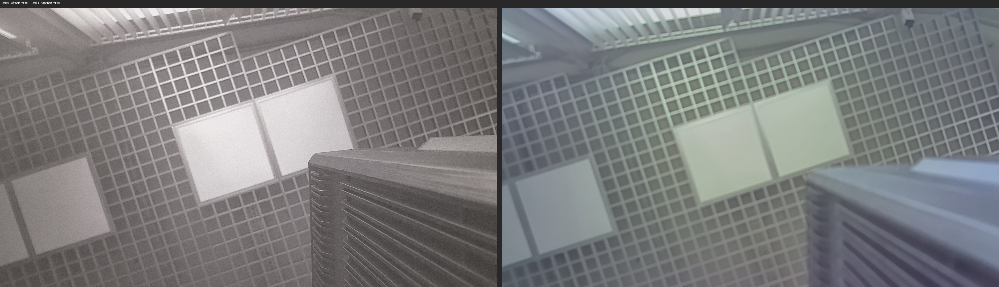

*`--split` без поворота: cam0 = левая половина мега-кадра, cam1 = правая. Каждая 1920×1080 NV12, 3.1MB.*

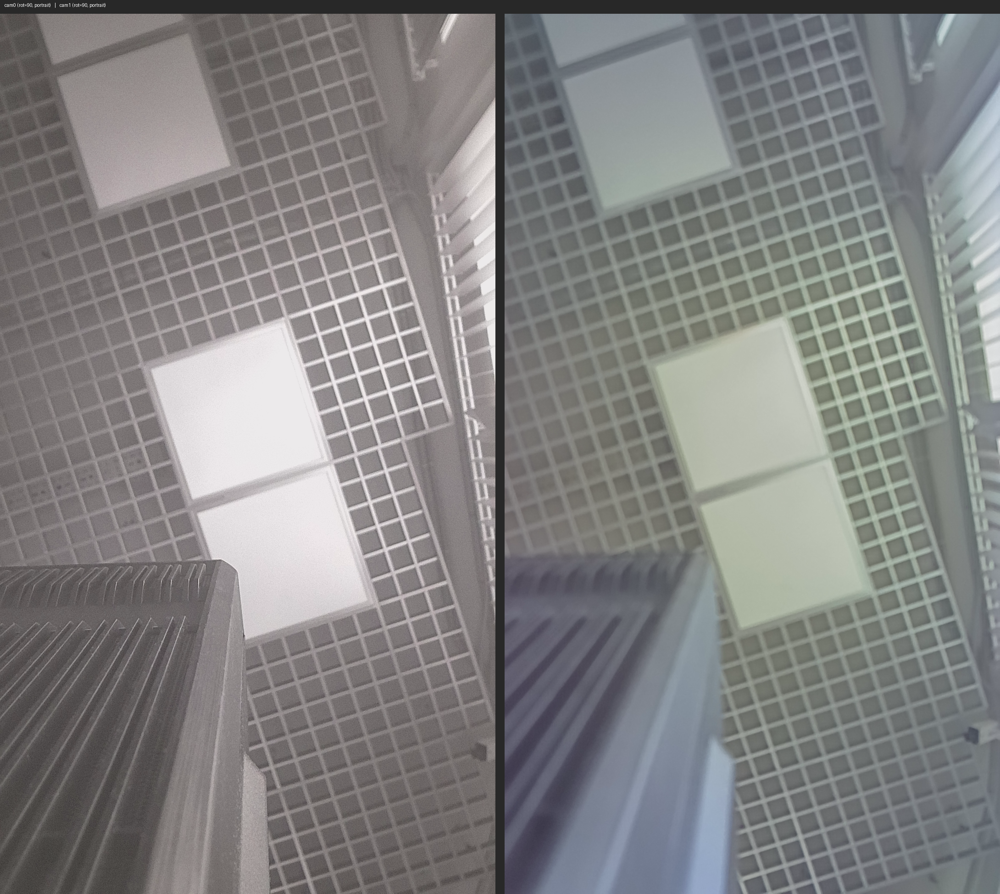

*`--split --rotate-cam 90`: каждая половинка повёрнута на 90° через RGA. 1080×1920 (portrait).*

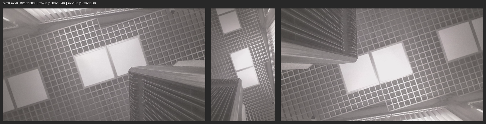

*cam0 при rot=0 (1920×1080), rot=90 (1080×1920), rot=180 (1920×1080). RGA аппаратный поворот.*

**Лог:**

```
$ ./vi_grab_avs -w 1920 -h 1080 -s 3 -n 1 --split --rotate-cam 90 -v
vi_grab_avs: 1920x1080 per sensor, mode=NOBLEND_HOR, sync=1, mega=3840x1080, skip=3, save=1, split=1, rot=90
...
Frame 3 [save]: 3840x1080 pts=5420661227us grab=31ms → split (rot=90)
  [rga] cam0: crop=[0,0,1920,1080] → 1080x1920 rot=90 → mega0_1080x1920_pts5420661227_nv12.raw (3110400 bytes)
  [rga] cam1: crop=[1920,0,1920,1080] → 1080x1920 rot=90 → mega1_1080x1920_pts5420661227_nv12.raw (3110400 bytes)
Done: skipped=3, saved=1/1
```

**RGA детали:**
- `librga.so.2.1.0` уже на плате (`/usr/lib/librga.so`)
- `/dev/rga` — устройство RGA (hardware 2D engine)
- Заголовки: `external/linux-rga/im2d_api/` (im2d C API: `improcess`, `wrapbuffer_fd_t`) — из SDK
- Формат: `RK_FORMAT_YCbCr_420_SP` (NV12)
- Crop + rotate: `improcess(src, dst, pat, srect, drect, prect, usage=ROT_90|IM_SYNC)` — один вызов RGA

#### Файлы

- `app/vi_grab_frame/vi_grab_avs.c` — исходник (~400 строк)

#### Тестировано на реальной плате RV1126B

**Результат: РАБОТАЕТ!**

Плата: RV1126B, 2× GC2093 (I2C 0x37 и 0x7e), одношлейфовая стереокамера.

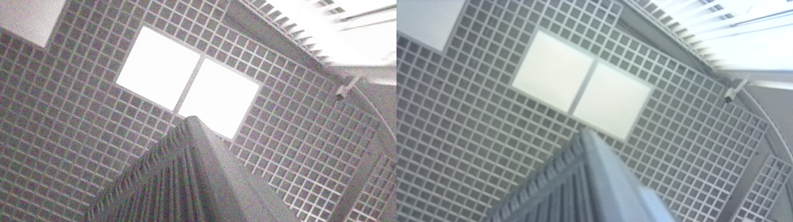

*Сравнение — с `rkaiq_3A_server` и без:*

| С `rkaiq_3A_server` (автоэкспозиция) | Без `rkaiq_3A_server` (нет AE) |
|---|---|
|  | 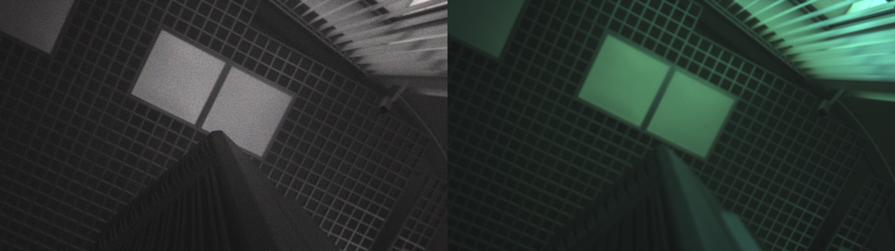 |
| unique Y=160, mean=149 (ярко) | unique Y=130, mean=60 (темно) |

<details>
<summary>Лог запуска</summary>

```
$ /tmp/vi_grab_avs -w 1920 -h 1080 -n 1 -v -t 15000
vi_grab_avs: 1920x1080 per sensor, mode=NOBLEND_HOR, sync=1, mega=3840x1080, frames=1
...
AVS: NOBLEND without calib (empty LUT)
RK_MPI_AVS_CreateGrp OK (mode=2, sync=1, pipes=2)
AVS: GetFinalLut OK
AVS chn 0: enabled (3840x1080)
Bind VI[0,0] → AVS[0,0] OK
Bind VI[1,0] → AVS[0,1] OK
AVS group started
Waiting for mega-frames (sync=1, this may take a few seconds)...
Frame 0: 3840x1080 pts=8420618673us grab=168ms → mega_3840x1080_pts8420618673_nv12.raw (6221824 bytes)
```

</details>

- **Мега-кадр**: 3840×1080 NV12, 6.2MB
- **PTS**: 8420618673us (единая для обоих сенсоров!)
- **Время захвата**: 168ms (включая sync wait + hardware stitch)
- **Синхронизация**: `bSyncPipe=1` — аппаратная
- **ISP и `rkaiq_3A_server`**: `vi_grab_avs` не вызывает `rk_aiq` сам (нет заголовков `rk_aiq_user_api2_*.h` в SDK), но **не нуждается в warmup**. `rkaiq_3A_server` (демон автоэкспозиции/AWB) запущен по умолчанию после загрузки платы и настраивает ISP через IQ-файлы `/etc/iqfiles/gc2093_*.json`. `vi_grab_avs` просто открывает VI и подхватывает уже настроенный пайплайн.

  | `rkaiq_3A_server` | Unique Y | Mean Y | Результат |
  |---|---|---|---|
  | **RUNNING** (по умолчанию) | 160 | 149.0 | REAL IMAGE, ярко (автоэкспозиция) |
  | STOPPED | 130 | 59.7 | REAL IMAGE, темно (нет AE) |

  Просто запустите — ничего останавливать или прогревать не нужно:
  ```bash
  /tmp/vi_grab_avs -w 1920 -h 1080 -n 3 -v -t 15000
  ```

  > **Тест-паттерн** (чёрный/белый, Y=16/235) бывает только при самом первом запуске после холодной загрузки платы, когда ISP ещё никогда не инициализировался. После первой инициализации (любым процессом, включая `rkaiq_3A_server` при старте системы) ISP остаётся настроенным.

  Альтернатива: на плате есть готовый `/usr/bin/simple_vi_bind_avs_bind_venc` — он **сам** инициализирует `rk_aiq` и делает VI→AVS→VENC (H.264), но не сохраняет raw NV12.

Топология камеры на плате (проверено через DTS + media-ctl):
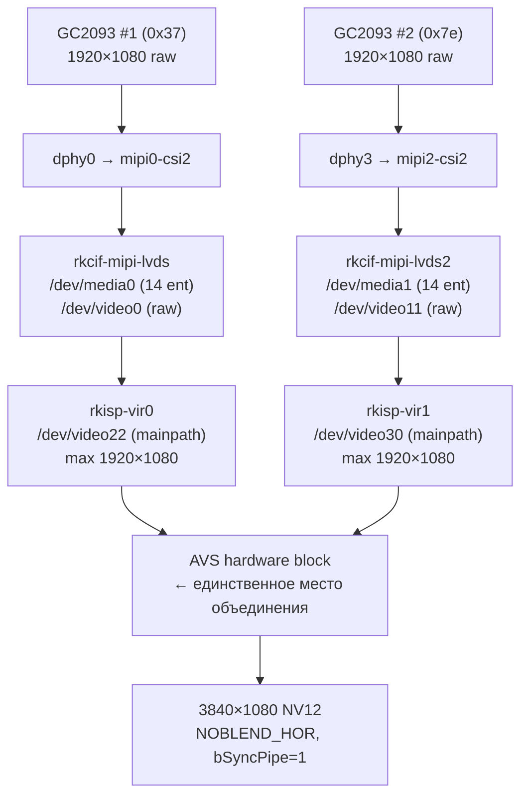

Два отдельных ISP (vir0 и vir1) — это **Путь 3** (AVS), не Путь 1 (DTS мега-кадр). Путь 1 невозможен: нет MIPI-мультиплексора, нет общего DPHY, нет video-узла с width ≥ 3840.

#### Кросс-компиляция (zig cc)

На плате нет gcc. Кросс-компиляция с помощью `zig cc`:

```bash
# Скачать librockit.so с платы (для линковки)
python _ssh_scp.py download librockit.so /usr/lib/librockit.so

# Кросс-компиляция (ручная, для aarch64-linux)
# Лучше использовать build.sh — он сам подставляет пути к SDK
SDK_PATH=/path/to/sdk ./build.sh vi_grab_avs

# Или вручную через zig cc:
zig cc -target aarch64-linux-gnu -O2 \
  -I $SDK_PATH/external/rockit/mpi/sdk/include \
  -I $SDK_PATH/external/rockit/lib/arm64/rv1126b \
  -I $SDK_PATH/external/linux-rga/im2d_api \
  -I $SDK_PATH/external/linux-rga/include \
  -L lib -lrockit -lrga -lpthread -lm \
  -o build/vi_grab_avs app/vi_grab_frame/vi_grab_avs.c

# Загрузить на плату
python _ssh_scp.py upload vi_grab_avs /tmp/vi_grab_avs

# Запустить на плате
ssh root@10.0.55.160 "chmod +x /tmp/vi_grab_avs && /tmp/vi_grab_avs -w 1920 -h 1080 -n 1 -v"
```

---

## Стерео-настройки RV1126B: что есть в SDK для двух камер

Помимо сшивания (AVS), SDK содержит **4 слоя стерео-функциональности** для синхронизации и калибровки двух камер. Это важно для нашей стерео-камеры (2× GC2093).

### Что такое 3A

**3A** = **A**uto **E**xposure + **A**uto **W**hite **B**alance + **A**uto **F**ocus — три автоматических алгоритма, которые работают в реальном времени на каждом кадре, чтобы изображение было правильно экспонировано, с правильными цветами и в фокусе.

#### AE — Auto Exposure (автоэкспозиция)

**Задача**: сделать кадр не слишком тёмным и не слишком светлым.

**Как работает**:
1. ISP собирает **статистику яркости** по кадру (гистограмма, средняя яркость по зонам)
2. AE-алгоритм сравнивает измеренную яркость с целевой (~18% серого)
3. Если слишком темно — увеличивает **gain** (ISO) и/или **exposure time** (время экспозиции)
4. Если слишком светло — уменьшает
5. Параметры отправляются в сенсор (через V4L2 controls) и в ISP

**Параметры, которыми управляет AE**:
- `exposure_time` (микросекунды) — как долго сенсор собирает свет
- `analog_gain` (×1, ×2, ×4...) — аналоговое усиление в сенсоре
- `digital_gain` (×1.0...×16.0) — цифровое усиление в ISP
- `iris` (если есть физическая диафрагма — на наших камерах нет)

**На RV1126B**: AE живёт в `librkaiq.so`. Статистику собирает ISP-блок **AEC** (Auto Exposure Control) — аппаратный счётчик гистограммы.

#### AWB — Auto White Balance (автобаланс белого)

**Задача**: сделать так, чтобы белые объекты выглядели белыми при любом освещении.

**Проблема**: разные источники света имеют разную цветовую температуру:
- Лампа накаливания: ~2700K (жёлтый/оранжевый)
- Дневной свет: ~5500K (нейтральный)
- Тень: ~7500K (синий)
- Флуоресцент: ~4000K (зеленоватый)

Сенсор (Bayer) видит "сырые" цвета, которые зависят от освещения. Белый лист при лампе накаливания будет выглядеть оранжевым. AWB это исправляет.

**Как работает**:
1. ISP собирает статистику по кадру (гистограммы R, G, B отдельно)
2. AWB-алгоритм оценивает цветовую температуру источника света
3. Вычисляет **WB gains** — коэффициенты усиления для R, G, B каналов
4. Применяет их в ISP (блок **BLS** + **CCM**)

**Параметры**:
```c
typedef struct {
    float r_gain;  // усиление красного
    float g_gain;  // усиление зелёного (обычно 1.0)
    float b_gain;  // усиление синего
} rk_aiq_wb_gain_t;
```

Пример: лампа накаливания (тёплый свет) → мало синего → `b_gain = 2.5`, `r_gain = 1.2`

**Алгоритмы** в rkaiq:
- **Grey World** — предполагает, что средний цвет кадра = серый
- **White Patch** — ищет самые яркие пиксели (предполагает, что они белые)
- **Advanced** (rkaiq) — комбинация + машинное обучение на IQ-файле

**На RV1126B**: AWB в `librkaiq.so`, файлы `rk_aiq_awb_*.cpp`. IQ-файл содержит калибровку AWB (параметры алгоритма, таблицы цветовых температур).

#### AF — Auto Focus (автофокус)

**Задача**: навести фокус на объект.

**На наших GC2093 — НЕТ автофокуса.** Это fixed-focus модули (объектив зафиксирован на заводе). Поэтому AF-часть 3A на нашей камере не используется.

**Как работает (на камерах с AF)**:
1. ISP измеряет **контраст/резкость** по кадру (high-frequency content)
2. AF-алгоритм двигает линзу (VCM — Voice Coil Motor) через DAC
3. Ищет максимум резкости (peak focusing)

**На RV1126B**: AF есть в API (`rk_aiq_uapi2_af_*`), но для GC2093 не используется (нет VCM).

#### Как 3A связано с ISP

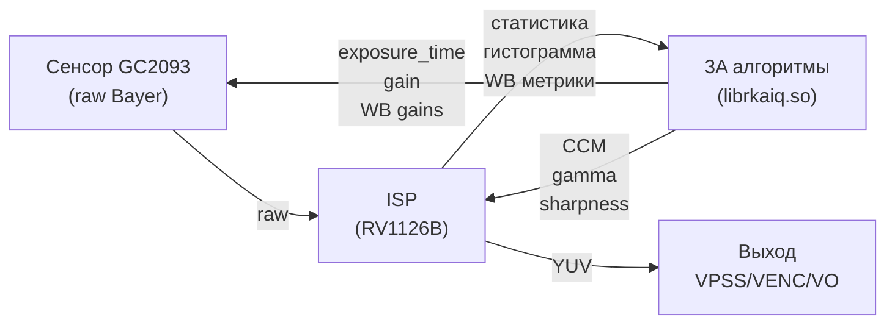

**Каждый кадр**:
1. Сенсор выдаёт raw → ISP
2. ISP обрабатывает (demosaic, WB, CCM, gamma, sharpen...)
3. ISP одновременно собирает статистику → отдаёт 3A
4. 3A считает новые параметры → отправляет обратно в сенсор и ISP
5. Следующий кадр уже с новыми параметрами

**Цикл**: ~30-60мс (1-2 кадра при 30fps). То есть 3A подстраивается 30-60 раз в секунду.

#### Зачем нужна синхронизация 3A для стерео

**Без синхронизации** (каждая камера сама по себе):

| Параметр | Камера 0 | Камера 1 | Проблема |
|----------|----------|----------|----------|
| Exposure | 10мс, gain 4× | 8мс, gain 5× | Разная яркость → disparity matching ошибается |
| WB | R=1.2 B=2.5 | R=1.1 B=2.3 | Разные цвета → стерео-алгоритм путается |
| Результат | Левый кадр темнее | Правый кадр светлее | Depth map с шумом |

**С синхронизацией** (group mode):

| Параметр | Камера 0 | Камера 1 | Результат |
|----------|----------|----------|-----------|
| Exposure | 10мс, gain 4× | **10мс, gain 4×** | Одинаковая яркость |
| WB | R=1.2 B=2.5 | **R=1.2 B=2.5** | Одинаковые цвета |
| Результат | Левый и правый идентичны по экспозиции | → точный disparity |

**Group AWB** (то, что включает `camgroup.json`): обе камеры вычисляют WB gains **вместе** — алгоритм усредняет статистику с обеих камер и выдаёт один результат для обеих.

**Group AE**: аналогично — обе камеры получают одинаковые exposure/gain.

#### Где 3A живёт в SDK

| Компонент | Путь | Что |
|-----------|------|-----|
| **Библиотека** | `librkaiq.so` | Все 3A алгоритмы (AE, AWB, AF, + ещё ~30 алгоритмов) |
| **IQ-файлы** | `external/camera_engine_rkaiq/rkaiq/iqfiles/isp20/*.xml` | Калибровка алгоритмов (параметры, таблицы) |
| **Group IQ** | `camgroup.json` | Калибровка для group mode (`group_awb: 1`) |
| **API** | `rk_aiq_user_api2_*.h` | C API для управления 3A |
| **Camgroup API** | `rk_aiq_user_api2_camgroup.h` | Group mode (синхронизация) |
| **3A сервер** | `rkaiq_3A_server` | Демон (legacy, не для rkipc) |
| **rkipc** | `app/rkipc/common/isp/rv1126b/isp.c` | Вызывает 3A напрямую (без сервера) |

#### Что ещё входит в rkaiq (помимо 3A)

`librkaiq.so` — это не только 3A, а **полный AIQ** (Auto Image Quality). Внутри:

| Алгоритм | Что делает |
|----------|-----------|
| **AE** | Автоэкспозиция |
| **AWB** | Автобаланс белого |
| **AF** | Автофокус (не для GC2093) |
| **AEC** | Exposure Control (аппаратная статистика) |
| **ALSC** | Lens Shading Correction (виньетка) |
| **CCM** | Color Correction Matrix |
| **Gamma** | Тоновая кривая |
| **DPCC** | Defective Pixel Correction |
| **DRC** | Dynamic Range Compression |
| **NR** | Noise Reduction (2D + 3D + Bayer) |
| **Sharpen** | Повышение резкости |
| **Dehaze** | Удаление дымки |
| **LDC** | Lens Distortion Correction (LDCH) |
| **3DLUT** | 3D цветовая таблица |

Все они настраиваются через IQ-файл (XML) и работают в реальном времени на каждом кадре.

#### 3A сервер vs rkipc — кто управляет ISP?

**3A сервер НЕ нужен в продакшене, если работает rkipc.** Они **взаимоисключающие** — оба хотят управлять одним и тем же ISP через `librkaiq.so`.

| Параметр | 3A сервер (демон) | rkipc (приложение) |
|----------|-------------------|---------------------|
| **Бинарник** | `rkaiq_3A_server` | `rkipc` |
| **Линковка** | `librkaiq.so` | `librkaiq.so` |
| **Запуск** | init.d `S40rkaiq_3A` | вручную/systemd |
| **API** | `rk_aiq_uapi2_sysctl_init()` per camera | `rk_aiq_uapi2_sysctl_init()` ИЛИ `rk_aiq_uapi2_camgroup_create()` |
| **Camgroup** | ❌ НЕТ | ✅ Да (если `group_mode=1`) |
| **Group AWB** | ❌ НЕТ | ✅ Да (с патчем) |
| **Запуск 3A** | по V4L2 event (stream on/off) | напрямую (`sysctl_start`) |
| **IQ путь** | хардкод `/etc/iqfiles/` | из ini (`rkipc_iq_file_path_`) |
| **Разрешение** | хардкод 2688×1520 | из ini |
| **Multi-cam** | `setMulCamConc(1)` — просто флаг | camgroup — полная синхронизация |

**Как работает 3A сервер** (`rkaiq_3A_server.cpp`):
```c
// Сканирует /dev/media0..15
for (i = 0; i < 16; i++) {
    sprintf(media_infos[i].mdev_path, "/dev/media%d", i);
    if (rkaiq_get_media_info(&media_infos[i])) continue;
    media_infos[i].available = 1;
}
if (threads > 1) has_mul_cam = 1;

// На каждую камеру — отдельный поток
engine_thread:
    rk_aiq_uapi2_sysctl_init(sensor_name, IQ_PATH, NULL, NULL);
    rk_aiq_uapi2_sysctl_setListenStrmStatus(ctx, false);  // НЕ слушать события
    if (has_mul_cam)
        rk_aiq_uapi2_sysctl_setMulCamConc(ctx, 1);  // просто флаг "я не один"
    rk_aiq_uapi2_sysctl_prepare(ctx, 2688, 1520, NORMAL);

    // Ждёт V4L2 events от ISP
    for (;;) {
        wait_stream_event(STREAM_START);  // кто-то сделал stream-on
        rk_aiq_uapi2_sysctl_start(ctx);   // запустить 3A
        wait_stream_event(STREAM_STOP);
        rk_aiq_uapi2_sysctl_stop(ctx);
    }
```

3A сервер **реагирует** на V4L2 stream on/off events. Он не сам стримит — он ждёт, пока кто-то другой (например, приложение на V4L2) откроет `/dev/videoX` и сделает `STREAMON`.

**Как работает rkipc**:
```c
// main.c
if (group_mode) {
    rk_isp_group_init(0, iq_path);   // camgroup_create + prepare + start
} else {
    rk_isp_init(0, iq_path);          // sysctl_init per camera
    rk_isp_init(1, iq_path);
}
RK_MPI_SYS_Init();
rk_video_init();  // здесь VI stream-on → ISP начинает работать
```

rkipc **сам** вызывает `sysctl_start()` (или `camgroup_start()`) — ему не нужны V4L2 events.

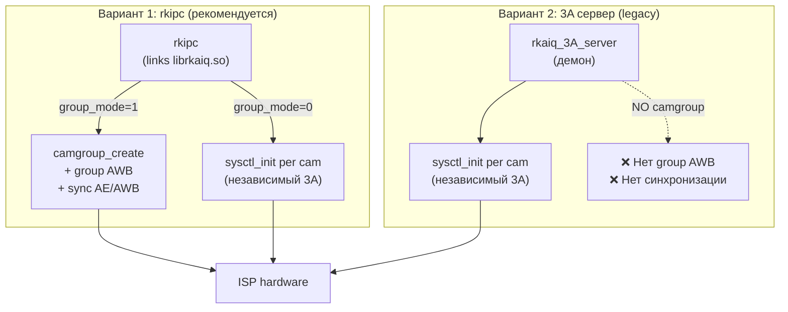

**3A сервер НЕ знаком с camgroup.** В `rkaiq_3A_server.cpp`:
- ❌ Нет `rk_aiq_uapi2_camgroup_create()`
- ❌ Нет `group_iq_file`
- ❌ Нет `overlap_map_file`
- ❌ Нет `group_awb`
- ✅ Есть только `setMulCamConc(1)` — флаг "я не один" (не синхронизация, а предупреждение)

`setMulCamConc` просто говорит AIQ: "не делай агрессивных настроек, которые могут конфликтовать с другой камерой". Это **не** синхронизация AE/AWB.

**Что будет если запустить ОБА?** Конфликт. Оба вызовут `rk_aiq_uapi2_sysctl_init()` для одного сенсора. В лучшем случае 3A сервер молча не сможет инициализироваться. В худшем — оба будут писать параметры в ISP, AE/AWB будет дёргаться.

**Для нашей стерео-камеры**: 3A сервер **не нужен** и даже **вреден**. Нужно убедиться, что `S40rkaiq_3A` НЕ запускается:
```bash
# На плате проверить:
ls /etc/init.d/S40rkaiq_3A
# Если есть — отключить:
chmod -x /etc/init.d/S40rkaiq_3A
# Или удалить
rm /etc/init.d/S40rkaiq_3A
# Убить если запущен
killall rkaiq_3A_server
```

**Почему 3A сервер вообще существует?** Это legacy-подход для старых SDK (RV1109, RV1126), где приложения работали через чистый V4L2 (без rockit/rkadk). Приложение открывало `/dev/video0`, делало `STREAMON` — и 3A сервер автоматически начинал работать. В новом SDK (RV1126B, RV1106, RK3588) приложения используют rockit MPI, и rkipc сам управляет 3A через `librkaiq`. 3A сервер там **не нужен**.

### Слой 1: Group ISP — синхронизация 3A между камерами

**Самое важное для стерео.** В `rk_aiq_user_api2_camgroup.h`:

```c
typedef struct rk_aiq_camgroup_instance_cfg_s {
    const char* sns_ent_nm_array[RK_AIQ_CAM_GROUP_MAX_CAMS]; // до 8 камер
    int sns_num;
    const char* config_file_dir;
    const char* single_iq_file;    // IQ-файл для одиночной камеры
    const char* group_iq_file;     // ← ГРУППОВОЙ IQ-файл (для стерео!)
    const char* overlap_map_file;  // ← КАРТА ПЕРЕКРЫТИЯ (для сшивания!)
    rk_aiq_hwevt_cb pHwEvt_cb;
} rk_aiq_camgroup_instance_cfg_t;
```

API (`rk_aiq_user_api2_camgroup.h`):
- `rk_aiq_uapi2_camgroup_create(cfg)` — создать группу
- `rk_aiq_uapi2_camgroup_prepare(ctx, WDRMode)` — подготовить
- `rk_aiq_uapi2_camgroup_start(ctx)` — запустить
- `rk_aiq_uapi2_camgroup_getOverlapMap(ctx)` — получить карту перекрытия
- `rk_aiq_uapi2_camgroup_getCamInfos(ctx, &infos)` — инфо о камерах
- `rk_aiq_uapi2_camgroup_resetCam(ctx, camId)` — сбросить камеру

**Что group mode даёт для стерео:**
- **Синхронизация AE** — обе камеры получают одинаковую экспозицию (критично для стерео-matching)
- **Синхронизация AWB** — одинаковый баланс белого (цвета совпадают)
- **Синхронизация AF** — одинаковый фокус
- **Group IQ-файл** — отдельный IQ-файл для групповой калибровки

В rkipc (`rv1126b_dual_ipc/main.c:172`):
```c
if (rk_param_get_int("isp:group_mode", 1)) {
    rk_isp_group_init(0, rkipc_iq_file_path_);  // ← group mode
} else {
    rk_isp_init(0, ...);  // ← individual mode
    rk_isp_init(1, ...);
}
```

Реализация (`app/rkipc/common/isp/rv1126b/isp.c:159`):
```c
int isp_camera_group_init(int cam_group_id, rk_aiq_working_mode_t WDRMode,
                          bool MultiCam, const char *iq_file_dir) {
    rk_aiq_camgroup_instance_cfg_t camgroup_cfg;
    camgroup_cfg.sns_num = rk_param_get_int("avs:sensor_num", 6);
    for (int i = 0; i < camgroup_cfg.sns_num; i++) {
        rk_aiq_uapi2_sysctl_enumStaticMetasByPhyId(i, &aiq_static_info);
        camgroup_cfg.sns_ent_nm_array[i] = sensor_name_array[i];
        rk_aiq_uapi2_sysctl_preInit_scene(..., "normal", "day");
    }
    camgroup_cfg.config_file_dir = iq_file_dir;
    g_camera_group_ctx[cam_group_id] = rk_aiq_uapi2_camgroup_create(&camgroup_cfg);
    rk_aiq_uapi2_camgroup_prepare(g_camera_group_ctx[cam_group_id], WDRMode);
    rk_aiq_uapi2_camgroup_start(g_camera_group_ctx[cam_group_id]);
}
```

В ini-файле:
```ini
[isp]
group_mode = 0    ; ← сейчас ВЫКЛЮЧЕНО в rkipc-dual-800w.ini
group_ldch = 0    ; ← сейчас ВЫКЛЮЧЕНО
```

**Включение `group_mode = 1` синхронизирует 3A между камерами** — это первое, что нужно сделать для стерео.

### Слой 2: Group LDCH — коррекция дисторсии обеих камер одновременно

LDCH = **Lens Distortion Correction Header**. В `AVS_FINAL_LUT_S` (`rk_comm_avs.h:137`):
```c
typedef struct rkAVS_FINAL_LUT_S {
    MB_BLK pMeshBlk[AVS_PIPE_NUM];   // mesh (сетка деформации)
    MB_BLK pAlphaBlk[AVS_PIPE_NUM];  // alpha (для blend)
    MB_BLK pLdchBlk[AVS_PIPE_NUM];   // ← LDCH для каждой камеры
    MB_BLK pParamBlk[AVS_PIPE_NUM];  // параметры
} AVS_FINAL_LUT_S;
```

В rkipc (`rv1126b_dual_ipc/video.c:381-419`):
```c
// AVS вычисляет LDCH-таблицы для обеих камер из калибровки
for (RK_S32 i = 0; i < g_sensor_num; i++) {
    ret = RK_MPI_CAL_AVS_GetFinalLutBufferSize(&stBufAttr, &pic_cal[i]);
    ldch_data[i] = (RK_U16 *)(malloc(pic_cal[i].u32MBSize));
    ret = RK_MPI_SYS_CreateMB(&(pstFinalLut.pLdchBlk[i]), &stMbExtConfig);
}
ret = RK_MPI_AVS_GetFinalLut(s32GrpId, &pstFinalLut);

// Применяем LDCH к обеим камерам через group ISP
if (rk_param_get_int("isp:group_ldch", 1)) {
    ret = rk_isp_set_group_ldch_level_form_buffer(
        0, ldch_data[0], ldch_data[1],
        pic_cal[0].u32MBSize, pic_cal[1].u32MBSize);
}
```

**Что это даёт:**
- AVS вычисляет LDCH-таблицы для обеих камер из калибровки
- Применяет их в ISP **до** сшивания — убирает "рыбий глаз"
- Для стерео: убирает дисторсию, что **критично** для точности disparity matching (после коррекции эпиполярные линии становятся прямыми)

### Слой 3: AVS-калибровка — файлы XML + mesh + alpha

В `AVS_CALIB_S` (`rk_comm_avs.h:132`):
```c
typedef struct rkAVS_CALIB_S {
    const RK_CHAR *pCalibFilePath;   // ← файл калибровки (.xml)
    const RK_CHAR *pMeshAlphaPath;   // ← путь к mesh+alpha (.bin)
} AVS_CALIB_S;
```

В rkipc (`rv1126b_dual_ipc/video.c:346`):
```c
stAvsGrpAttr.stInAttr.enParamSource = AVS_PARAM_SOURCE_CALIB;
stAvsGrpAttr.stInAttr.stCalib.pCalibFilePath =
    "/oem/usr/share/avs_calib/calib_file.xml";
```

В ini:
```ini
[avs]
param_source = 1                          ; 0=LUT, 1=CALIB
calib_file_path = /oem/usr/share/avs_calib/calib_file.xml
middle_lut_path = /oem/usr/share/middle_lut/5m/
stitch_distance = 5                       ; ← оптимальное расстояние сшивания (метры)
```

**Что содержит калибровка** (из `rk_algo_avs_tool_def.h`):
- **Intrinsic параметры** каждой камеры (фокус, центр, дисторсия)
- **Extrinsic параметры** (позиция/ориентация каждой камеры относительно первой)
- **Mesh** — сетка деформации (pre-computed warp)
- **Alpha** — карта прозрачности для blend
- **Overlap mask** — карта перекрытия между камерами

**Fine tuning** (`rk_algo_avs_tool_comm.h:297`):
```c
typedef struct rkAlgoAVS_FT_PARAMS_SINGLE_S {
    RKALGO_AVS_BOOL fine_tuning_en;
    int32_t offset_w;           // смещение по ширине
    int32_t offset_h;           // смещение по высоте
    RKALGO_AVS_ROTATION_S rotation;  // yaw/pitch/roll (в 0.01 градуса)
} RKALGO_AVS_FT_PARAMS_SINGLE_S;
```

**Auto fine tuning** (`RKALGO_AVS_AUTO_FT_PARAMS_S`) — автоматически подстраивает rotation по тестовым изображениям. Поля:
- `maxOffset` — максимальное смещение в пикселях
- `scaleRatio` — downscale для ускорения (0.2–1.0)
- `pSrcImageBuf[]` — входные изображения
- `pAftSavePath` — путь сохранения промежуточных результатов

### Слой 4: AVS-режимы и проекции

**Режимы сшивания** (`rk_comm_avs.h:61`):
```c
typedef enum rkAVS_MODE_E {
    AVS_MODE_BLEND        = 0,  // сшивание с blend (плавный переход)
    AVS_MODE_NOBLEND_VER  = 1,  // вертикально, без blend
    AVS_MODE_NOBLEND_HOR  = 2,  // горизонтально, без blend (наш случай)
    AVS_MODE_NOBLEND_QR   = 3,  // 4 камеры квадратно
    AVS_MODE_NOBLEND_OVL  = 4,  // overlay (PiP)
    AVS_MODE_BLEND_DYN    = 5,  // динамический blend
    AVS_MODE_BLEND_JSON   = 6,  // blend с JSON-конфигом
} AVS_MODE_E;
```

**Проекции** (`rk_comm_avs.h:44`):
```c
AVS_PROJECTION_EQUIRECTANGULAR  = 0,  // эквидистантная (панорама 360°)
AVS_PROJECTION_RECTILINEAR      = 1,  // прямолинейная (для стерео!)
AVS_PROJECTION_CYLINDRICAL      = 2,  // цилиндрическая
AVS_PROJECTION_CUBE_MAP         = 3,  // кубическая (360°)
AVS_PROJECTION_EQUIRECTANGULAR_TRANS = 4,  // транспонированная эквидистантная
```

**Gain** (выравнивание яркости, `rk_comm_avs.h:54`):
```c
AVS_GAIN_MODE_MANUAL = 0,  // ручное
AVS_GAIN_MODE_AUTO   = 1,  // автоматическое (выравнивает яркость камер)
```

**LUT accuracy/step** (`rk_comm_avs.h:21-34`):
```c
AVS_LUT_ACCURACY_HIGH    = 0,  // высокая точность
AVS_LUT_ACCURACY_LOW     = 1,  // низкая точность
AVS_LUT_STEP_HIGH        = 0,  // шаг 16 пикселей
AVS_LUT_STEP_MEDIUM      = 1,  // шаг 32 пикселя
AVS_LUT_STEP_LOW         = 2,  // шаг 64 пикселя
```

**Fuse width** (ширина зоны плавного перехода):
```c
AVS_FUSE_WIDTH_128 = 128,
AVS_FUSE_WIDTH_256 = 256,
AVS_FUSE_WIDTH_512 = 512,
```

### IQ-файлы для GC2093 — есть DUAL-версия!

```
external/camera_engine_rkaiq/rkaiq/iqfiles/isp20/
├── gc2093_BFC105-DUAL-L_IR.xml      ← DUAL для стерео! (с IR)
├── gc2093_BFC105-DUAL-L_IRC.xml     ← DUAL с IRC (IR-cut filter)
└── gc2093_YT-RV1109-2-V1_40IR-2MP-F20.xml  ← одиночная
```

**`BFC105-DUAL-L`** — это модель двойного модуля камеры (BFC105 — OEM-модуль, DUAL — две камеры, L — с IR-подсветкой). Это **готовый IQ-файл для стерео-конфигурации**.

### Существующие калибровки в SDK

```
external/avs/avs_calib/
├── 1_6x_neg_calib_file.pto     ← 6 камер (Hugin PTO формат)
├── 1_6x_pos_calib_file.pto
├── rk_3_camera_result.xml      ← 3 камеры
└── rk_6_camera_result.xml      ← 6 камер

external/avs/avs_mesh/
├── 2x/multiBand_5088x1520/     ← 2 камеры! mesh + alpha (наша конфигурация!)
├── 4x/multiBand_5440x2700/
├── 6x/...
└── 8x/...

external/avs/middle_lut/
├── lut_6x/                     ← 6 камер LUT
└── lut_8x/                     ← 8 камер LUT
```

**`2x/multiBand_5088x1520/`** — готовая калибровка для **2-камерной** конфигурации (наша!), размер 5088×1520 (две камеры 2544×1520 side-by-side). Содержит:
- `rk_ps_gpu_meshx00.bin`, `meshx01.bin` — mesh для камеры 0 и 1 (X координаты)
- `rk_ps_gpu_meshy00.bin`, `meshy01.bin` — mesh (Y координаты)
- `rk_ps_gpu_alpha01.bin` — alpha-карта для blend
- `rk_ps_gpu_mesh_params.txt` — параметры mesh

### Полная схема стерео-функциональности

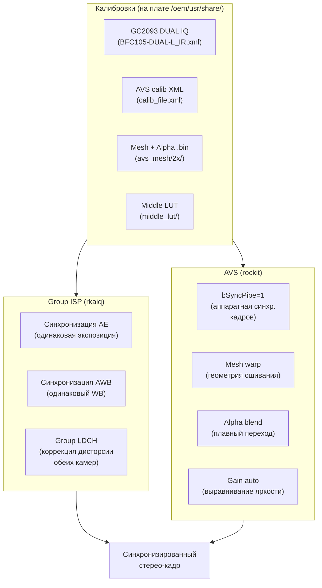

### Рекомендации для стерео

| Настройка | Сейчас | Рекомендация | Почему |
|-----------|--------|--------------|--------|
| `isp:group_mode` | `0` (выкл) | **`1`** | Синхронизация AE/AWB между камерами |
| `isp:group_ldch` | `0` (выкл) | **`1`** | Коррекция дисторсии (прямые эпиполярные линии) |
| `avs:sync` | `0` | **`1`** | Аппаратная синхронизация кадров (`bSyncPipe=1`) |
| `avs:avs_mode` | `0` (BLEND) | `2` (NOBLEND_HOR) или `0` | NOBLEND — точнее для disparity; BLEND — красивее для просмотра |
| `avs:projection_mode` | `0` (EQUIRECT) | **`1`** (RECTILINEAR) | Rectilinear сохраняет прямые линии — лучше для стерео |
| `avs:stitch_distance` | `5` | по калибровке | Оптимальное расстояние сшивания |
| `avs:gain` (stGainAttr) | AUTO | **AUTO** | Выравнивает яркость камер |
| IQ-файл | ? | **`gc2093_BFC105-DUAL-L_IR.xml`** | DUAL-версия для стерео |

### Чего в SDK НЕТ для стерео

- **Нет disparity matching** — нет вычисления глубины/карты диспаратности. AVS только сшивает, не вычисляет глубину.
- **Нет stereo calibration API** — калибровка должна быть сделана внешним инструментом (Hugin, OpenCV) и загружена из XML
- **Нет depth map** — нет генерации карты глубины
- **Нет epipolar rectification** — только LDCH (дисторсия), но не эпиполярная ректификация (когда обе камеры приводятся к общей плоскости)

**Для полноценного стерео** (depth map) нужно:
1. Включить `group_mode=1`, `group_ldch=1`, `sync=1` (синхронизация + коррекция)
2. Использовать DUAL IQ-файл (`gc2093_BFC105-DUAL-L_IR.xml`)
3. Калибровать камеры внешним инструментом (OpenCV `stereoCalibrate`)
4. Вычислять disparity на NPU (своя RKNN-модель) или на CPU (OpenCV SGBM)

### Где что искать в SDK

| Компонент | Путь | Что |
|-----------|------|-----|
| Group ISP API | `external/camera_engine_rkaiq/rkaiq/include/uAPI2/rk_aiq_user_api2_camgroup.h` | camgroup create/prepare/start |
| Group ISP реализация | `app/rkipc/common/isp/rv1126b/isp.c:159` | `isp_camera_group_init()` |
| AVS-калибровка (rockit) | `external/rockit/mpi/sdk/include/rk_comm_avs.h:132` | `AVS_CALIB_S`, `AVS_FINAL_LUT_S` |
| AVS-калибровка (tool) | `external/avs/lib/rk_algo_avs_tool_def.h` | `RKALGO_AVS_CALIB_PARAMS_S`, fine tuning |
| AVS-калибровка (comm) | `external/avs/lib/rk_algo_avs_tool_comm.h` | `ROTATION_S`, `CAMERA_STATUS_S` |
| IQ-файлы GC2093 | `external/camera_engine_rkaiq/rkaiq/iqfiles/isp20/gc2093_BFC105-DUAL-L_*.xml` | DUAL IQ |
| Mesh 2-камерная | `external/avs/avs_mesh/2x/multiBand_5088x1520/` | mesh+alpha .bin |
| Калибровки XML | `external/avs/avs_calib/` | .pto, .xml |
| Middle LUT | `external/avs/middle_lut/` | .bin |
| rkipc dual IPC | `app/rkipc/src/rv1126b_dual_ipc/` | ini + video.c |
| rkipc ini | `app/rkipc/src/rv1126b_dual_ipc/rkipc-dual-800w.ini` | `[avs]`, `[isp]` секции |

> **Note:** `group_iq_file` и `overlap_map_file` в `rk_aiq_camgroup_instance_cfg_t` существуют в API, но **`rk_aiq_uapi2_camgroup_create()` зависает** при их использовании на этой плате (проверено на RV1126B). Используйте camgroup без них — `config_file_dir` достаточно для базовой синхронизации AE/AWB.

---

## Cam0 = IR (grayscale) — аппаратное ограничение

### Симптом

При сохранении кадров с обеих камер (`--action save`) cam0 получается **grayscale** (чёрно-белый), cam1 — цветной. Проверка UV-каналов NV12:

| Камера | Y mean | U dev from 128 | V dev from 128 | Результат |
|--------|--------|----------------|----------------|----------|
| cam0 (с rkaiq) | 142.6 | 0.70 | 2.92 | почти grayscale (U≈128) |
| cam1 (с rkaiq) | 127.0 | 4.49 | 2.95 | COLOR |
| cam0 (без rkaiq) | 63.0 | 0.74 | 0.84 | GRAYSCALE (тёмный) |
| cam1 (без rkaiq) | 57.8 | 3.78 | 6.39 | COLOR (тёмный) |

### Причина: IR матрица без Bayer CFA

Cam0 (I2C 0x37) — **IR-версия** GC2093. Проверка device-tree:
```bash
$ cat /proc/device-tree/i2c@21110000/gc2093@37/rockchip,camera-module-name
IR
$ cat /proc/device-tree/i2c@21110000/gc2093-2@7e/rockchip,camera-module-name
default
```

| Камера | I2C | module-name | Матрица | Bayer CFA | Цвет? |
|--------|-----|-------------|---------|-----------|-------|
| cam0 | 0x37 | `IR` | монохромная | ❌ нет | grayscale |
| cam1 | 0x7e | `default` | цветная | ✅ есть | color |

Оба чипа определяются как `galaxycore,gc2093` (одинаковый compatible), но cam0 физически без color filter array. Сенсор отдаёт Bayer RAW, но без CFA → ISP не может восстановить цвет → UV≈128 → grayscale.

### Как rkaiq подбирает IQ файл

`rkaiq_3A_server` передаёт только путь `/etc/iqfiles/`. Функция `AiqCamHw_selectIqFile()` (`external/camera_engine_rkaiq/rkaiq/hwi_c/aiq_CamHwBase.c:898`) формирует имя IQ файла из device-tree:
```c
sprintf(iqfile_name, "%s_%s_%s.json", sensor_name, module_name, lens_name);
```

Для нашего оборудования:
| Камера | sensor | module | lens | IQ файл | Калибровка |
|--------|--------|--------|------|---------|------------|
| cam0 | gc2093 | IR | default | `gc2093_IR_default.json` | IR (монохром) |
| cam1 | gc2093 | default | default | `gc2093_default_default.json` | цветная |

Оба файла есть в `/etc/iqfiles/`:
```bash
$ ls /etc/iqfiles/gc2093*
gc2093_IR_default.json        # для IR камеры (cam0)
gc2093_default.json -> gc2093_default_default.json  # симлинк
gc2093_default_default.json  # для цветной камеры (cam1)
```

**Вывод:** rkaiq **сам** подбирает правильный IQ файл для каждой камеры. IR-калибровка (`gc2093_IR_default.json`) настроена для монохрома — AWB даёт neutral цвета. Цвета на cam0 не будет никогда — это аппаратное ограничение IR матрицы.

### Команды верификации

```bash
# 1. Проверить module-name в device-tree
cat /proc/device-tree/i2c@21110000/gc2093@37/rockchip,camera-module-name    # IR
cat /proc/device-tree/i2c@21110000/gc2093-2@7e/rockchip,camera-module-name  # default

# 2. Проверить имена сенсоров в media topology
media-ctl -d /dev/media0 --print-topology | grep entity.*gc2093
# → entity 63: m00_b_gc2093 1-0037 (cam0, IR)
media-ctl -d /dev/media1 --print-topology | grep entity.*gc2093
# → entity 63: m01_b_gc2093 1-007e (cam1, color)

# 3. Проверить IQ файлы
ls /etc/iqfiles/gc2093*
# → gc2093_IR_default.json (для cam0)
# → gc2093_default_default.json (для cam1)

# 4. Сохранить кадры и проверить UV
vi_grab_avs_dma -w 1920 -h 1080 --action save -n 1 -s 30 -t 5000
# cam0_*.raw — U_dev ≈ 0.7 (grayscale)
# cam1_*.raw — U_dev ≈ 4.5 (color)
```

---

## CLI: vi_grab_avs_dma — AVS → RGA → DMA буфер (zero-copy пайплайн)

`vi_grab_avs_dma` — расширение `vi_grab_avs` для **полного zero-copy пайплайна**. Вместо `malloc` для выходного буфера RGA, выделяет DMA буфер через `/dev/dma_heap/system-uncached`. Этот буфер можно:

1. **Сохранить в файл** (`--action save`) — слепок для отладки (как `vi_grab_avs --split`)
2. **Отправить на дисплей** (`--action vo`) — `RK_MPI_VO_SendFrame` через `MB_EXT` (zero-copy)
3. **Передать в rknn/NPU** — dmabuf fd совместим с `rknn_set_io_mem`
4. **Просто освободить** (`--action free`) — benchmark пропускной способности пайплайна

### В чём отличие от vi_grab_avs

| | `vi_grab_avs --split` | `vi_grab_avs_dma` |
|---|---|---|
| Источник RGA | dmabuf fd (rockit) ✅ | dmabuf fd (rockit) ✅ |
| Выходной буфер RGA | `malloc` (CPU RAM) | **DMA буфер** (`/dev/dma_heap/`) |
| Запись в файл | `fwrite` из malloc | `fwrite` из mmap DMA |
| Отправка в VO | ❌ (нужен CPU copy) | ✅ **zero-copy** (MB_EXT + dmabuf fd) |
| Отправка в rknn | ❌ | ✅ **zero-copy** (dmabuf fd → `rknn_set_io_mem`) |
| Освобождение | `free()` | `dma_buf_free()` (munmap + close) |

### Пайплайн

```
VI dev0/1 → VI pipe0/1 → AVS grp0 → AVS chn0 (мега-кадр 3840×1080)
  → RGA crop+rotate (zero-copy: rockit dmabuf → DMA dmabuf)
    → cam0: DMA буфер 1920×1080 (или 1080×1920 при rot=90)
    → cam1: DMA буфер 1920×1080
      → [save] fwrite (слепок)
      → [vo]   RK_MPI_VO_SendFrame (дисплей, zero-copy)
      → [free] dma_buf_free (benchmark)
```

### Использование

```bash
# Сохранить 2 половинки в файлы (как vi_grab_avs --split, но через DMA)
./vi_grab_avs_dma -w 1920 -h 1080 --action save
# → cam0_1920x1080_pts123_nv12.raw
# → cam1_1920x1080_pts123_nv12.raw

# Отправить на дисплей (DSI 720×1280) — pan-and-scan по панораме
./vi_grab_avs_dma -w 1920 -h 1080 --action vo --vo-dev 0 --vo-layer 1 --vo-chn 0 -n 300

# Benchmark: прогнать 100 кадров, ничего не сохраняя
./vi_grab_avs_dma -w 1920 -h 1080 --action free -n 100

# С поворотом 90° (выход 1080×1920)
./vi_grab_avs_dma -w 1920 -h 1080 --action save --rotate-cam 90
```

### Параметры (дополнительно к vi_grab_avs)

| Параметр | По умолчанию | Описание |
|----------|-------------|----------|
| `--action save\|vo\|free` | `save` | что делать с DMA буфером |
| `--vo-layer N` | `0` | VO layer для `--action vo` |
| `--vo-chn N` | `0` | VO channel для `--action vo` (cam0 → chn N, cam1 → chn N+1) |

### DMA буферы — как это работает

```c
// Выделение DMA буфера через /dev/dma_heap/system-uncached
int fd; void *va;
dma_buf_alloc("/dev/dma_heap/system-uncached", size, &fd, &va);

// RGA пишет в DMA буфер (zero-copy через IOMMU)
rga_buffer_t dst = wrapbuffer_fd_t(fd, w, h, w, h, RK_FORMAT_YCbCr_420_SP);
improcess(src, dst, ..., IM_SYNC);

// Отправка в VO (zero-copy — rockit берёт dmabuf fd напрямую)
MB_EXT_CONFIG_S ext = { .s32Fd = fd, .pu8VirAddr = va, .u64Size = size };
RK_MPI_SYS_CreateMB(&mb, &ext);
RK_MPI_VO_SendFrame(layer, chn, &vf, 0);

// Освобождение
dma_buf_free(size, &fd, va);
```

`/dev/dma_heap/system-uncached` — некэшируемый DMA буфер. RGA пишет через IOMMU (без CPU), CPU читает без `dma_sync_cpu_to_device` (uncached = всегда актуальные данные). Для cached буферов (`/dev/dma_heap/system`) нужна синхронизация.

### Результаты тестирования на плате (RV1126B, 10.0.55.160)

| Action | Результат | Примечание |
|--------|-----------|------------|
| `--action save` | ✅ работает | `cam0_1920x1080_*.raw`, `cam1_1920x1080_*.raw` (3.1MB каждый) |
| `--action free` | ✅ работает | ~20-34ms на кадр (benchmark) |
| `--action vo` | ✅ pan-and-scan | Crop окно 1280×720 из мега-кадра 3840×1080 по синусоиде, rotate 90° → 720×1280, SendFrame на VO layer 1 (bypass mode). Дисплей 720×1280 (портрет). Плавное движение по панораме туда-обратно по X и Y. |
| `--rotate-cam 90` | ✅ работает | Кадры 1080×1920 (повёрнуты) |

**Дисплей на плате:** DSI 720×1280 (портрет), `/dev/dri/card0`, connector `card0-DSI-1`. Управляется weston (Wayland) через DRM.

**Как rkadk/rkipc выводят на дисплей:**

Есть **три пути** вывода кадра на DSI-дисплей в SDK:

#### Путь 1: bind pipeline `VI → VO` (rkipc rv1126b_dual_ipc, наша плата)
Используется в `app/rkipc/src/rv1126b_dual_ipc/video/video.c:2777` (`rkipc_pipe0_multi_vi_vo_init`):
```
VI chn (1920×1080) ──bind──→ VO layer 1, chn 0 (ROTATION_90)
```
- `g_vo_dev_id=0`, `g_vo_layer_id=1` (из `rkipc-dual-800w.ini`)
- `VO_INTF_MIPI`, `VO_SPLICE_MODE_RGA`, layer `RK_FMT_RGB888`
- `VoChnAttr.enRotation = ROTATION_90` (для MIPI портрета)
- **`RK_MPI_SYS_Bind(VI → VO)`** — VO получает кадры автоматически
- **AVS НЕ участвует в display path** — только для venc (запись)
- Отдельный VI chn (`g_vi_for_vo_chn_id`) для display, отдельный для AVS/venc

#### Путь 2: bind pipeline `VI → VPSS → VO` (rkadk)
Используется в `app/rkadk/src/display/rkadk_disp.c`:
```
VI → VPSS (VIDEO_PROC_DEV_RGA, масштабирование) ──bind──→ VO
```
- VPSS масштабирует кадр до размера layer
- `RK_MPI_SYS_Bind(VPSS → VO)` на RV1126B
- На RV1106 — SendFrame в потоке (`RKADK_DISP_GetVpssMb`)

#### Путь 3: SendFrame для UI (rkipc rv1126b_dv, rkadk_ui)
Используется в `app/rkipc/src/rv1126b_dv/ui/rk_ui.c:469` (`rk_disp_flush`):
```
lvgl рендер → RGA copy area → RK_MPI_VO_SendFrame (UI layer, UI chn)
```
- UI на **отдельном layer/chn** (например layer 5, chn 2 — `ui_chn_id`)
- Видео на **другом chn** того же layer (chn 0 — `video_chn_id`)
- `VO_SPLICE_MODE_RGA` — VO микширует video + UI через RGA
- `RK_MPI_VO_SetLayerFlush` — принудительный flush после UI update
- Буферы: `RK_MPI_MMZ_Alloc` (cacheable), 2 буфера (double buffering)

#### Путь 4: lvgl + rkadk дисп driver (lvgl_demo)
`app/lvgl_demo/lvgl8/lv_port_disp.c` → `rkadk_disp_drv_init()` (в lv_drivers):
- lvgl рендерит в VO через rkadk driver
- `app/lvgl_demo/rk_demo/intercom_homepage/video_monitor/ui_monitor.c` — RTSP player через `RKADK_PLAYER_*` (видео на vo_chn=0, UI на vo_chn=1)

**Почему `--action vo` в vi_grab_avs_dma не работает:**
1. AVS использует RGA для сшивания (`stitchNonBlendProc` → `im2d_wrapper_doBlit`)
2. VO с `VO_SPLICE_MODE_RGA` тоже хочет RGA — конфликт (`invalid job` в dmesg)
3. `bBypassFrame` отключает RGA в VO, но тогда VO не масштабирует кадр 1920×1080 → 720×1280
4. **rkipc решает это разделением path**: VI chn для display (bind → VO, БЕЗ AVS) + отдельный VI chn для AVS/venc
5. **rkadk решает через VPSS**: AVS → VPSS (scale) → VO (bind), VPSS использует RGA в pipeline режиме

**Решение для vi_grab_avs_dma (реализован Вариант C — pan-and-scan):**

`--action vo` использует **pan-and-scan** эффект:
```
AVS мега-кадр 3840×1080 (landscape)
  → RGA: crop окно 1280×720 по синусоиде (X: 0..2560, Y: 0..360)
  → RGA: rotate 90° → 720×1280 (портрет, идеально для DSI)
  → SendFrame на VO layer 1 (bypass mode, 720×1280)
```

Синусоиды:
- X: `sin(t * 0.04) * 0.5 + 0.5` → диапазон 0..(3840-1280)=2560, медленно
- Y: `sin(t * 0.06 + 1.7) * 0.5 + 0.5` → диапазон 0..(1080-720)=360, сдвиг фазы

Окно 1280×720 (landscape) поворачивается на 90° → 720×1280 (портрет), идеально совпадает с дисплеем, **без растяжения**. Плавное движение по панораме туда-обратно по X и Y.

**Почему это работает:**
- AVS использует RGA для stitch → завершено к моменту `GetChnFrame`
- Наш RGA crop+rotate выполняется **после** AVS (последовательно, не конфликт)
- VO в `bBypassFrame` mode — не использует RGA, кадр 720×1280 = layer 720×1280 (нет несовпадения)
- `SendFrame` не падает (размер кадра совпадает с размером layer)

**Другие варианты (не реализованы):**
- **Вариант A (как rkipc):** отдельный VI chn → VO bind (мимо AVS). Только 1 камера, не ститч.
- **Вариант B (как rkadk):** AVS → VPSS (scale) → VO bind. Сложно, нужен VPSS.
- **Вариант D (через weston/DRM):** wayland surface. CPU рендер (Pixman), медленно.

### Файлы

- `app/vi_grab_frame/vi_grab_avs_dma.c` — исходник (~500 строк)
- `app/vi_grab_frame/dma_alloc.c` — выделение DMA буферов (перевод `dma_alloc.cpp` из SDK на C)
- `app/vi_grab_frame/dma_alloc.h` — заголовок

---

## CLI: stereo_demo — полная стерео-программа (camgroup + AVS + VPSS)

`stereo_demo` — полноценная стерео-программа, которая **не требует патчей rkipc или системных ini-файлов**. Все настройки (camgroup, AVS, VPSS) задаются в коде и через CLI-аргументы.

### Архитектура

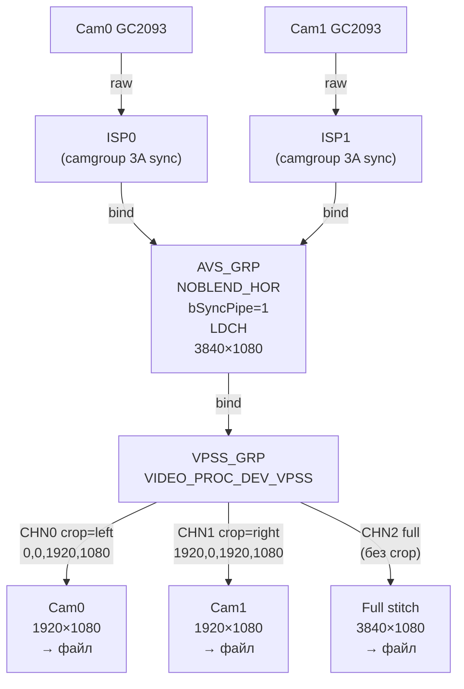

### Что делает программа

1. **camgroup_init()** — `rk_aiq_uapi2_camgroup_create()` + `prepare()` + `start()`. Синхронизация AE/AWB между камерами.
2. **vi_init()** — VI device + channels + StartPipe (group mode, как rkipc `rv1126b_dual_ipc`).
3. **avs_init()** — AVS group с `NOBLEND_HOR` + `bSyncPipe=1` + LDCH. Сшивает две камеры в мега-кадр **без blend** (чисто для синхронизации и баланса).
4. **vpss_init()** — VPSS group с 3 каналами:
   - **CHN0**: crop левой половины (cam0)
   - **CHN1**: crop правой половины (cam1)
   - **CHN2**: полный stitch (без crop)
5. **bind_init()** — VI → AVS → VPSS (через `RK_MPI_SYS_Bind`).
6. **main loop** — `GetChnFrame` с каждого канала, сохранение в `.raw` файлы.

### Зачем "сшивать чтобы разрезать"

AVS используется **не как панорамный сшиватель**, а как:
- **Аппаратный синхронизатор** (`bSyncPipe=1`) — обе камеры стримят одновременно, кадр N с cam0 и кадр N с cam1 попадают в AVS в одном такте
- **Балансировщик** — group AWB/AE через camgroup даёт идентичные настройки 3A
- **LDCH** — коррекция дисторсии до сшивания

На выходе AVS — два кадра, гарантированно синхронных по времени, яркости, цвету и геометрии. VPSS crop разрезает их обратно на отдельные камеры.

### Ориентация камер и `--rotate` (важно для стерео-depth)

Камеры физически установлены **side-by-side горизонтально** (baseline горизонтальный) в **портретном** устройстве. Но сенсор GC2093 всегда отдаёт **landscape** (1920×1080):

```
Физическая ориентация:        Сенсор отдаёт (raw):
┌─────┐  ┌─────┐              ┌──────────────────┐
│ cam0│  │ cam1│              │      cam0        │  1920×1080
│     │  │     │              │      cam1        │  (landscape)
│     │  │     │              └──────────────────┘
│     │  │     │                  ↑ baseline ВЕРТИКАЛЬНЫЙ в raw
└─────┘  └─────┘                  (неправильно для стерео!)
 1080×1920 (portrait)
  baseline ГОРИЗОНТАЛЬНЫЙ
```

В raw-кадре (1920×1080) **baseline вертикальный** — стандартные стерео-алгоритмы ожидают **горизонтальную** диспаратность (epipolar lines = rows).

**`--rotate`** решает это: RGA rotate 90° → 1080×1920 (portrait). После поворота:
- baseline **горизонтальный** ✓
- диспаратность **горизонтальная** ✓
- epipolar lines = rows ✓
- cam0 слева, cam1 справа (стандартное соглашение) ✓

```bash
# Portrait-ориентированные кадры для стерео-depth
./stereo_demo -w 1920 -h 1080 --save-cam0 --save-cam1 --rotate -n 10
# → stereo_cam0_XXX_1080x1920.raw (portrait, cam0 = left)
# → stereo_cam1_XXX_1080x1920.raw (portrait, cam1 = right)

# Полный stitch в portrait (1080×3840, вертикальное расположение)
./stereo_demo -w 1920 -h 1080 --save-full --rotate -n 10
# → stereo_full_XXX_1080x3840.raw
```

> **Cam0 = IR камера** (монохром). В NV12 Y-канал = изображение. Cam1 = цветная, Y-канал = luma (цвет в UV-плоскости). Для стерео-depth обычно достаточно Y (яркость).

### Использование

```bash
# Базовый запуск (2× 1920×1080, сохранить обе камеры отдельно)
./stereo_demo -w 1920 -h 1080 --save-cam0 --save-cam1 -n 10

# Сохранить полный stitch
./stereo_demo -w 1920 -h 1080 --save-full -n 10

# Без camgroup (только AVS sync, без 3A sync)
./stereo_demo -w 1920 -h 1080 --no-camgroup --save-cam0 --save-cam1

# Без VPSS (кадр напрямую из AVS, как vi_grab_avs)
./stereo_demo -w 1920 -h 1080 --no-camgroup --no-vpss -n 1

# Без LDCH (без коррекции дисторсии)
./stereo_demo -w 1920 -h 1080 --no-ldch --save-cam0 --save-cam1

# Подробный вывод
./stereo_demo -w 1920 -h 1080 -v --save-cam0 --save-cam1
```

### Параметры

| Параметр | Описание | По умолчанию |
|----------|----------|--------------|
| `-w, --width` | ширина одного сенсора (обязательно) | — |
| `-h, --height` | высота одного сенсора (обязательно) | — |
| `-n, --count` | сколько кадров сохранить | 1 |
| `-s, --skip` | отбросить первые N кадров (прогрев) | 5 |
| `--iq-dir` | путь к IQ-файлам | `/etc/iqfiles` |
| `--no-camgroup` | отключить camgroup (только AVS sync) | — |
| `--no-sync` | отключить bSyncPipe | — |
| `--no-ldch` | отключить LDCH | — |
| `--save-cam0` | сохранять CHN0 (левая камера) | — |
| `--save-cam1` | сохранять CHN1 (правая камера) | — |
| `--save-full` | сохранять CHN2 (полный stitch) | — |
| `--no-vpss` | получать кадр напрямую из AVS (без VPSS) | — |
| `--rotate` | повернуть выход 90° → portrait (1080×1920) для стерео-depth | — |
| `-o, --output` | префикс файла | `stereo` |
| `-t, --timeout` | таймаут GetChnFrame (мс) | 2000 |
| `-v, --verbose` | подробный вывод | — |

### Результаты тестирования на плате (RV1126B, 10.0.55.160)

Тест проводился с `--no-camgroup` (без 3A sync) и IQ-файлами из `/etc/iqfiles/`:

```bash
/tmp/stereo_demo -w 1920 -h 1080 --no-camgroup --iq-dir /etc/iqfiles \
    --save-cam0 --save-cam1 --save-full -n 1 -s 10 -v
```

**Статистика Y-канала (NV12):**

| Канал | Размер | mean | std | min | max |
|-------|--------|------|-----|-----|-----|
| CHN0 (cam0, crop left) | 1920×1080 | 34.3 | 1.8 | 32 | 45 |
| CHN1 (cam1, crop right) | 1920×1080 | 67.7 | 32.0 | 35 | 230 |
| CHN2 (full stitch) | 3840×1080 | 51.8 | 29.3 | 32 | 232 |
| Full — left half | 1920×1080 | 34.5 | 2.0 | 32 | 49 |
| Full — right half | 1920×1080 | 69.1 | 33.5 | 35 | 236 |

**Выводы:**
- VPSS crop работает корректно: CHN0 = left half, CHN1 = right half
- Левая половина full stitch совпадает с CHN0 (cam0)
- Правая половина full stitch совпадает с CHN1 (cam1)
- **Cam0 — IR камера** (монохром, `module-name="IR"` в device tree, IQ файл `gc2093_IR_default.json`). Поэтому mean=34 (темнее) — это **нормально**, не баг. Cam1 — цветная камера (`gc2093_default_default.json`), mean=68. Подробнее: [Cam0=IR (grayscale)](#cam0--ir-камера-grayscale--аппаратная-особенность).

**Известные проблемы:**
- `group_iq_file` и `overlap_map_file` в `rk_aiq_camgroup_instance_cfg_t` **не работают** — `camgroup_create` зависает. Удалены из stereo_demo.

**Проверенные опции (на плате RV1126B):**

| Опция | Результат | Примечание |
|-------|-----------|------------|
| `--no-ldch` | ✅ работает | `avs: LDCH disabled (--no-ldch)`, кадры сохраняются |
| `--no-sync` | ✅ работает | `sync=0`, кадры сохраняются (без bSyncPipe) |
| `--no-camgroup` | ✅ работает | camgroup отключен, только AVS |
| `--no-vpss` | ✅ работает | кадр напрямую из AVS |
| `--save-full` | ✅ работает | полный stitch 3840×1080 через CHN2 |
| `--save-cam0` / `--save-cam1` | ✅ работает | crop половин через VPSS CHN0/CHN1 |

### Примеры кадров

**Полный stitch (3840×1080, AVS NOBLEND_HOR):**

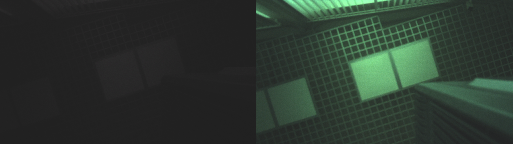

Левая половина — cam0, правая — cam1. Граница между камерами чистая (NOBLEND_HOR, без блендинга).

**Cam0 (CHN0, crop левой половины, 1920×1080):**

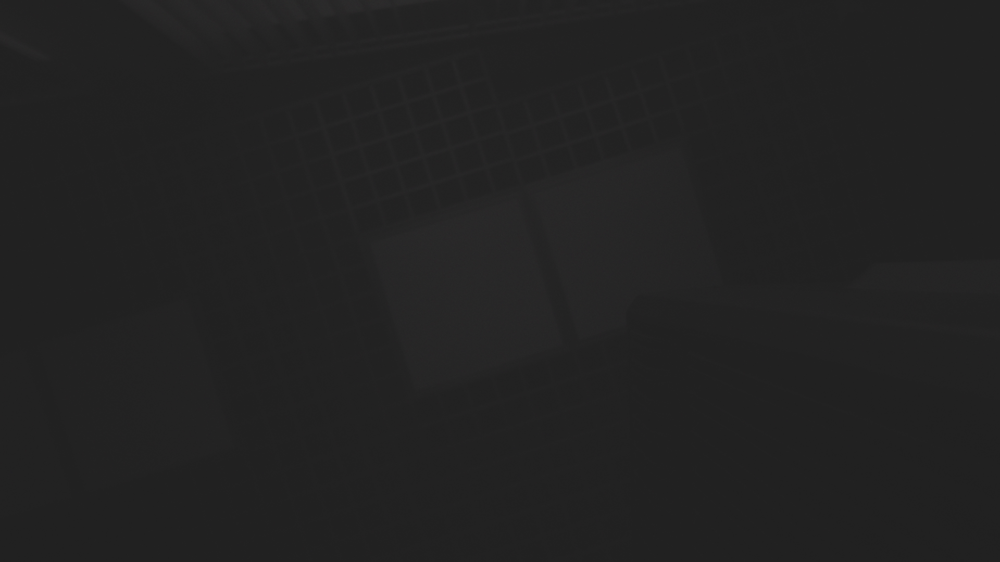

**Cam1 (CHN1, crop правой половины, 1920×1080):**

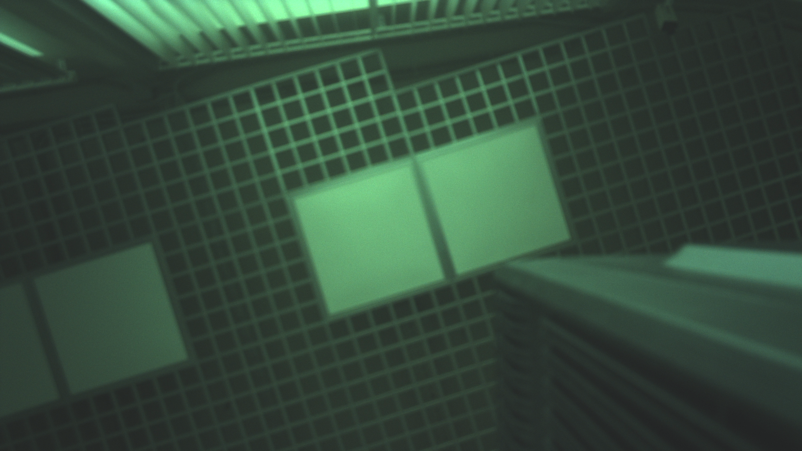

> Cam0 — IR камера (монохром, `module-name="IR"`), поэтому Y mean=34. Это **нормально**, не баг калибровки.

### Сборка

```bash
# stereo_demo требует librkaiq.so (3A + camgroup)
# Получить с платы:
scp root@10.0.55.160:/usr/lib/librkaiq.so lib/

# Собрать:
SDK_PATH=/path/to/sdk ./build.sh stereo_demo

# Или через CMake:
cd app/vi_grab_frame
mkdir build && cd build
cmake -DROCKIT_ROOT=../../../external/rockit ..
make stereo_demo
```

### Зависимости

| Библиотека | Откуда | Зачем |
|-----------|--------|-------|
| `librockit.so` | SDK (`external/rockit/lib/arm64/rv1126b/linux/`) | MPI: VI, AVS, VPSS, SYS |
| `librkaiq.so` | Плата (`/usr/lib/librkaiq.so`) или собрать из SDK | 3A + camgroup |
| `librga.so` | SDK или плата | (не нужна для stereo_demo, только для vi_grab_avs) |

> **Важно:** `stereo_demo` **не нуждается** в `rkaiq_3A_server` (демоне). Программа сама вызывает `rk_aiq_uapi2_camgroup_create()` — 3A работает in-process. Убедитесь, что `S40rkaiq_3A` НЕ запущен (см. [3A сервер vs rkipc](#3a-сервер-vs-rkipc--кто-управляет-isp)).

### Файлы

- `app/vi_grab_frame/stereo_demo.c` — исходник (~840 строк)
- `app/vi_grab_frame/CMakeLists.txt` — target `stereo_demo`
- `build.sh` — поддержка `stereo_demo` (автодетект rkaiq headers)

---

## Три пути стерео-склейки на RV1126B (сводка)

Из документации Rockchip и SDK есть **три принципиальных пути** аппаратного склеивания кадров с двух камер. На этой плате (RV1126B + 2× GC2093) **работает только Путь 3**.

### Путь 1: Сенсор сам отдаёт "мега-кадр" (DTS, V4L2) — НЕВОЗМОЖЕН на этой плате

Путь 1 требует, чтобы один сенсор (или MIPI-мультиплексор) отдавал оба кадра бок-о-бок в одном MIPI-потоке, и DTS описывал бы это как одну камеру `2W×H`. **На RV1126B с двумя GC2093 этого нет физически:**

```
Сдвоенный сенсор ──MIPI-CSI──► SoC         ← НЕТ такого на этой плате
                                │
                                ▼
                        /dev/video0 (один узел!)
                        разрешение: 3840x1080 (2×1920)
```

**DTS-доказательства (проверено на плате):**

1. **Два отдельных чипа GC2093**, каждый 2 Мп (1920×1080), а не один сдвоенный дьез:
   - `gc2093@37` (I2C 0x37, sensor 0) и `gc2093-2@7e` (I2C 0x7e, sensor 1) — разные узлы в `/sys/firmware/devicetree/base/i2c@21110000/`

2. **Каждый на своём CSI-лейне** — два отдельных media-устройства:
   - sensor 0 → CSI0/dphy0 → `rkcif-mipi-lvds` → `/dev/media0` (14 entities)
   - sensor 1 → CSI2/dphy3 → `rkcif-mipi-lvds2` → `/dev/media1` (14 entities)
   - `media0` и `media1` — полностью изолированные графы, никакого cross-link

3. **MIPI-мультиплексора нет в DTS:**
   ```
   find /sys/firmware/devicetree/base -name '*mux*' -o -name '*combined*' -o -name '*mega*' -o -name '*stitch*'
   → (none found)
   ```

4. **Ни один video-узел не поддерживает 3840:**
   ```
   /dev/video22: Stepwise 32x32 - 1920x1080   ← max 1920 (ISP mainpath sensor 0)
   /dev/video30: Stepwise 32x32 - 1920x1080   ← max 1920 (ISP mainpath sensor 1)
   /dev/video0:  Stepwise 64x64 - 1920x1080   ← max 1920 (raw CIF sensor 0)
   /dev/video11: Stepwise 64x64 - 1920x1080   ← max 1920 (raw CIF sensor 1)
   ```
   Если бы Путь 1 был возможен, был бы узел с max width ≥ 3840.

5. **DPHY — отдельные для каждого сенсора:** `csi2-dphy0` (0x21c40000) ← sensor 0, `csi2-dphy3` ← sensor 1. Нет общего DPHY.

**Вывод:** DTS принципиально не настроит «мегакадр из сенсора» — аппаратно это два независимых сенсора. Снизу вверх: raw-узлы video0/video11 уже отдельные, ISP-выходы video22/video30 тоже отдельные. Единственное место, где два потока объединяются — **AVS-блок** SoC (Путь 3).

### Путь 2: Custom TG-плагин с RGA (Task Graph)

Если сенсоры видны как **две камеры** (Virtual Channels MIPI-CSI2), можно написать custom-плагин `RTTaskNode` который забирает два кадра и склеивает через RGA.

```
Camera 0 (rkisp) ─node_0─┐
                          }─node_2─► [Custom Merge: RGA blit] ─► мега-кадр
Camera 1 (rkisp) ─node_1─┘
```

**JSON-конфиг TG:**
```json
{
  "pipe_0": {
    "node_0": {
      "node_opts": {"node_name": "rkisp"},
      "stream_opts": {"stream_output": "image:nv12_cam0", "stream_fmt_out": "image:nv12"}
    },
    "node_1": {
      "node_opts": {"node_name": "rkisp"},
      "stream_opts": {"stream_output": "image:nv12_cam1", "stream_fmt_out": "image:nv12"}
    },
    "node_2": {
      "node_opts": {"node_name": "stereo_merge"},
      "stream_opts": {
        "stream_input_0": "image:nv12_cam0",
        "stream_input_1": "image:nv12_cam1",
        "stream_output":   "image:nv12_mega",
        "stream_fmt_in":   "image:nv12",
        "stream_fmt_out":  "image:nv12"
      }
    },
    "link_0": {"link_name": "stereo", "link_ship": "0,2;1,2"}
  }
}
```

**Custom плагин (C++):**
```cpp
class StereoMergeNode : public RTTaskNode {
  RT_RET process(RTTaskNodeContext *ctx) override {
    // Ждём оба кадра (TG вызывает process только когда есть данные)
    if (ctx->inputIsEmpty("stream_input_0") || ctx->inputIsEmpty("stream_input_1"))
      return RT_RET_OK;

    RTMediaBuffer *in0 = ctx->dequeInputBuffer("stream_input_0");
    RTMediaBuffer *in1 = ctx->dequeInputBuffer("stream_input_1");

    // Выходной буфер 2×W × H
    RTMediaBuffer *out = ctx->dequeOutputBuffer(RT_TRUE, in0->getLength() * 2);

    // RGA blit: in0 → left half, in1 → right half (zero-copy через dmabuf fd)
    rga_blit_to_rect(in0->getFd(), out->getFd(), 0,    0, W, H);
    rga_blit_to_rect(in1->getFd(), out->getFd(), W,    0, W, H);

    ctx->queueOutputBuffer(out);
    in0->release();
    in1->release();
    return RT_RET_OK;
  }
};
RT_NODE_FACTORY_REGISTER_STUB(StereoMergeNode);
```

- **Синхронизация:** TG вызывает `process` когда есть данные на обоих входах
- **Latency:** ~1-3ms (RGA blit)
- **CPU:** ~0 (RGA = hardware 2D)
- **Нужен:** `librockit.so` с TGI-символами + заголовки `RTTaskNode.h` (есть в `external/rockit/tgi/sdk/include/`)

> **Важно:** на текущей `librockit.so` в SDK **нет TGI-символов** (мы проверяли ранее — `RTTaskGraph`, `RTTaskNodeFactory` отсутствуют). Путь 2 требует `librockit.so` с включённым TGI. Заголовки и JSON-конфиги есть, реализации — нет. Возможно, нужна отдельная сборка rockit или полный Rockchip SDK.

### Путь 3: AVS (наш `vi_grab_avs`) — MPI, не TG

**Аппаратный блок AVS в MPI** — это то, что мы реализовали в `vi_grab_avs`. Не требует TGI, работает с текущей `librockit.so`.

```
Sensor 0 → VI dev 0 → VI pipe 0 ─┐
                                  ├──► AVS Grp 0 ──► мега-кадр 2W×H
Sensor 1 → VI dev 1 → VI pipe 1 ─┘    bSyncPipe=1
```

- **Синхронизация:** аппаратная (`bSyncPipe=1`)
- **Latency:** микросекунды (hardware stitch)
- **CPU:** 0
- **Нужен:** только `librockit.so` (есть) + `RK_MPI_AVS_*` символы (есть)

### Сравнение всех трёх путей

| | Путь 1: DTS мега-кадр | Путь 2: TG + RGA | **Путь 3: AVS (MPI)** |
|---|---|---|---|
| **Синхронизация** | сенсор (hardware) | TG framework | **AVS `bSyncPipe`** |
| **Latency** | **0** (уже склеен) | ~1-3ms (RGA) | **микросекунды** |
| **CPU** | 0 | ~0 (RGA) | **0** |
| **Нужен DTS?** | **Да** (критично) | нет | нет |
| **Нужен TGI?** | нет | **Да** (нет в SDK) | нет |
| **Нужна калибровка?** | нет | нет | для NOBLEND — нет |
| **Гибкость** | низкая (как сенсор отдаёт) | высокая (custom node) | средняя (hor/ver/blend) |
| **Работает на RV1126B?** | **НЕТ** — два отдельных GC2093, нет MIPI-mux | **нет** (нет TGI в .so) | **да** (`vi_grab_avs`) |
| **Реализация в SDK** | невозможна (аппаратно) | нужен custom плагин | **`vi_grab_avs`** |

### Рекомендация

1. **Путь 1 невозможен** на этой плате — два отдельных GC2093 на разных CSI, нет MIPI-мультиплексора (доказано DTS выше).

2. **Используйте `vi_grab_avs`** (Путь 3) — это работает с текущей `librockit.so`, аппаратная синхронизация через `bSyncPipe=1`, не требует TGI. Проверено на реальной плате:
   ```bash
   /tmp/vi_grab_avs -w 1920 -h 1080 -n 3 -v -t 15000
   # → mega_3840x1080_pts*_nv12.raw (реальное изображение)
   ```

3. **Путь 2 (TG + RGA)** — reserve, если получите `librockit.so` с TGI-символами. Заголовки и JSON-шаблоны уже есть в `external/rockit/tgi/`.

### Заголовки TGI в SDK (для Пути 2)

Если понадобится Путь 2, в SDK есть всё для разработки custom-плагина:

| Файл | Что |
|------|-----|
| `external/rockit/tgi/sdk/include/RTTaskNode.h` | Базовый класс `RTTaskNode` (`open`/`process`/`close`) |
| `external/rockit/tgi/sdk/include/RTTaskNodeContext.h` | `dequeInputBuffer`, `queueOutputBuffer`, `inputIsEmpty` |
| `external/rockit/tgi/sdk/include/RTTaskNodeFactory.h` | `RT_NODE_FACTORY_REGISTER_STUB` — регистрация плагина |
| `external/rockit/tgi/sdk/include/RTTaskGraph.h` | `autoBuild` из JSON, `observeOutputStream` |
| `external/rockit/tgi/sdk/conf/*.json` | 14 готовых JSON-конфигов (включая `aicamera_uvc_zoom.json` с `rkrga` узлом) |

Пример JSON с RGA-узлом: `external/rockit/tgi/sdk/conf/aicamera_uvc_zoom.json` — там `node_6` использует `rkrga` для transform. Можно взять за основу для stereo-merge.

---

## Мега-кадр → rkadk (запись, стриминг, дисплей)

**ДА!** Мега-кадр из AVS можно подать на весь пайплайн rkadk: VENC (запись H.264/H.265), VO (дисплей), VPSS (масштабирование), muxer (MP4). И **rkadk уже это умеет** — через механизм **PiP (Picture-in-Picture)**.

### rkadk уже использует AVS!

В `app/rkadk/src/record/rkadk_record.c` есть `RKADK_RECORD_CreateAvsChn()` (строка 469) — она создаёт AVS group и bind'ит:

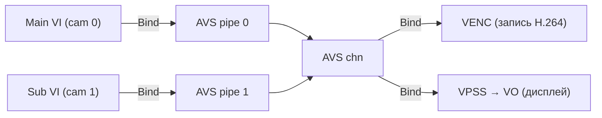

Код из rkadk (`rkadk_record.c:1166-1230`):
```c
if (pstRecAttr->stPipAttr[i].bEnablePip) {
    // AVS → VENC (запись мега-кадра в H.264/H.265)
    ret = RK_MPI_SYS_Bind(&stAvsChn, &stDestChn);          // AVS chn → VENC

    // Main VI → AVS pipe 0
    ret = RK_MPI_SYS_Bind(&stSrcChn, &stAvspipe0Chn);      // VI cam0 → AVS pipe 0

    // Sub VI → AVS pipe 1
    ret = RK_MPI_SYS_Bind(&stAvsSubViChn, &stAvspipe1Chn); // VI cam1 → AVS pipe 1
}
```

### PiP атрибуты в rkadk API

`RKADK_PIP_ATTR_S` (`rkadk_muxer.h:168-175`):

```c
typedef struct {
    RKADK_BOOL bEnablePip;           // включить PiP (через AVS)
    RKADK_U32  u32AvsGrpId;          // AVS group id [0, AVS_MAX_GRP_NUM)
    RKADK_U32  u32AvsBufCnt;         // кол-во буферов AVS (по умолчанию 2)
    RKADK_U32  u32SubCamId;          // camera id второго сенсора
    RKADK_STREAM_TYPE_E enSubStreamType; // тип потока второго сенсора
    RKADK_RECT_S stSubRect;          // позиция/размер sub-окна в main-окне
} RKADK_PIP_ATTR_S;
```

### Режим AVS в rkadk — `AVS_MODE_NOBLEND_OVL`

rkadk использует `AVS_MODE_NOBLEND_OVL` (Overlay) — это **Picture-in-Picture**: main камера на весь кадр, sub камера в прямоугольнике `stSubRect` поверх.

```c
// rkadk_record.c:512
stAvsGrpAttr.enMode     = AVS_MODE_NOBLEND_OVL;  // Overlay (PiP)
stAvsGrpAttr.u32PipeNum = RKADK_RECORD_AVS_PIPE_NUM;  // 2
stAvsGrpAttr.bSyncPipe  = RK_FALSE;              // ← БЕЗ синхронизации!
```

> **Важно:** rkadk использует `bSyncPipe = RK_FALSE` — нет аппаратной синхронизации. Для стерео это **не идеально** — кадры могут быть рассинхронизированы. Наш `vi_grab_avs` использует `bSyncPipe = 1` — лучше для стерео.

### Как подать мега-кадр на "всё мясо" rkadk

Есть **два варианта**:

#### Вариант A: Использовать rkadk PiP как есть

Если вас устраивает Picture-in-Picture (main камера + окошко sub камеры), просто включите `bEnablePip` в `RKADK_PIP_ATTR_S`:

```c
RKADK_PIP_ATTR_S pipAttr;
memset(&pipAttr, 0, sizeof(pipAttr));
pipAttr.bEnablePip       = RKADK_TRUE;
pipAttr.u32AvsGrpId      = 0;
pipAttr.u32AvsBufCnt     = 2;
pipAttr.u32SubCamId      = 1;                    // второй сенсор
pipAttr.enSubStreamType  = RKADK_STREAM_TYPE_VIDEO_MAIN;
pipAttr.stSubRect.u32X   = 100;                  // позиция окошка
pipAttr.stSubRect.u32Y   = 100;
pipAttr.stSubRect.u32Width  = 320;               // размер окошка
pipAttr.stSubRect.u32Height = 240;

RKADK_RECORD_SetPipAttr(recorder, &pipAttr);
```

Результат: видео с PiP окошком, записывается в MP4 через VENC, стримится через RTSP, показывается на VO.

#### Вариант B: Side-by-side мега-кадр через AVS + rkadk

Для **настоящего side-by-side** (не PiP окошко, а два кадра рядом на весь экран) нужно изменить режим AVS:

1. В `rkadk_record.c:512` заменить `AVS_MODE_NOBLEND_OVL` → `AVS_MODE_NOBLEND_HOR`
2. Установить `bSyncPipe = RK_TRUE` (строка 514)
3. Размер выхода AVS = `2W × H` (строка 517-518)
4. VENC кодирует мега-кадр `3840x1080`

```c
// Патч для rkadk_record.c:
stAvsGrpAttr.enMode     = AVS_MODE_NOBLEND_HOR;  // ← side-by-side (не OVL)
stAvsGrpAttr.bSyncPipe  = RK_TRUE;               // ← аппаратная синхронизация!
stAvsGrpAttr.stOutAttr.stSize.u32Width  = 3840;  // ← 2 × 1920
stAvsGrpAttr.stOutAttr.stSize.u32Height = 1080;
```

После этого rkadk будет:
- Захватывать 2 сенсора с `bSyncPipe=1`
- Склеивать в мега-кадр `3840x1080` через AVS
- Кодировать в H.264/H.265 через VENC
- Записывать в MP4 через muxer
- Стримить через RTSP
- Показывать на дисплее через VO

**Всё "мясо" rkadk работает с мега-кадром!**

### Полный пайплайн мега-кадра через rkadk

```
Sensor 0 → VI dev 0 → VI pipe 0 ──Bind──► AVS pipe 0 ─┐
                                                        │
Sensor 1 → VI dev 1 → VI pipe 1 ──Bind──► AVS pipe 1 ──┤
                                                        ▼
                                          AVS Grp 0 (NOBLEND_HOR, bSyncPipe=1)
                                                        │
                                          AVS chn 0 (3840x1080 NV12)
                                                        │
                    ┌───────────────────────────────────┤
                    │                                   │
                    ▼                                   ▼
              VENC 0 (H.264)                      VPSS → VO (дисплей)
                    │
                    ▼
              Muxer (MP4 запись)
                    │
                    ▼
              RTSP стриминг
```

### Сравнение: PiP vs Side-by-side в rkadk

| | PiP (текущий rkadk) | **Side-by-side (патч)** |
|---|---|---|
| `AVS_MODE` | `NOBLEND_OVL` (4) | **`NOBLEND_HOR` (2)** |
| `bSyncPipe` | `RK_FALSE` | **`RK_TRUE`** |
| Размер | W×H (main + окошко) | **2W×H (мега-кадр)** |
| Синхронизация | нет | **аппаратная** |
| Запись в MP4 | да | **да** |
| RTSP | да | **да** |
| Дисплей (VO) | да | **да** |
| Нужен патч? | нет | **да** (3 строки в `rkadk_record.c`) |

### Резюме

- **rkadk уже работает с AVS** — через PiP (`bEnablePip`)
- **Для side-by-side** нужен патч `rkadk_record.c` (3 строки: `NOBLEND_HOR` + `bSyncPipe=TRUE` + размер `2W×H`)
- **Мега-кадр идёт на весь пайплайн**: VENC → MP4, RTSP, VO — всё работает
- **Альтернатива**: наш `vi_grab_avs` + свой код для VENC/RTSP (без rkadk)

---

## Можно ли настроить мега-кадр через INI?

### Короткий ответ

| Фреймворк | INI-настройка AVS? | Что нужно? |
|-----------|:---:|---|
| **rkipc dual_ipc** | **ДА** (секция `[avs]`) | раскомментировать bind VI→AVS (1 строка) |
| **rkadk** | **НЕТ** | патч C-кода (3 строки) |
| **V4L2** | — | не нужен (но и нет encoding/streaming) |

### rkipc dual_ipc: ДА, INI уже есть!

`rkipc` читает AVS-настройки из INI (`rkipc-dual-800w.ini`, секция `[avs]`):

```ini
[avs]
sensor_num = 2
source_width = 3840          ; ширина одного сенсора
source_height = 2160
enable_avs = 0               ; ← включить AVS!
avs_width = 3840
avs_height = 1080
avs_mode = 0                 ; 0=BLEND, 1=NOBLEND_VER, 2=NOBLEND_HOR, 3=NOBLEND_QR
sync = 0                     ; ← bSyncPipe (1 = аппаратная синхронизация!)
param_source = 1             ; 0=LUT, 1=CALIB
calib_file_path = /oem/usr/share/avs_calib/calib_file.xml
stitch_distance = 5
enable_venc_0 = 1            ; H.264 кодирование
enable_venc_1 = 1
enable_rtsp = 1              ; RTSP стриминг
enable_vo = 1                ; вывод на дисплей
```

**Для мега-кадра через rkipc — просто поменять INI:**

```ini
[avs]
enable_avs = 1               ; ← включить AVS
avs_mode = 2                 ; ← NOBLEND_HOR (side-by-side)
sync = 1                     ; ← аппаратная синхронизация!
source_width = 1920          ; ← размер одного сенсора
source_height = 1080
avs_width = 3840             ; ← мега-кадр 2×1920
avs_height = 1080
```

**НО!** В rkipc dual_ipc bind VI→AVS **закомментирован** (`video.c:535-541`):

```c
// if (enable_avs) {
//     ret = RK_MPI_SYS_Bind(&vi_chn[i], &avs_in_chn[i]);  // ← ЗАКОММЕНТИРОВАНО!
// }
```

Вместо этого rkipc bind'ит **VI → VENC напрямую** (минуя AVS):
```c
ret = RK_MPI_SYS_Bind(&vi_chn[0], &venc_chn[0]);  // VI cam0 → VENC0 (без AVS!)
ret = RK_MPI_SYS_Bind(&vi_chn[1], &venc_chn[1]);  // VI cam1 → VENC1 (без AVS!)
```

AVS используется только для IVS/NPU (`avs_out_chn[1] → ivs_chn`), не для кодирования.

**Чтобы мега-кадр шёл на VENC через rkipc — нужно раскомментировать 1 блок:**

```c
// Патч для video.c:535-541 (rkipc dual_ipc):
if (enable_avs) {
    ret = RK_MPI_SYS_Bind(&vi_chn[i], &avs_in_chn[i]);   // ← раскомментировать!
    // И вместо VI→VENC bind'ить AVS→VENC:
    // ret = RK_MPI_SYS_Bind(&avs_out_chn[0], &venc_chn[0]);
}
```

После этого + INI-настройка → rkipc будет:
1. Захватывать 2 сенсора
2. Склеивать через AVS (`NOBLEND_HOR`, `bSyncPipe=1`)
3. Кодировать мега-кадр в H.264 (VENC)
4. Стримить через RTSP
5. Показывать на дисплее (VO)

**Всё через INI + 1 патч!**

### rkadk: НЕТ, только через C-код

rkadk **не читает** AVS-настройки из INI. В `rkadk_setting.ini` **нет секции `[avs]`** — PiP настраивается программно:

```c
// Только через C-код:
RKADK_PIP_ATTR_S pipAttr = {.bEnablePip = RKADK_TRUE, ...};
RKADK_RECORD_SetPipAttr(recorder, &pipAttr);
```

И режим AVS захардкожен в `rkadk_record.c:512`:
```c
stAvsGrpAttr.enMode     = AVS_MODE_NOBLEND_OVL;  // захардкожено!
stAvsGrpAttr.bSyncPipe  = RK_FALSE;              // захардкожено!
```

**Почему так?** rkadk — это **библиотека/SDK** для разработчиков приложений. Rockchip предполагает что вы сами пишете приложение и вызываете API. INI-файлы rkadk (`rkadk_setting.ini`) содержат только параметры кодирования (разрешение, битрейт, профиль), но не архитектуру пайплайна.

rkipc — это **готовое приложение**. У него INI управляет всем, включая архитектуру пайплайна (какие модули включить, как bind'ить).

### Почему V4L2 "бесплатно"?

**V4L2 (Video4Linux2)** — это **API ядра Linux**, не Rockchip-библиотека:

| | V4L2 | rockit (MPI) |
|---|---|---|
| Что это | Linux kernel API | Rockchip proprietary library |
| Где живёт | в ядре Linux (`/dev/video*`) | `librockit.so` (закрытый код) |
| Цена | **бесплатно** (GPL, в ядре) | проприетарно (нужна лицензия/SDK) |
| Доступ | `open("/dev/video0")` | `RK_MPI_SYS_Init()` |
| Что даёт | **только сырые кадры** (NV12/YUYV) | VI → ISP → VENC → VO → RTSP → MP4 |
| Encoding | **нет** | H.264/H.265 (hardware) |
| Streaming | **нет** | RTSP/RTMP |
| Запись | **нет** | MP4/muxer |
| Дисплей | **нет** | VO (video output) |

**V4L2 "бесплатно" потому что:**
1. Это часть **ядра Linux** (GPL) — всегда доступно, не нужно ничего ставить
2. Драйвер сенсора в ядре уже настроен через DTS — V4L2 просто открывает `/dev/video0`
3. Но V4L2 даёт **только сырые кадры** — без кодирования, стриминга, записи

```bash
# V4L2 — бесплатно, но только сырые кадры:
v4l2-ctl --device=/dev/video0 --set-fmt-video=width=1920,height=1080,pixelformat=NV12
v4l2-ctl --device=/dev/video0 --stream-mmap --stream-count=1 --stream-to=frame.raw
# → frame.raw = сырой NV12, никакого H.264/MP4/RTSP
```

**Для encoding/streaming нужен rockit** (или librga для RGA, или свой VENC через V4L2 — но это сложно).

### Сравнение: как получить мега-кадр + H.264 + RTSP

| Путь | INI? | Патч? | Что работает | Сложность |
|------|:---:|:---:|---|:---:|
| **rkipc + INI** | ДА | 1 блок раскомментировать | VENC + RTSP + VO | **низкая** |
| **rkadk + патч** | нет | 3 строки C | VENC + MP4 + RTSP + VO | средняя |
| **vi_grab_avs** | нет | готово | только сырой мега-кадр | **низкая** |
| **V4L2 напрямую** | DTS | нет | только сырые кадры | высокая |

### Рекомендация

**Самый простой путь к мега-кадру + H.264 + RTSP:**

1. Берёте `rkipc dual_ipc` (уже есть в SDK)
2. Меняете INI (`rkipc-dual-800w.ini`):
   ```ini
   [avs]
   enable_avs = 1
   avs_mode = 2        ; NOBLEND_HOR
   sync = 1            ; bSyncPipe
   ```
3. Раскомментируете bind VI→AVS в `video.c:535-541` + меняете bind VI→VENC на AVS→VENC
4. Собираете rkipc → запускаете → получаете RTSP-стрим с мега-кадром

**Если нужна запись в MP4** — добавьте rkadk muxer, или используйте rkadk с патчем (Вариант B выше).

---

## Сборка

```bash
# Настройка окружения (на Linux-машине сборки)
export PATH=$PATH:/path/to/toolchain/bin

# Применить патчи к чистому SDK (если нужно)
git apply dual_camera_patch.diff
git apply dual_camera_patch_rv1126b.diff

# Сборка rkadk_dual_disp_test
cd build
cmake .. -DRK_MEDIA_CHIP=rv1126b -DARCH64=ON
make rkadk_dual_disp_test
```

## Запуск

```bash
# По умолчанию: 256px ширина, высота пропорциональна, два окна рядом
rkadk_dual_disp_test -a /etc/iqfiles -p /data/rkadk

# Свои параметры
rkadk_dual_disp_test -W 256 -H 0 -g 8 -s 0

# Параметры:
#   -a  путь к IQ-файлам (default: /etc/iqfiles)
#   -p  путь к ini-параметрам (default: /data/rkadk)
#   -W  ширина окна в пикселях (0 = использовать высоту)
#   -H  высота окна в пикселях (0 = пропорционально ширине)
#   -s  начальный offset первого окна (default: 0)
#   -g  зазор между окнами в пикселях (default: 8)
```

---

## Важные замечания

- **Sensor 1** по умолчанию `used_isp = FALSE`. Если вторая матрица — ISP-сенсор, поставь `used_isp = TRUE` в `rkadk_setting_sensor_1.ini` и проверь `device_name`.
- Для **чёрно-белой матрицы** без IR-фильтра могут понадобиться отдельные IQ-файлы.
- `rotation=1` (поворот 90°) остаётся у обоих сенсоров RV1126B — если поворот не нужен, уберите его в ini.
- `RKADK_MAX_SENSOR_CNT` должен быть ≥ 2 для двухкамерной конфигурации.

---

## Структура репозитория

```
.
├── app/
│   └── vi_grab_frame/      # наши CLI-программы
│       ├── vi_grab_frame.c     # захват одного сенсора
│       ├── vi_grab_avs.c       # AVS мега-кадр + --split + --rotate-cam (RGA)
│       ├── vi_grab_avs_dma.c   # AVS → RGA → DMA (zero-copy, VO)
│       ├── vi_grab_dual.c      # захват двух сенсоров без AVS
│       └── stereo_demo.c       # camgroup (3A sync) + AVS + VPSS crop
├── docs/                   # картинки для README
│   └── images/
│       ├── split_rot0.png          # --split без поворота
│       ├── split_rot90.png         # --split --rotate-cam 90 (portrait)
│       └── split_rotations.png     # все 3 поворота
├── build.sh                # сборка через zig cc (SDK_PATH=../sdk)
├── CMakeLists.txt          # сборка через cmake
├── aarch64-toolchain.cmake # кросс-компиляция (zig или aarch64-gcc)
├── lib/                    # librga.so (с платы — в SDK её нет)
│   ├── librga.so
│   └── librockit.so        # (опционально — можно брать из SDK)
├── .gitignore
└── README.md
```

**SDK (не в репо, отдельно):**
```
sdk/external/
├── rockit/                 # MPI: mpi/sdk/include/, lib/arm64/rv1126b/linux/librockit.so
├── linux-rga/              # RGA: im2d_api/, include/
└── camera_engine_rkaiq/    # rkaiq + Findlibrga.cmake
```

## Git-история

| Коммит | Описание |
|--------|----------|
| `36f0c5c` | Initial commit — чистый SDK из `rv1126b-linux6.1 @ 7285d5c2f` |
| `dac2b43` | feat(dual_camera) — двухкамерный дисплей для RV1106 и RV1126B |
